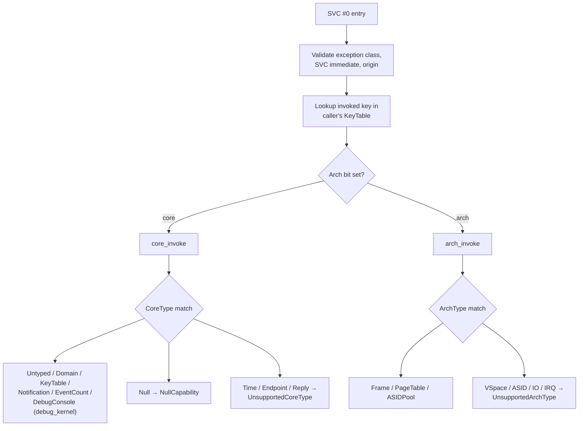

# Object types

User-facing reference for every object kind in the Vesper capability catalogue,
one document per kind. Each document follows the same structure: **name**,
**purpose**, **user-level visible operations**, **kernel-level implementation
details**, **sidenotes**, **TODOs**, and a final cross-reference section
comparing the current implementation against the desired-capability notes in
the `🧠 Vesper` vault.

Contract sources: [`doc/nucleus_capabilities.md`](../nucleus_capabilities.md)
(design contracts and decision register), [`doc/lifetime-and-authority.md`](../lifetime-and-authority.md)
(lifetime/authority semantics), [`doc/capabilities_implementation_plan.md`](../capabilities_implementation_plan.md)
(slice plan and validation status).

## Wire encoding

The wire object type is one byte. Bit 7 selects the category; bits 6–0 hold the
category-local index.

- Core: `wire_type = core_index`, range `0x00..=0x7f`.
- Architecture: `wire_type = 0x80 | arch_index`, range `0x80..=0xff`.

Unknown and reserved indices fail explicitly with a defined error; a reserved
ID never advertises implementation support.

## Catalogue

### Core kinds (`core/`)

| Kind | Wire | Document | Status |
|---|---:|---|---|
| Null | `0x00` | [null.md](core/null.md) | Active (always rejected) |
| Untyped | `0x01` | [untyped.md](core/untyped.md) | Retype active |
| Domain | `0x02` | [domain.md](core/domain.md) | Activate/Retire active |
| KeyTable | `0x03` | [key_table.md](core/key_table.md) | CopyDerive/Move/Delete active |
| Time | `0x04` | [time.md](core/time.md) | Excluded sketch |
| Endpoint | `0x05` | [endpoint.md](core/endpoint.md) | Excluded sketch |
| Notification | `0x06` | [notification.md](core/notification.md) | Signal/Wait/Poll active |
| EventCount | `0x07` | [event_count.md](core/event_count.md) | Advance/Await/Read active |
| Reply | `0x08` | [reply.md](core/reply.md) | Excluded sketch |
| DebugConsole | `0x7f` | [debug_console.md](core/debug_console.md) | Debug-gated Write |

IDs 9–126 are reserved. There is no `Buffer` wire kind (removed 2026-09-15;
Buffer is a userspace/libOS construct over frame capabilities, and `Reply`
took the freed ID 8).

### Architecture kinds (`arch/`)

| Kind | Wire | Document | Status (AArch64) |
|---|---:|---|---|
| Frame | `0x80` | [frame.md](arch/frame.md) | Map/Unmap/GetAddress active |
| PageTable | `0x81` | [page_table.md](arch/page_table.md) | Map/Unmap active |
| VSpace | `0x82` | [vspace.md](arch/vspace.md) | Reserved (Domain is the mapping context) |
| ASIDPool | `0x83` | [asid_pool.md](arch/asid_pool.md) | Assign active (boot-provided) |
| ASID | `0x84` | [asid.md](arch/asid.md) | Reserved |
| IOSpace | `0x85` | [io_space.md](arch/io_space.md) | Deferred |
| IOPort | `0x86` | [io_port.md](arch/io_port.md) | x86-only; unsupported on AArch64 |
| IRQHandler | `0x87` | [irq_handler.md](arch/irq_handler.md) | Deferred |
| IRQControl | `0x88` | [irq_control.md](arch/irq_control.md) | Deferred |

Indices 9–127 are reserved. Support is target-specific: a registered ID (for
example `IOPort`) does not become supported on AArch64 merely because it is
defined.

## Invocation model

All operations are invoked through a single `SVC #0` capability invocation.
Entry registers: `x0` packed caller-local key (incarnation in bits 63–32, slot
in bits 31–0), `x1` operation number, `x2..x7` six operation arguments.
Results: `x0` status (zero = success), `x1`/`x2` two result words (ordinary
contract). Unused argument words are transmitted as zero and rejected when
nonzero (strict wire-argument convention, selected 2026-09-15).

Blocking operations do not return a "blocked" status: the syscall entry parks
the caller's exception frame and the eventual resume delivers the terminal
result (completion or cancellation error) — see the completion foundation in
`doc/nucleus_capabilities.md` § "Communication and deferred completion".

## Cross-reference note

The final section of each document compares the current implementation with
the desired-capability notes in the `🧠 Vesper` vault (Obsidian). Those notes
are research intent, not implemented contracts; discrepancies listed there are
for maintainer review, not adopted behavior.
