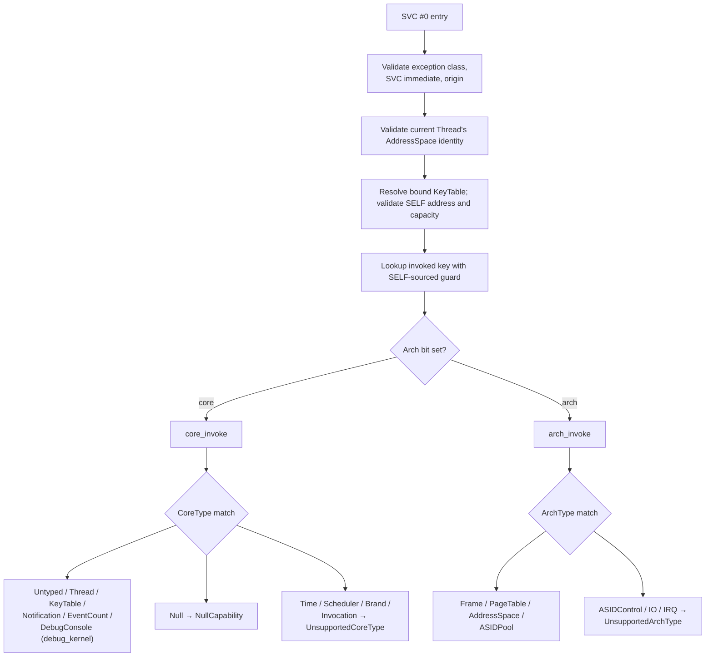

# Object types

User-facing reference for every object kind in the Vesper capability catalogue,
one document per kind. Each document follows the same structure: **name**,
**purpose**, **user-level visible operations**, **kernel-level implementation
details**, **sidenotes**, **TODOs**, and a final cross-reference section
comparing the current implementation against the desired-capability notes in
the `🧠 Vesper` vault.

Contract sources: [`doc/nucleus_capabilities.md`](../nucleus_capabilities.md)
(design contracts and decision register), [`doc/lifetime-and-authority.md`](../lifetime-and-authority.md)
(lifetime/authority semantics), [`doc/capabilities_implementation_plan.md`](../capabilities_implementation_plan.md)
(slice plan and validation status).

## Wire encoding

The wire object type is one byte. Bit 7 selects the category; bits 6–0 hold the
category-local index.

- Core: `wire_type = core_index`, range `0x00..=0x7f`.
- Architecture: `wire_type = 0x80 | arch_index`, range `0x80..=0xff`.

Unknown and reserved indices fail explicitly with a defined error; a reserved
ID never advertises implementation support.

## Catalogue

### Core kinds (`core/`)

| Kind | Wire | Document | Status |
|---|---:|---|---|
| Null | `0x00` | [null.md](core/null.md) | Active (always rejected) |
| Untyped | `0x01` | [untyped.md](core/untyped.md) | Retype active |
| KeyTable | `0x02` | [key_table.md](core/key_table.md) | AddressSpace-associated caller lookup; CopyDerive/Move/Delete active |
| Thread | `0x03` | [thread.md](core/thread.md) | Named Thread Retire active; Return `0` only on `CurrentReturnOnly`, dispatch/helper/wrapper unimplemented; `ThreadSelector` and kernel-constructed boot Slot(1) sentinel implemented; Return currently `InvalidOperation`; Thread-resident wait continuations and checked fixture root/ASID switching on a shared trap stack |
| Time | `0x04` | [time.md](core/time.md) | Excluded sketch |
| Scheduler | `0x05` | [scheduler.md](core/scheduler.md) | Contract selected; not implemented |
| Brand | `0x06` | [brand.md](core/brand.md) | Contract direction recorded; implementation deferred to IRQ |
| Invocation | `0x07` | [invocation.md](core/invocation.md) | Call-only `0` with mandatory `NonZero<u64>` function address; six-input capability construction and immutable validated extent/headroom implemented; target identity, mandatory nonzero entry and extent stored inline in a 40 B Invocation payload; target-entry dummy `x0`/`x1` plus in-place `x2..x7` arguments selected; two-u64 payload with source completion x0=SUCCESS/x1=r0/x2=r1 selected and `Thread.Return` `0` payload x2=r0/x3=r1 with packed key/op in x0/x1 selected with x4..x7 ignored and fallible Result<Infallible, CapError> Return helper selected with adapter Err routed to non-returning libOS fault handler plus original payload retained in a selected 16-byte aligned target-stack frame area (no kernel allocation/record growth; not implemented) with provisionally link-resolved userspace handler `vesper_thread_return_fault` with five-u64 extern-C non-returning ABI (status/detail1/detail2/original r0/original r1 in x0..x4; binding not frozen, not implemented); unexpected local Return SUCCESS becomes synthetic `UnexpectedReturn` status 34 with local x1/x2 diagnostics, routed with original payload to that handler (no unchanged-state/safe-retry guarantee; not implemented); per-procedure non-returning extern-C export wrapper entry selected (normal linked body call with target-local linkage; no extra kernel entry metadata/trampoline, not implemented); extern-C two-u64 repr-C body return in x0/x1 experimental pending end-to-end confirmation (not frozen/implemented); x9 SP transport provisionally selected pending end-to-end feasibility confirmation (not frozen/implemented); conservative x0..x17 raw-SVC compiler operands/clobbers plus caller-volatile x18 discarded clobbers selected (no extra results/record growth or reserved x18 role, fallible Return not noreturn; not implemented); integer-only execution/explicit FP-SIMD trapping selected for kernel/components and EL1t/EL0 (execution-fault classification, D1 delivery open; no vector/control-state storage; enforcement/validation pending); `InvalidStack` status 32 and root-exported `InvalidStackReason` IDs 1–12 implemented with lossless full-width decoding (0 invalid); ordered constructor admission and numeric extent/SP helpers implemented; non-committing Call admission/preparation (key/op/`CALL` → live target → saved-x9 SP → translation → depth) and stage-5 commit (continuation push, AS migration, scrubbed target-entry frame) implemented and tested but not dispatched until Return exists; `NestingDepth` status 33 with current/maximum count in x1 and zero in x2 implemented in the shared ABI/client decoder and enforced by Call preparation; kernel-owned source x19–x30 preservation and non-payload GPR/NZCV scrubbing selected (Call retains x2..x7, zeroes dummy x0/x1 and x8..x30, clears target NZCV after source save/x9 capture; Return delivers SUCCESS/r0/r1, zeroes x3..x18 and restores exact source x19..x30/context/raw SPSR including NZCV; recoverable local rejection unchanged, no userspace dummy/ignored-Return zeroing requirement; no extra fields/runtime allocation, measured 144 B record/2304 B depth-16 array per Thread with type-derived accounting; saved-source target-entry SPSR mode/masks/other non-NZCV control inheritance selected; TLS/debug/complete isolation open; not implemented/validated); PPC Call/Return not implemented |
| Notification | `0x08` | [notification.md](core/notification.md) | Signal/Wait/Poll active |
| EventCount | `0x09` | [event_count.md](core/event_count.md) | Advance/Await/Read active |
| DebugConsole | `0x7f` | [debug_console.md](core/debug_console.md) | Debug-gated Write |

IDs 10–126 are reserved. There is no `Buffer` wire kind (Buffer is a
userspace/libOS construct over frame capabilities) and no `Domain` wire kind
(the execution entity is the core `Thread`; the mapping context is the arch
`AddressSpace`).

### Architecture kinds (`arch/`)

| Kind | Wire | Document | Status (AArch64) |
|---|---:|---|---|
| Frame | `0x80` | [frame.md](arch/frame.md) | Map/Unmap/GetAddress active; non-global TTBR0 leaves and ordered VA-scoped invalidation |
| PageTable | `0x81` | [page_table.md](arch/page_table.md) | Map/Unmap active; ordered whole-ASID root invalidation |
| AddressSpace | `0x82` | [address_space.md](arch/address_space.md) | Immutable KeyTable binding/current-AS caller lookup; Activate installs after guards end; Retire/CreateInvocation active; six-input construction stores validated extent/headroom (`x5` base, `x6` exclusive end, `x7` minimum headroom in bytes), with status 32 diagnostics and authority/live-target → nonzero entry → stack predicates → destination admission; AArch64 user ceiling `1 << 48`; no PPC Call/Return |
| ASIDPool | `0x83` | [asid_pool.md](arch/asid_pool.md) | Assign active (boot-provided); source/Bounce ASIDs 1/2 provisioned; full pool/hardware-width reconciliation pending |
| ASIDControl | `0x84` | [asid_control.md](arch/asid_control.md) | Reserved |
| IOSpace | `0x85` | [io_space.md](arch/io_space.md) | Deferred |
| IOPort | `0x86` | [io_port.md](arch/io_port.md) | x86-only; unsupported on AArch64 |
| IRQHandler | `0x87` | [irq_handler.md](arch/irq_handler.md) | Deferred |
| IRQControl | `0x88` | [irq_control.md](arch/irq_control.md) | Deferred |

Indices 9–127 are reserved. Support is target-specific: a registered ID (for
example `IOPort`) does not become supported on AArch64 merely because it is
defined.

## Invocation model

All operations are invoked through a single `SVC #0` capability invocation.
Entry registers: `x0` packed caller-local key (incarnation in bits 63–32, slot
in bits 31–0), `x1` operation number, `x2..x7` six operation arguments.
Results: `x0` status (zero = success), `x1`/`x2` two result words (ordinary
contract). Unless an operation explicitly ignores them, unused argument words
are transmitted as zero and rejected when nonzero (strict wire-argument
convention). `Thread.Return` ignores x4..x7 without userspace initialization
or zeroing; successful resumed-frame scrubbing does not change that input rule.

Invocation is Call-only `0` with a mandatory `NonZero<u64>` function address.
`Thread.Return` is `0` only on the explicit `CurrentReturnOnly` Thread selector,
never `Named(ObjectId)`. `KeySlot::THREAD_RETURN` remains Slot(1); all other
slots and kind IDs are unchanged. The sentinel names no function, AddressSpace
or concrete Thread, carries no Thread-management rights, and rejects
management operations and `object_id` extraction. Named Thread entries reject
Return with `InvalidOperation`. It uses ordinary live-current-AS/table/SELF,
guard, incarnation, bounds and presence checks, not a lookup bypass or magic
raw key. All Threads in an AddressSpace share the sentinel, but it acts only
on the invoking Thread's own top continuation; presence is libOS policy.
Opcode zero on an Invocation means Call, not wrong-form Return. Unknown
Invocation opcode `1` is `InvalidOperation` once Call dispatch is enabled;
the kind currently remains unsupported. Return dispatch/helper/wrapper and
PPC migration remain unimplemented. `ThreadSelector`, its kernel
constructors/accessors, `ThreadOp::Return = 0` and boot Slot(1) installation are
implemented. Current-relative `object_id` extraction returns `InvalidOperation`,
and Retire rejects the sentinel before checking rights or extracting identity.
Return currently returns `InvalidOperation`; Invocation dispatch remains
unsupported. Return-form propagation and Call-only Invocation distribution
remain separately deferred, with no broader derivation or transfer permission.

```mermaid
flowchart TD
    A["SVC #0 entry"] --> B["Validate exception class,<br/>SVC immediate, origin"]
    B --> AS["Validate current Thread's AddressSpace identity"]
    AS --> KT["Resolve bound KeyTable; validate SELF address and capacity"]
    KT --> C["Lookup invoked key with SELF-sourced guard"]
    C --> D{"Arch bit set?"}
    D -- "core" --> E["core_invoke"]
    D -- "arch" --> F["arch_invoke"]
    E --> G{"CoreType match"}
    G --> H["Untyped / Thread / KeyTable /<br/>Notification / EventCount /<br/>DebugConsole (debug_kernel)"]
    G --> I["Null → NullCapability"]
    G --> J["Time / Scheduler / Brand /<br/>Invocation → UnsupportedCoreType"]
    F --> K{"ArchType match"}
    K --> L["Frame / PageTable / AddressSpace /<br/>ASIDPool"]
    K --> M["ASIDControl / IO / IRQ →<br/>UnsupportedArchType"]
```

Blocking operations do not return a "blocked" status. The bounded wait/resume
path validates the selected Thread's live AddressSpace, root/ASID encoding,
saved execution state, and pending completion before committing park/select.
The caller's continuation resides in Thread storage. Entry installs the copied
root/ASID after object/Access guards and the kernel lock end, restores the
transient frame with the terminal result, and returns normally through `ERET`
on the shared per-core kernel stack. Rejected scheduling preparation preserves
Thread contexts, pending records, current selection, and the runnable FIFO;
it does not undo the wait already admitted by capability dispatch. The trusted
fixture treats an impossible preparation failure as an invariant failure, not
wait completion or a recovery ABI.

Source and Bounce use independently provisioned roots with ASIDs 1 and 2;
source activation precedes the first handoff. Subsequent capability invocations
resolve the selected Thread's current AddressSpace's keytable, not an
independent table selector. Execution is trusted EL1t on SP_EL0 with a shared
high SP_EL1 trap stack, not same-Thread PPC migration or protected EL0
confinement. Prepared metadata does not pin backing: immediate installation
relies on the serialized single-core, masked, non-reentrant trap interval;
later or asynchronous use requires fresh validation.

`AddressSpace.Activate` likewise prepares checked metadata and installs it at
syscall entry after guards and the kernel lock end, before tracing success and
returning zeros. Its internal deferred outcome adds no wire status or ABI.
The supported AArch64 profile is an L0-rooted, four-level, 48-bit TTBR0 walk
(`T0SZ=16`, `EPD0=0`, `A1=0`, 4 KiB granule, no DS/LPA2), with configured and
hardware PA/ASID checks — see [AddressSpace](arch/address_space.md).

Success and operation-specific error wait completions are active;
cancellation-resume encoding remains open — see the completion foundation in
`doc/nucleus_capabilities.md` § "Communication and deferred completion".

### PPC construction and storage

`AddressSpaceKey::create_invocation` appends `stack_base`, `stack_end`, and
`minimum_headroom` to its function/destination/slot inputs and uses ordinary
`protected_call6`. The kernel stores an immutable validated
`InvocationStackExtent` inline with the target identity and nonzero entry.
Its numeric `validate_sp` helper has dedicated tests but is not actual Call
admission; Invocation dispatch remains unsupported. Construction does not
prove mapped/writable stack backing or executable-entry validity. Statuses
33/34, invocation-stack storage, Call/Return, PPC wrappers/adapters, faults and
distribution remain deferred.

The current `InvocationPayload` and `KeyPayload` are 40 B; `KeyEntry` is 64 B
with alignment 32. KeyTables retain a 32 B header and separate 4 B incarnation
counters: `KeyTable::carve_size(8)` is 17,440 B for 256 entries. Runtime Retype,
bootstrap, archive tables and fixture backing use type-derived carve sizes;
entry growth does not change packed key widths, guards or slot-incarnation
semantics.

### PPC migration-frame contract

The [Invocation GPR/NZCV policy](core/invocation.md#non-payload-gpr-and-condition-flag-exposure)
is selected, not implemented or validated. On successful Call, the kernel first
saves source x19..x30/context and consumes provisional target SP from saved
`frame.gpr[9]`; it retains real arguments x2..x7, zeroes dummy x0/x1 and
x8..x30, clears target NZCV, inherits source saved SPSR mode/masks/other
non-NZCV controls, and sets target execution SP/PC. Status comes from the
saved admitted source frame, not live kernel-handler PSTATE; EL1t stays EL1t
and EL0 stays EL0. No source-side
dummy-zeroing is required. Successful Return captures r0/r1 before rewriting
the frame, delivers x0=SUCCESS/x1=r0/x2=r1, zeroes x3..x18, and restores exact
source x19..x30, AddressSpace/SP/PC/origin and raw SPSR including NZCV.
Migration scrubbing does not apply to recoverable local Call/Return rejection;
existing preservation/error contracts are unchanged.

This requires no extra fields or runtime allocation; projected continuation
record/depth-16 array sizes remain 144 B/2304 B, unmeasured. Only GPR/NZCV
disclosure is addressed; saved-source status inheritance is also selected,
not implemented/validated. TLS, debug state and complete architectural-state
isolation remain open; effective FP/SIMD trap enforcement is separate.
Trusted EL1 tests do not establish hostile-EL0 confinement. x9 remains
provisional, and the native two-u64 body-result convention remains experimental.

## Cross-reference note

The final section of each document compares the current implementation with
the desired-capability notes in the `🧠 Vesper` vault (Obsidian). Those notes
are research intent, not implemented contracts; discrepancies listed there are
for maintainer review, not adopted behavior.
