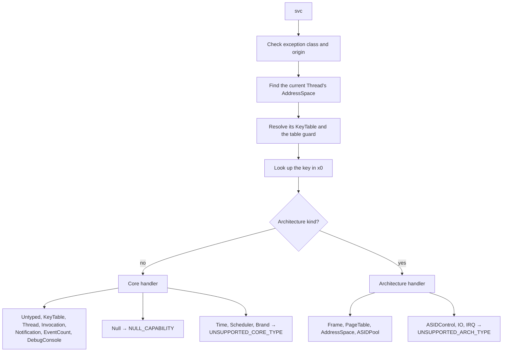

# Object types

Reference for every kind of kernel object a Vesper component can hold a capability to: what it is for, which operations it supports, and how to invoke them. One page per kind.

## Wire encoding

An object type is one byte. Bit 7 selects the category; bits 6–0 hold the index within it.

- Core kinds: `0x00..=0x7f`.
- Architecture kinds: `0x80 | index`, `0x80..=0xff`.

## Catalogue

### Core kinds

| Kind | Wire | Page | Status |
|---|---:|---|---|
| Null | `0x00` | [null.md](core/null.md) | Every invocation fails |
| Untyped | `0x01` | [untyped.md](core/untyped.md) | Retype |
| KeyTable | `0x02` | [key_table.md](core/key_table.md) | CopyDerive, Move, Delete |
| Thread | `0x03` | [thread.md](core/thread.md) | Return, Retire |
| Time | `0x04` | [time.md](core/time.md) | Not implemented |
| Scheduler | `0x05` | [scheduler.md](core/scheduler.md) | Not implemented |
| Brand | `0x06` | [brand.md](core/brand.md) | Not implemented |
| Invocation | `0x07` | [invocation.md](core/invocation.md) | Call |
| Notification | `0x08` | [notification.md](core/notification.md) | Signal, Wait, Poll |
| EventCount | `0x09` | [event_count.md](core/event_count.md) | Advance, Await, Read |
| DebugConsole | `0x7f` | [debug_console.md](core/debug_console.md) | Write (debug kernels only) |

Indices 10–126 are unassigned.

### Architecture kinds

| Kind | Wire | Page | Status on AArch64 |
|---|---:|---|---|
| Frame | `0x80` | [frame.md](arch/frame.md) | Map, Unmap, GetAddress |
| PageTable | `0x81` | [page_table.md](arch/page_table.md) | Map, Unmap |
| AddressSpace | `0x82` | [address_space.md](arch/address_space.md) | Activate, Retire, CreateInvocation |
| ASIDPool | `0x83` | [asid_pool.md](arch/asid_pool.md) | Assign |
| ASIDControl | `0x84` | [asid_control.md](arch/asid_control.md) | Not implemented |
| IOSpace | `0x85` | [io_space.md](arch/io_space.md) | Not implemented |
| IOPort | `0x86` | [io_port.md](arch/io_port.md) | x86 only; not available on AArch64 |
| IRQHandler | `0x87` | [irq_handler.md](arch/irq_handler.md) | Not implemented |
| IRQControl | `0x88` | [irq_control.md](arch/irq_control.md) | Not implemented |

Indices 9–127 are unassigned. Invoking a kind that is not implemented fails with `UNSUPPORTED_CORE_TYPE` or `UNSUPPORTED_ARCH_TYPE`.

## Invocation model

### Registers

Every operation is one `svc` instruction. The immediate is ignored; the userspace wrappers use `svc #0`.

| Direction | Register | Meaning |
|---|---|---|
| In | `x0` | Key of the invoked capability |
| In | `x1` | Operation number |
| In | `x2..x7` | Six operation arguments |
| Out | `x0` | Status; zero is success |
| Out | `x1`, `x2` | Two result words on success, error details on failure |

Argument words an operation does not use must be zero; a nonzero unused word fails with `INVALID_OPERATION`. Exceptions: `Thread.Return` ignores `x4..x7`, and `Invocation.Call` also reads `x9`.

An invocation writes only `x0..x2`. Every other register, SP and the NZCV flags are returned unchanged, whether the operation succeeds, fails, or blocks and resumes later. `Invocation.Call` and `Thread.Return` move the Thread between address spaces and have their own register rules; see [Invocation](core/invocation.md#register-state).

### Keys

A key is a 64-bit value that names one capability in the caller's KeyTable:

| Bits | Field |
|---|---|
| 63–32 | Incarnation: which occupant of the slot this key names |
| 31–`size_bits` | The table's guard |
| `size_bits`−1–0 | Slot index |

`size_bits` is the table's capacity exponent (a 256-entry table has `size_bits = 8`). A key is valid only while the slot still holds the same occupant; see [KeyTable](core/key_table.md#keys-and-incarnations).

### Status codes

| Status | Name | `x1` | `x2` |
|---:|---|---|---|
| 0 | `SUCCESS` | result | result |
| 1 | `UNKNOWN` | 0 | 0 |
| 2 | `NULL_CAPABILITY` | 0 | 0 |
| 3 | `INVALID_DOMAIN` | 0 | 0 |
| 4 | `INVALID_POINTER` | 0 | 0 |
| 5 | `INSUFFICIENT_RIGHTS` | 0 | 0 |
| 6 | `NOT_MAPPED` | 0 | 0 |
| 7 | `ALREADY_MAPPED` | 0 | 0 |
| 8 | `INVALID_OPERATION` | 0 | 0 |
| 9 | `ASID_POOL_EXHAUSTED` | 0 | 0 |
| 10 | `NO_ASID_ASSIGNED` | 0 | 0 |
| 11 | `INVALID_SLOT` | slot | 0 |
| 12 | `EMPTY_SLOT` | slot | 0 |
| 13 | `SLOT_OCCUPIED` | slot | 0 |
| 14 | `NOT_CORE_TYPE` | wire type | 0 |
| 15 | `UNKNOWN_CORE_TYPE` | type byte | 0 |
| 16 | `UNSUPPORTED_CORE_TYPE` | core index | 0 |
| 17 | `NOT_ARCH_TYPE` | wire type | 0 |
| 18 | `UNKNOWN_ARCH_TYPE` | type byte | 0 |
| 19 | `UNSUPPORTED_ARCH_TYPE` | arch index | 0 |
| 20 | `INVALID_OBJECT_TYPE` | wire type | 0 |
| 21 | `TYPE_MISMATCH` | expected wire type | found wire type |
| 22 | `INSUFFICIENT_MEMORY` | 0 | 0 |
| 23 | `POOL_EXHAUSTED` | 0 | 0 |
| 24 | `INVALID_SIZE` | size | 0 |
| 25 | `INVALID_FRAME_SIZE` | size | 0 |
| 26 | `INVALID_KEY` | submitted key | reason \| (argument register << 8) |
| 27 | `INCONSISTENT_KEY` | submitted key | reason \| (argument register << 8) |
| 28 | `KEY_SLOT_EXHAUSTED` | slot | 0 |
| 29 | `MISSING_INTERMEDIATE` | virtual address | 0 |
| 30 | `PHYSICAL_ALIAS` | physical base of the conflicting mapping | 0 |
| 31 | `COUNTER_OVERFLOW` | 0 | 0 |
| 32 | `INVALID_STACK` | offending value | reason, see [Invocation](core/invocation.md#invalidstack) |
| 33 | `NESTING_DEPTH` | saved continuations | 0 |
| 34 | `UNEXPECTED_RETURN` | local `x1` | local `x2` |

`decode_syscall_result` in `libs/object/src/lib.rs` turns these into `CapError`. A status it does not recognize, or a known status with malformed details, decodes as `CapError::UnknownResponse` with all three words kept.

### Key errors

Any key argument can fail lookup. Lookup checks, in this order:

| Check | Error | Reason |
|---|---|---|
| Incarnation is nonzero | `INVALID_KEY` | 1 `ZeroIncarnation` |
| Guard matches the table's guard | `INVALID_KEY` | 4 `GuardMismatch` |
| Slot index is within the table's capacity | `INVALID_KEY` | 2 `SlotOutOfRange` |
| A capability was ever installed in the slot | `INVALID_KEY` | 3 `NeverIssued` |
| The slot still holds the same occupant | `INCONSISTENT_KEY` | 1 `SlotIncarnationMismatch` |
| That occupant was not deleted or moved | `INCONSISTENT_KEY` | 2 `CapabilityInvalidated` |

`x2` bits 15–8 hold the index of the argument register that carried the failing key (`0` for `x0`).

### Dispatch

```mermaid
flowchart TD
    A["svc"] --> B["Check exception class and origin"]
    B --> AS["Find the current Thread's AddressSpace"]
    AS --> KT["Resolve its KeyTable and the table guard"]
    KT --> C["Look up the key in x0"]
    C --> D{"Architecture kind?"}
    D -- "no" --> E["Core handler"]
    D -- "yes" --> F["Architecture handler"]
    E --> G["Untyped, KeyTable, Thread, Invocation,<br/>Notification, EventCount, DebugConsole"]
    E --> I["Null → NULL_CAPABILITY"]
    E --> J["Time, Scheduler, Brand →<br/>UNSUPPORTED_CORE_TYPE"]
    F --> L["Frame, PageTable, AddressSpace, ASIDPool"]
    F --> M["ASIDControl, IO, IRQ →<br/>UNSUPPORTED_ARCH_TYPE"]
```

### Blocking and address-space switches

A blocking operation (`Notification.Wait`, `EventCount.Await`) does not return to the caller until it completes. The kernel saves the caller's registers in its Thread, runs the next runnable Thread, and later resumes the caller with the result in `x0..x2`. `AddressSpace.Activate`, scheduling, `Invocation.Call` and `Thread.Return` switch the hardware translation context (`TTBR0_EL1` and the ASID) on the way back to the caller. A synchronous exception from EL0 other than `svc` is a fault, delivered to the fault handler of the faulting AddressSpace; see [Thread](core/thread.md#fault-delivery).
