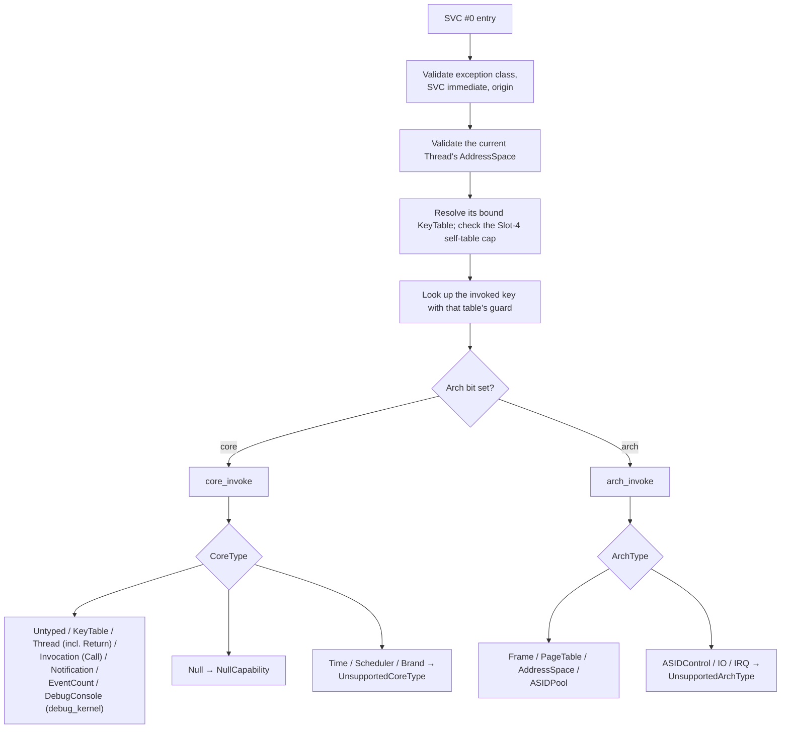

# Object types

User-facing reference for every object kind in the Vesper capability catalogue,
one document per kind. Each document follows the same structure: **name**,
**purpose**, **user-level visible operations**, **kernel-level implementation
details**, **sidenotes** and **TODOs**. The documents describe the system as
it is now; history and rationale live in the contract and the plan.

Contract sources: [`doc/nucleus_capabilities.md`](../nucleus_capabilities.md)
(design contracts and decision register), [`doc/lifetime-and-authority.md`](../lifetime-and-authority.md)
(lifetime/authority semantics), [`doc/capabilities_implementation_plan.md`](../capabilities_implementation_plan.md)
(slice plan and validation status).

## Wire encoding

The wire object type is one byte. Bit 7 selects the category; bits 6–0 hold the
category-local index.

- Core: `wire_type = core_index`, range `0x00..=0x7f`.
- Architecture: `wire_type = 0x80 | arch_index`, range `0x80..=0xff`.

Unknown and reserved indices fail explicitly with a defined error; a reserved
ID never advertises implementation support.

## Catalogue

### Core kinds (`core/`)

| Kind | Wire | Document | Status |
|---|---:|---|---|
| Null | `0x00` | [null.md](core/null.md) | Active (always rejected) |
| Untyped | `0x01` | [untyped.md](core/untyped.md) | Retype active |
| KeyTable | `0x02` | [key_table.md](core/key_table.md) | CopyDerive/Move/Delete active; Revoke rejected |
| Thread | `0x03` | [thread.md](core/thread.md) | Return (on `CurrentReturnOnly`) and Retire active; Grant/Suspend/Resume rejected |
| Time | `0x04` | [time.md](core/time.md) | Excluded sketch |
| Scheduler | `0x05` | [scheduler.md](core/scheduler.md) | Not implemented |
| Brand | `0x06` | [brand.md](core/brand.md) | Not implemented (IRQ/upcall work) |
| Invocation | `0x07` | [invocation.md](core/invocation.md) | Call active (PPC migration) |
| Notification | `0x08` | [notification.md](core/notification.md) | Signal/Wait/Poll active |
| EventCount | `0x09` | [event_count.md](core/event_count.md) | Advance/Await/Read active |
| DebugConsole | `0x7f` | [debug_console.md](core/debug_console.md) | Write active (`debug_kernel` only) |

IDs 10–126 are reserved. There is no `Buffer` kind (a userspace construct over
Frame capabilities) and no `Domain` kind (execution is the core `Thread`; the
protection context is the arch `AddressSpace`).

### Architecture kinds (`arch/`)

| Kind | Wire | Document | Status (AArch64) |
|---|---:|---|---|
| Frame | `0x80` | [frame.md](arch/frame.md) | Map/Unmap/GetAddress active |
| PageTable | `0x81` | [page_table.md](arch/page_table.md) | Map/Unmap active |
| AddressSpace | `0x82` | [address_space.md](arch/address_space.md) | Activate/Retire/CreateInvocation active |
| ASIDPool | `0x83` | [asid_pool.md](arch/asid_pool.md) | Assign active (boot pool only) |
| ASIDControl | `0x84` | [asid_control.md](arch/asid_control.md) | Reserved |
| IOSpace | `0x85` | [io_space.md](arch/io_space.md) | Deferred |
| IOPort | `0x86` | [io_port.md](arch/io_port.md) | x86-only; unsupported on AArch64 |
| IRQHandler | `0x87` | [irq_handler.md](arch/irq_handler.md) | Deferred |
| IRQControl | `0x88` | [irq_control.md](arch/irq_control.md) | Deferred |

Indices 9–127 are reserved. A registered ID (for example `IOPort`) is not
supported on a target merely because it is defined.

## Invocation model

Every operation is one `SVC #0` capability invocation:

| Direction | Registers | Meaning |
|---|---|---|
| In | `x0` | Packed caller-local key (incarnation in bits 63–32, guard + slot in bits 31–0) |
| In | `x1` | Operation number |
| In | `x2..x7` | Six operation arguments |
| Out | `x0` | Status; zero is success |
| Out | `x1`, `x2` | Two result words (or error details) |

Argument words an operation does not use are sent as zero and rejected when
nonzero, unless the operation says otherwise (`Thread.Return` ignores
`x4..x7`; `Invocation.Call` also reads `x9`).

An ordinary invocation writes only `x0..x2`: `x3..x30`, SP and NZCV come back
unchanged, whether it succeeds, fails, or blocks and resumes later. PPC Call and
Return have their own register contract (see [Invocation](core/invocation.md)).

```mermaid
flowchart TD
    A["SVC #0 entry"] --> B["Validate exception class,<br/>SVC immediate, origin"]
    B --> AS["Validate the current Thread's AddressSpace"]
    AS --> KT["Resolve its bound KeyTable; check the Slot-4 self-table cap"]
    KT --> C["Look up the invoked key with that table's guard"]
    C --> D{"Arch bit set?"}
    D -- "core" --> E["core_invoke"]
    D -- "arch" --> F["arch_invoke"]
    E --> G{"CoreType"}
    G --> H["Untyped / KeyTable / Thread (incl. Return) /<br/>Invocation (Call) / Notification /<br/>EventCount / DebugConsole (debug_kernel)"]
    G --> I["Null → NullCapability"]
    G --> J["Time / Scheduler / Brand →<br/>UnsupportedCoreType"]
    F --> K{"ArchType"}
    K --> L["Frame / PageTable / AddressSpace /<br/>ASIDPool"]
    K --> M["ASIDControl / IO / IRQ →<br/>UnsupportedArchType"]
```

**Blocking and context switches.** Blocking operations never return a
"blocked" status: the caller's state is saved in its Thread, the next runnable
Thread is selected, and the waiter later resumes with its terminal result.
`AddressSpace.Activate`, scheduling, and PPC `Invocation.Call` /
`Thread.Return` all change the installed translation context the same way:
the handler validates and prepares the target root and ASID, and the SVC entry
installs `TTBR0_EL1` only after object guards and the kernel lock are
released, then returns through `ERET` on the single per-core kernel stack.
Threads run either as trusted `EL1t` on `SP_EL0` (the test builders) or
unprivileged at EL0; both enter the kernel through the same SVC path. A
non-SVC exception from EL0 is a fault, delivered to the faulting
`AddressSpace`'s fault handler on the faulting Thread (see
[Thread: fault delivery](core/thread.md#fault-delivery)); a fault in trusted
`EL1t` code halts the kernel.
