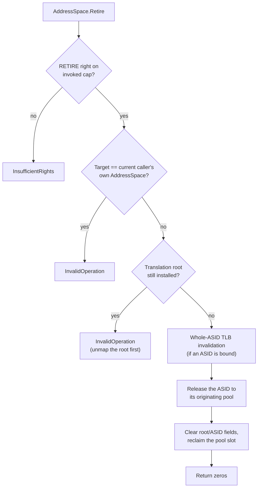

# AddressSpace

| | |
|---|---|
| Wire type | `0x82` (arch index 2) |
| Pool | `PoolTag::AddressSpace` (pool-backed kernel object; boot-carved) |
| Status | Active: `Activate` (translation-context installation) and `Retire` (teardown) |

## Purpose

An `AddressSpace` is the protection/mapping-context boundary — Vesper's
equivalent of seL4's VSpace (which is arch-side there too). It holds the
translation root and the bound ASID: everything that makes a hardware
translation context. It was created by the 2026-09-21 Domain split: the
renamed `VSpace` kind, activated as the object that formerly was the
Domain's mapping-context half. A [`Thread`](../core/thread.md) executes in
exactly one AddressSpace and references it through a checked pool identity.
Sharing across protection boundaries uses frame capabilities mapped into
each participant's own AddressSpace (distinct PTEs); sharing a translation
context would merge protection boundaries.

## User-level visible operations

| Op | Name | Wire schema (`x2..x7`) | Authority | Success result |
|---|---|---|---|---|
| `0` | Activate | no arguments (all zero) | `MAP` on the invoked AddressSpace | zeros; installs the bound translation root + ASID into the current hardware translation context (`TTBR0_EL1`) |
| `1` | Retire | no arguments (all zero) | `RETIRE` (`0x20`) on the invoked AddressSpace | zeros; tears down the invoked AddressSpace |

### Activate (selected 2026-09-15 as `Domain.Activate`; moved 2026-09-21)

Installs the invoked AddressSpace's bound translation root into the current
hardware translation context. Preconditions: a translation root is installed
*and* an ASID is bound (`NotMapped` if either is missing); until Thread
scheduling exists, **only the current caller's own AddressSpace may be
activated** (`InvalidOperation` otherwise). Installation is idempotent for
the same context. This is the translation-context step of activation only —
full Thread Start/Suspend/Resume (initialized execution contexts, execution
budget, EL0 entry) remains Phase 7 work.

### Retire (selected 2026-09-21)

Tears down the invoked AddressSpace:

The current caller's own AddressSpace may not be retired: the invocation
must return to a surviving caller. A translation root must not still be
installed: the root is torn down first through the empty-table-gated
`PageTable.Unmap` path. Threads still referencing the retired AddressSpace
fail generation validation on their next resolution (the stale-identity
rule).

## Kernel-level implementation details

- Pool-backed via `ArchPools::address_spaces`; capabilities store a checked
  `ObjectId`, resolved through the guarded `Access` context. The pool is
  boot-carved (Kickstart allocates the boot AddressSpace and fixture
  address spaces); the kind is not Retype-creatable yet.
- Kernel-private fields (`kernel/nucleus/src/objects/arch/address_space.rs`,
  behind the `AddressSpaceObject` trait): `translation_root` (physical
  address of the installed root PageTable) and `asid` (the bound hardware
  ASID).
- `AddressSpace.Retire` releases the bound ASID back to its originating pool
  (the boot pool, index 0, is the only pool today) after the whole-ASID
  invalidation — closing the ASID-release gap recorded under D6.
  Hardware-safe ASID reuse and multi-pool partitioning remain open.
- `PageTable.Map` (root), `Frame.Map`, and `ASIDPool.Assign` all target an
  AddressSpace capability with `MAP` authority — one consistent
  mapping-context permission across the mapping family.
- Retype cannot create an AddressSpace (`InvalidObjectType`): bootstrap
  grants are the initial source of AddressSpace capabilities.

## Sidenotes

- `Activate` requires `MAP` — the same right as root installation, frame
  mapping, and ASID binding — making "authority over the mapping context"
  one consistent permission across the mapping family.
- A caller that keeps executing under the activated context must itself be
  mapped (executable) in the AddressSpace's tables — the bootstrap caller
  maps its own image and stack as frames with the `EXECUTE` right.
- seL4 on ARM has no distinct VSpace *kind* (the root is a top-level
  PageTable); Vesper's explicit AddressSpace object holding the root + ASID
  is a deliberate, cleaner model.

## TODOs

- Hardware-safe ASID reuse and partitioning the 16-bit ASID space across
  multiple pools — D6 (the `ASIDControl` kind is the eventual home).
- Multiple threads per address space — Phase 7 scheduling work.
- Retype-creatable address spaces (needs a creation contract).

## Cross-reference: implementation vs. desired capabilities (🧠 Vesper vault)

- `Vesper.md` (vault): "**single address space** … pointer transparency
  between processes" — **major divergence**: the selected D1 architecture
  gives each AddressSpace its own translation context; cross-context sharing
  is via frame capabilities mapped as distinct PTEs, not a global SAS. The
  vault note itself anticipates this: "single-address-space could be
  implemented by mapping frames to same virtual addresses in different
  processes … Vesper therefore does not dictate specific address space
  arrangements."
- `Memory.md` (vault): "A passive address space … in which arbitrary threads
  may execute — a Protection Domain (PD)" (Mach/Mungi notes) — **structural
  alignment**: the 2026-09-21 split makes the AddressSpace exactly the
  passive protection context; "arbitrary threads" (multiple threads per
  context) remains future work.
- `Prototype.md` (vault): no VSpace kind in the sketch — superseded by the
  activated AddressSpace kind.
