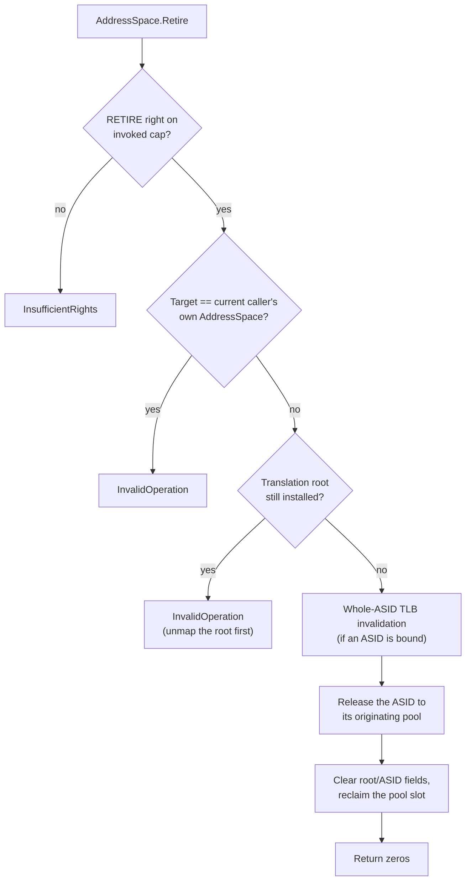

# AddressSpace

| | |
|---|---|
| Wire type | `0x82` (arch index 2) |
| Pool | `PoolTag::AddressSpace` (pool-backed kernel object; boot-carved) |
| Status | Immutable KeyTable binding/current-AS caller lookup and checked fixture root/ASID switching active; `Activate` installs after guards end; `Retire` and six-input `CreateInvocation` with validated extent/headroom and status 32 diagnostics active; PPC Call/Return is not implemented |

## Purpose

An `AddressSpace` is the protection/mapping-context boundary — Vesper's
equivalent of seL4's VSpace (which is arch-side there too). It holds the
translation root and the bound ASID: everything that makes a hardware
translation context. A [`Thread`](../core/thread.md) executes in
exactly one AddressSpace and references it through a checked pool identity.
Each AddressSpace has one associated keytable shared by all its Threads.
The association is established during AddressSpace construction/provisioning,
not by the first Thread created there. The backing is provisioned by the libOS;
association setup does not allocate runtime kernel memory. The immutable
binding is issued from initialized, stable kernel-private carved storage;
a public runtime creation schema remains unspecified.
Sharing across protection boundaries uses frame capabilities mapped into
each participant's own AddressSpace (distinct PTEs); sharing a translation
context would merge protection boundaries.

## User-level visible operations

| Op | Name | Wire schema (`x2..x7`) | Authority | Success result |
|---|---|---|---|---|
| `0` | Activate | no arguments (all zero) | `MAP` on the invoked AddressSpace | zeros; installs the bound translation root + ASID into the current hardware translation context (`TTBR0_EL1`) |
| `1` | Retire | no arguments (all zero) | `RETIRE` (`0x20`) on the invoked AddressSpace | zeros; tears down the invoked AddressSpace |
| `3` | CreateInvocation | `x2` nonzero function address, `x3` destination KeyTable capability, `x4` vacant destination slot index, `x5` stack base, `x6` exclusive stack end, `x7` positive minimum headroom as a direct `u64` byte count; byte extent `[base, end)`, reject `base >= end`; active six-input schema | `GRANT` on the invoked AddressSpace; `INSTALL` on the destination KeyTable | Destination-table-local Invocation key with `CALL` authority in result `x1`, zero in `x2`; a zero function address is rejected with `InvalidPointer` |

### Activate

Installs the invoked AddressSpace's bound translation root into the current
hardware translation context. Preconditions: a translation root is installed
*and* an ASID is bound (`NotMapped` if either is missing). **Only the current
caller's own AddressSpace may be activated** (`InvalidOperation` otherwise).
The bounded wait/resume fixture switches selected Threads' contexts
separately; `Activate` neither changes the caller's logical AddressSpace nor
exposes public Thread control. Installation is idempotent for the same context.
This is the translation-context step of activation only — full Thread
Start/Suspend/Resume (initialized execution contexts, execution budget, EL0
entry) remains Phase 7 work.

The handler returns checked translation metadata through the internal
`InvokeOutcome::Activate`, without writing TTBR0 or reporting completion.
Syscall entry installs the root/ASID after object/Access guards and the kernel
lock end, emits `✅ AddressSpace::Activate()` after installation, then returns
zeros. This internal deferred outcome adds no wire status or ABI.

The shared preparation helper validates AddressSpace incarnation before
reading root/ASID metadata. The supported AArch64 profile is L0-rooted,
four-level, 48-bit TTBR0 translation with `T0SZ=16`, `EPD0=0` (walks enabled),
`A1=0` (TTBR0 supplies the ASID), a 4 KiB granule, and no DS/LPA2. The root must
be 4 KiB-aligned and fit the configured PA width, which must not exceed the
hardware PA width; the current encoding supports at most 48-bit PA. ASIDs
must be nonzero and fit the configured width: 1–255 in 8-bit mode, or 1–65535
in 16-bit mode only when hardware supports that mode. Invalid/stale AS identity
is `InvalidDomain`, missing root/ASID is `NotMapped`, an unencodable root is
`InvalidPointer`, and unsupported profile or PA/ASID configuration is
`InvalidOperation`. These installation checks do not reconcile the boot
pool's full issuance range or complete ASID reuse safety.

Prepared metadata is not a lifetime pin or authority token. Immediate
installation relies on the serialized single-core, masked, non-reentrant trap
interval preventing retirement, unmapping, ASID release/reuse, or another
scheduling transaction between preparation and installation. Later or
asynchronous use requires fresh validation.

### Retire

Tears down the invoked AddressSpace:

```mermaid
flowchart TD
    A["AddressSpace.Retire"] --> B{"RETIRE right on<br/>invoked cap?"}
    B -- "no" --> E1["InsufficientRights"]
    B -- "yes" --> C{"Target == current caller's<br/>own AddressSpace?"}
    C -- "yes" --> E2["InvalidOperation"]
    C -- "no" --> D{"Translation root<br/>still installed?"}
    D -- "yes" --> E3["InvalidOperation<br/>(unmap the root first)"]
    D -- "no" --> F["Whole-ASID TLB invalidation<br/>(if an ASID is bound)"]
    F --> G["Release the ASID to<br/>its originating pool"]
    G --> H["Clear root/ASID fields,<br/>reclaim the pool slot"]
    H --> OK["Return zeros"]
```

The current caller's own AddressSpace may not be retired: the invocation
must return to a surviving caller. A translation root must not still be
installed: the root is torn down first through the empty-table-gated
`PageTable.Unmap` path. Threads still referencing the retired AddressSpace
fail generation validation on their next resolution (the stale-identity
rule).

## Kernel-level implementation details

- Pool-backed via `ArchPools::address_spaces`; capabilities store a checked
  `ObjectId`, resolved through the guarded `Access` context. The pool is
  boot-carved (Kickstart allocates the boot AddressSpace and fixture
  address spaces); the kind is not Retype-creatable yet.
- Kernel-private fields (`kernel/nucleus/src/objects/arch/address_space.rs`,
  behind the `AddressSpaceObject` trait): `translation_root` (physical
  address of the installed root PageTable) and `asid` (the bound hardware
  ASID), plus a private immutable `KeyTableBinding` holding the issued
  nonzero carved address and capacity exponent. `ArchObjects::new_address_space`
  requires this binding; there is no rebinding setter. Binding issuance is
  unsafe and requires all retained copies' backing to remain private, stable,
  and neither reclaimed nor reinitialized. Caller dispatch validates this
  AddressSpace's incarnation before dereferencing its table and checks SELF's
  address/capacity against the binding/header. Retirement does not reclaim the
  table carve; future reclaimable identity/backing enforcement remains D3 work.
- `AddressSpace.Retire` releases the bound ASID back to its originating pool
  (the boot pool, index 0, is the only pool today) after the whole-ASID
  invalidation — closing the ASID-release gap recorded under D6.
  Hardware-safe ASID reuse, reconciliation of the configured hardware ASID
  width with the 512-entry boot pool, and multi-pool partitioning remain open.
- `PageTable.Map` (root), `Frame.Map`, and `ASIDPool.Assign` all target an
  AddressSpace capability with `MAP` authority — one consistent
  mapping-context permission across the mapping family. TTBR0 leaves set
  `nG`, so their cached translations are ASID-tagged; TTBR1's invariant kernel
  mappings remain global. The trusted source/Bounce wait/resume fixture
  switches independently provisioned roots with ASIDs 1 and 2. Target metadata
  is prepared before park/select commitment; installation follows after
  guards and the kernel lock end. Rejected preparation preserves Thread
  contexts, pending records, current selection, and the runnable FIFO, but
  does not undo dispatch's already admitted wait. The fixture treats an
  impossible preparation failure as an invariant failure, not wait completion
  or a recovery ABI.
- Active construction: `AddressSpace.CreateInvocation` (op `3`) creates an Invocation for
  a supplied function address and target stack extent, then installs it into a
  destination KeyTable. The extent is nonempty and wholly within the target
  AddressSpace's user virtual-address range. AArch64 supplies
  `ArchObjects::USER_VA_END = 1 << page_table::VA_BITS`, with `VA_BITS = 48`:
  base must be below `1 << 48`, and exclusive end may equal that ceiling.
  This is the low user interval, not the trusted Bounce fixture's high
  direct-map execution-stack range. Its encoding is `x5` base and
  `x6` exclusive end: byte extent `[base, end)`, rejecting `base >= end`.
  The target component/export setup also supplies positive minimum downward
  headroom `M` as a direct `u64` byte count in `x7`, not a size exponent.
  Require `base`, `end`, and positive `M` to each be multiples of 16 bytes,
  without rounding or requiring page-aligned boundaries. Sub-page extents
  and non-power-of-two sizes remain supported. Construction rejects
  `M > end - base` before capability installation, preserving destination-slot
  state and authority; check `base < end` before subtracting. Equality is valid
  and leaves only `SP = end` satisfying the Call-time stack predicate.
  Stack-validation failures use `InvalidStack`: `x1` offending `u64` value,
  `x2` field-specific typed reason identifying failure and field, without
  operand-index packing. Base/end/minimum-headroom/SP alignment failures have
  distinct reasons. The [Invocation diagnostic catalogue](../core/invocation.md#stack-validation-diagnostics)
  defines the selected conditions and submitted values: `ExtentEmpty` and
  `ExtentInverted` report `end`; boundary range/alignment failures report that
  boundary; minimum-headroom failures report `M`; SP failures report `SP`.
  Lower/upper SP-bound failures share `SpOutOfRange`; relational failures do
  not report computed differences. The exclusive end may equal the target
  user range's exclusive upper boundary. The diagnostic catalogue assigns
  complete `x2` IDs 1–12 (`ExtentEmpty` 1 through `SpInsufficientHeadroom` 12),
  with 0 invalid; these are not validation order. The wire status is
  `INVALID_STACK = 32` in `x0`. [Stack-predicate order](../core/invocation.md#stack-validation-order)
  is extent ordering, base/end user range, base/end alignment, zero minimum,
  minimum alignment, then minimum fit; Call checks SP alignment, SP bounds,
  then headroom. Stop at the first failure, checking ordering/bounds before
  subtraction. [Admission-stage order](../core/invocation.md#admission-stage-order)
  is capability/authority and live target identity first, then nonzero function
  address, ordered stack checks, destination-slot bounds/vacancy/installability,
  and installation. Call checks capability/authority and live target identity,
  then SP, translation readiness/encodability, depth capacity, and push/commit.
  Malformed values precede remaining destination/readiness/depth failures, but
  not authority/stale target failures. Every check is pre-commit.
  Status 32, root-exported `InvalidStackReason`, lossless full-width decoding,
  and this constructor admission order are implemented. Call admission order
  remains selected and unimplemented. The target chooses the extent and
  minimum to match its stack-pool and concurrency policy.
  The installed capability carries the extent and minimum headroom, with
  only `CALL` authority; no fixed 4 KiB floor is selected. The
  operation requires `GRANT` on the invoked AddressSpace and `INSTALL` on the
  destination KeyTable; success returns the destination-table-local key in `x1`,
  zero in `x2`, and emits `✅ AddressSpace::CreateInvocation()`; failure leaves
  state and authority unchanged. The function address is stored as supplied,
  with no construction-time mapping/executable validation. Its payload field is
  mandatory `NonZero<u64>`: a zero address is rejected with `InvalidPointer`.
  Invocation is Call-only `0`, with no optional entry or Return form.
  [`Thread.Return`](../core/thread.md#return) `0` uses the separate
  `CurrentReturnOnly` Thread selector at `KeySlot::THREAD_RETURN` Slot(1),
  not a named Thread or an AddressSpace/function target. Its ordinary
  current-AS-table lookup and guard/incarnation/presence checks remain mandatory;
  the AS-shared sentinel acts only on the invoking Thread. AddressSpace
  provisioning (`KeyTable::bind_address_space`) installs it at Slot(1) before
  the AddressSpace can be activated. Dispatched `Invocation.Call` admission
  applies these checks to the saved x9 SP through
  `InvocationStackExtent::validate_sp`. On `Invocation.Call`,
  require 16-byte-aligned `SP`, `base < SP <= end`, and `SP - base >= M` for
  an agreed positive minimum downward headroom. `SP = end` is allowed, but
  `SP = base` and insufficient headroom are rejected. `M` is the requirement
  stored in the invoked Invocation. An invalid SP is rejected before
  the invocation-stack push or context switch, preserving
  the source context and invocation stack, with `InvalidStack` carrying the
  offending `u64` value in `x1` and a field-specific typed reason in `x2`.
  Its wire status is `INVALID_STACK = 32`.
  This checks the SP
  against the declared extent, not the page-table mappings or writability of the
  whole stack. The Call ABI must carry that SP separately from the target
  function's argument registers; target-entry `x0` and `x1` are two leading
  dummy arguments ignored by the target, while the six real `u64` inputs
  remain unchanged in `x2..x7`, without a register shuffle. None carries stack
  metadata. The working SP transport is provisionally `x9`, supplied by the Call wrapper and read from saved `frame.gpr[9]` by the kernel, not live x9 after Rust entry. Keep the register unfrozen until end-to-end Call/Return confirms feasibility. The Call raw-SVC compiler declarations use x9 as an input with discarded output, alongside argument x3..x7 input/discarded outputs, x0..x2 input/results and x8/x10..x18 clobbers, with x18 selected as ordinary caller-volatile scratch and no kernel continuation field/reserved platform role; FP/SIMD is prohibited/trapped for the current integer-only slice (effective trap enforcement/validation pending); [non-payload GPR/NZCV scrubbing](../core/invocation.md#non-payload-gpr-and-condition-flag-exposure) is selected, not implemented or validated. No wrapper or end-to-end validation is claimed. Capability/authority
  failures retain their existing errors; stack validation does not replace
  zero-function `InvalidPointer`, depth-exhaustion `NestingDepth`, or Return
  fault delivery.
- PPC migration-frame contract: on successful Call, first save the source
  continuation including x19..x30 and context, and consume provisional target
  SP from saved `frame.gpr[9]`. Retain real arguments x2..x7, zero dummy x0/x1
  and x8..x30, clear target NZCV, inherit source saved SPSR mode/masks/other
    non-NZCV controls, and install target execution SP/PC. Use saved admitted
    source status, not live kernel-handler PSTATE; EL1t stays EL1t and EL0 stays
    EL0. No source
  dummy-zeroing is required. Successful Return captures r0/r1 before rewriting
  the frame, delivers x0=SUCCESS/x1=r0/x2=r1, zeroes x3..x18, and restores exact
  saved source x19..x30, AddressSpace/SP/PC/origin and raw SPSR including NZCV;
  the restored AddressSpace selects its associated keytable. Scrubbing does
  not apply to recoverable local Call/Return rejection and leaves existing
  preservation/error contracts unchanged. Ignored Return x4..x7 need no
  userspace initialization or zeroing despite resumed-frame scrubbing. No extra
  continuation fields or runtime allocation are required; projected record/array
  sizes remain 144 B/2304 B, unmeasured. GPR/NZCV disclosure policy and
  saved-source status inheritance are selected; TLS, debug state and complete
  architectural-state isolation remain open. Scrubbing and status inheritance
  are not implemented or validated. x9 remains provisional and the
  native body-result convention experimental; trusted EL1 fixture execution
  does not prove hostile-EL0 confinement.
- Implementation status: `AddressSpace.CreateInvocation` stores a mandatory
  `NonZero<u64>` function address, target AddressSpace identity and immutable
  validated `InvocationStackExtent` in its 40 B CALL-only payload; zero
  remains `InvalidPointer`. The extent's private fields and read-only getters
  live in `objects/invocation.rs`; validation proves only numeric bounds and
  headroom, not mappings/writability or private stack ownership. `ThreadSelector` and the kernel-constructed
  `CurrentReturnOnly` sentinel, installed at Slot(1) by AddressSpace
  provisioning, are implemented. Call and `Thread.Return` are dispatched with
  same-Thread PPC migration, with userspace wrappers and the export adapter. Return-form propagation
  and Call-only Invocation distribution remain independently deferred, without
  broader named-Thread derivation/transfer approval. The active
  `AddressSpaceKey::create_invocation` wrapper appends `stack_base`,
  `stack_end`, and `minimum_headroom` after function/destination/slot and
  uses ordinary `protected_call6`, forwarding every operand unchanged.
  Kernel validation owns the numeric invariants and installs the capability
  only after all admission checks. `KeyPayload` is 40 B and `KeyEntry` is
  64 B/alignment 32; type-derived KeyTable carves, accounting and fixture
  backing include that stride. AddressSpace-to-table binding and lookup
  are active. PPC `Invocation.Call` is not implemented;
  invocation-time fault behavior remains open. Source and Bounce have distinct
  AddressSpace/table identities and independently provisioned roots with ASIDs
  1 and 2. Source activation precedes the first handoff; capability lookup
  resolves each selected Thread's current AddressSpace's table. This is a
  trusted two-Thread EL1t fixture, not same-Thread PPC migration or protected
  EL0 confinement.
- Retype cannot create an AddressSpace (`InvalidObjectType`): bootstrap
  grants are the initial source of AddressSpace capabilities.

## Sidenotes

- `Activate` requires `MAP` — the same right as root installation, frame
  mapping, and ASID binding — making "authority over the mapping context"
  one consistent permission across the mapping family.
- A caller must have its executable image and execution stack available under
  the installed context. The fixture maps the complete retained linked image
  into both low roots with `EXECUTE` authority and maps the retained source
  stack read/write, execute-never. Bounce's accounted SP_EL0 execution stack
  uses the invariant high direct map; traps use the separate shared high
  SP_EL1 stack. Content-preserving bootstrap Frame grants cover occupied,
  accounted retained image/stack pages; Retype is never applied to live bytes.
- seL4 on ARM has no distinct VSpace *kind* (the root is a top-level
  PageTable); Vesper's explicit AddressSpace object holding the root + ASID
  is a deliberate, cleaner model.

## TODOs

- Hardware-safe ASID reuse and partitioning the 16-bit ASID space across
  multiple pools — D6 (the `ASIDControl` kind is the eventual home).
- Multiple threads per address space — Phase 7 scheduling work.
- Retype-creatable address spaces (needs a creation contract).

## Cross-reference: implementation vs. desired capabilities (🧠 Vesper vault)

- `Vesper.md` (vault): "**single address space** … pointer transparency
  between processes" — **major divergence**: the selected D1 architecture
  gives each AddressSpace its own translation context; cross-context sharing
  is via frame capabilities mapped as distinct PTEs, not a global SAS. The
  vault note itself anticipates this: "single-address-space could be
  implemented by mapping frames to same virtual addresses in different
  processes … Vesper therefore does not dictate specific address space
  arrangements."
- `Memory.md` (vault): "A passive address space … in which arbitrary threads
  may execute — a Protection Domain (PD)" (Mach/Mungi notes) — **structural
  alignment**: the AddressSpace is exactly the passive protection context;
  "arbitrary threads" (multiple threads per context) remains future work.
- `Prototype.md` (vault): no VSpace kind in the sketch — superseded by the
  activated AddressSpace kind.
