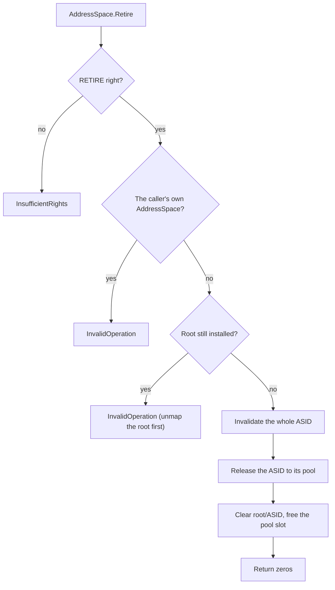

# AddressSpace

| | |
|---|---|
| Wire type | `0x82` (arch index 2) |
| Pool | `PoolTag::AddressSpace` (pool-backed; allocated by the bootstrap builder) |
| Status | Active: Activate, Retire, CreateInvocation |

## Purpose

An `AddressSpace` is the protection boundary and hardware translation context
— Vesper's equivalent of seL4's VSpace. It holds the translation root, the
bound ASID and the binding to its one capability table, which all Threads
executing in it share. A [`Thread`](../core/thread.md) executes in one
`AddressSpace` at a time; PPC moves a Thread into a target `AddressSpace` and
back. Sharing between `AddressSpace`s maps the same Frames into each one
(distinct PTEs); two parties never share a translation context.

## User-level visible operations

| Op | Name | Wire schema (`x2..x7`) | Authority | Success result |
|---|---|---|---|---|
| `0` | Activate | none | `MAP` | zeros; installs this root and ASID into `TTBR0_EL1` |
| `1` | Retire | none | `RETIRE` | zeros; tears the `AddressSpace` down |
| `2` | — | unassigned | — | `InvalidOperation` |
| `3` | CreateInvocation | `x2` entry address, `x3` destination-table key, `x4` vacant destination slot, `x5` stack base, `x6` stack end, `x7` minimum headroom (bytes) | `GRANT` on this `AddressSpace`, `INSTALL` on the destination | Destination-local `Invocation` key (`CALL` only) in `x1`, zero in `x2` |

### Activate

Requires an installed root *and* a bound ASID (`NotMapped` otherwise), and
only the caller's own `AddressSpace` may be activated (`InvalidOperation`).
It is idempotent. The handler returns checked metadata through the internal
`InvokeOutcome::Activate`; the SVC entry writes `TTBR0_EL1` after guards and
the kernel lock are released, then traces `✅ AddressSpace::Activate()`.

Supported AArch64 profile: L0-rooted, four-level, 48-bit TTBR0 walks
(`T0SZ=16`, `EPD0=0`, `A1=0`, 4 KiB granule, no DS/LPA2). The root must be
4 KiB aligned and fit the configured PA width (at most 48 bits, not beyond the
hardware's). ASIDs are nonzero and fit the configured width (1–255, or 1–65535
where 16-bit ASIDs are supported).

| Failure | Error |
|---|---|
| Stale or invalid `AddressSpace` | `InvalidDomain` |
| No root or no ASID | `NotMapped` |
| Root not encodable | `InvalidPointer` |
| Unsupported profile or PA/ASID configuration | `InvalidOperation` |

### Retire

```mermaid
flowchart TD
    A["AddressSpace.Retire"] --> B{"RETIRE right?"}
    B -- "no" --> E1["InsufficientRights"]
    B -- "yes" --> C{"The caller's own AddressSpace?"}
    C -- "yes" --> E2["InvalidOperation"]
    C -- "no" --> D{"Root still installed?"}
    D -- "yes" --> E3["InvalidOperation (unmap the root first)"]
    D -- "no" --> F["Invalidate the whole ASID"]
    F --> G["Release the ASID to its pool"]
    G --> H["Clear root/ASID, free the pool slot"]
    H --> OK["Return zeros"]
```

Threads still referencing a retired `AddressSpace` fail validation on their
next resolution. The table carve is not reclaimed.

### CreateInvocation

Creates an [`Invocation`](../core/invocation.md) for an entry point in this
`AddressSpace` and installs it into the destination table. The entry address
must be nonzero (`InvalidPointer`) and is stored as supplied. The stack extent
and headroom rules, the `InvalidStack` (status 32) reasons and the admission
order are specified in [Invocation](../core/invocation.md#stack-extent-and-sp).
Every failure leaves the destination slot and all authority unchanged.

## Kernel-level implementation details

- Pool-backed via `ArchPools::address_spaces`; capabilities hold a checked
  `ObjectId`.
- Kernel-private state (`kernel/nucleus/src/objects/arch/address_space.rs`):
  `translation_root`, `asid`, and an immutable `KeyTableBinding` (carve address
  and capacity exponent). `ArchObjects::new_address_space` requires the
  binding, which only `KeyTable::bind_address_space` issues — installing the
  `Thread.Return` sentinel at Slot 1 as it does. There is no rebinding.
- Caller dispatch validates the current Thread's `AddressSpace` before using
  its table, and checks the Slot-4 self-table capability against the binding.
- Retire releases the ASID to its originating pool (the boot pool is the only
  one) after the whole-ASID invalidation.
- TTBR0 leaves are non-global (`nG`), so cached translations are ASID-tagged;
  TTBR1's kernel mappings are global.
- Scheduling a Thread validates its `AddressSpace`, root and ASID before
  committing; the translation is installed after guards and the lock are
  released.
- `Untyped.Retype` cannot create an `AddressSpace` (`InvalidObjectType`); the
  bootstrap builder allocates them.

## Sidenotes

- `Activate`, root `PageTable.Map`, `Frame.Map` and `ASIDPool.Assign` all
  require `MAP` on the `AddressSpace`: one permission for the mapping family.
- An `AddressSpace` must map whatever its Threads execute and touch. The test
  kernels map the retained image (the same physical pages, RW+X) into every
  root, the low boot stack into the boot root, and party-private regions into
  one root each; high direct-map execution stacks and the shared trap stack
  are valid in every root.
- seL4 on ARM has no distinct VSpace kind; Vesper's explicit `AddressSpace`
  holding root and ASID is deliberate.

## TODOs

- An `AddressSpace` creation ABI.
- EL0 execution of the Threads in an `AddressSpace`.
- Hardware-safe ASID reuse and partitioning the ASID space across pools — D6
  (the eventual home of `ASIDControl`).
- Reclaiming table backing on retirement — D3.
