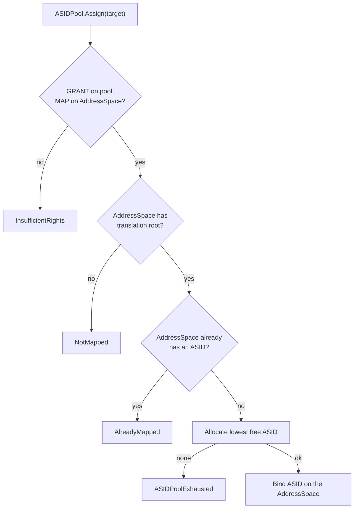

# ASIDPool

| | |
|---|---|
| Wire type | `0x83` (arch index 3) |
| Pool | `PoolTag::ASIDPool` (boot-provided; not Retype-creatable) |
| Status | Active: Assign (capability-protected ASID binding) |

## Purpose

An `ASIDPool` capability protects a slice of the hardware ASID (Address Space
ID) namespace: 512 ASIDs of the 16-bit hardware space, allocated from a
bitmap. ASIDs tag cached translations in the TLB; binding one to a AddressSpace's
translation root lets unmap paths withdraw exactly that AddressSpace's cached
translations. ASIDs are a hardware namespace, not memory-backed — memory
authority cannot mint them — so pools are **boot-provided, not
Retype-creatable**: Kickstart carves and initializes the boot pool
kernel-privately and installs its capability at `KeySlot::BOOT_ASID_POOL`.

## User-level visible operations

| Op | Name | Wire schema (`x2..x7`) | Authority | Success result |
|---|---|---|---|---|
| `0` | Assign | `x2` target AddressSpace key, `x3..x7` zero | `GRANT` on the invoked ASIDPool cap, `MAP` on the target AddressSpace cap | Allocated ASID in `x1`, zero in `x2` |

Preconditions: the target AddressSpace must have a translation root installed
(`NotMapped` otherwise) and no ASID yet (`AlreadyMapped` otherwise); pool
exhaustion is `ASIDPoolExhausted`. Allocation is the last failing step, so
every rejection leaves the pool and the AddressSpace unchanged.

## Kernel-level implementation details

- Object: `AArch64ASIDPool` (`kernel/nucleus/src/objects/arch/asid_pool.rs`)
  — an allocation bitmap (8 words × 64 bits = 512 ASIDs), with **ASID 0
  reserved** for the kernel's own boot translation context (TTBR0's ASID
  field is zero at boot), so the first grant is ASID 1.
- `AsidPoolObject::allocate` returns the lowest free ASID or `None`
  (`ASIDPoolExhausted`); binding is the API handler's commit step
  (`kernel/nucleus/src/api/arch/asid_pool.rs`): `domain.asid = Some(asid)`.
- The bound ASID is used by: `Frame.Unmap` (invalidate by virtual address
  under the owning AddressSpace's ASID), `PageTable.Unmap` of a root (invalidate
  the whole ASID), and `AddressSpace.Activate` (install `TTBR0_EL1` with the ASID
  in bits 63:48).
- The boot pool is the only pool today; partitioning the 16-bit space across
  multiple pools is future work recorded with the ASID contract.

## Sidenotes

- The `ASID` kind (wire `0x84`) stays reserved with no pool or handler:
  binding goes through `ASIDPool.Assign` directly (see [asid.md](asid.md)).
- ASID release is `AddressSpace.Retire` (selected 2026-09-21): the whole-ASID
  invalidation runs first, then the ASID returns to its originating pool.
  `Thread.Retire` deliberately leaves the AddressSpace untouched. Hardware-safe
  ASID reuse and multi-pool partitioning remain open (D6).

## TODOs

- ASID release and hardware-safe reuse rules — D6.
- Partitioning the 16-bit ASID space across multiple pools — D6.
- Whether any operation besides Assign is ever needed (e.g. query) — no
  contract selected.

## Cross-reference: implementation vs. desired capabilities (🧠 Vesper vault)

- `Memory.md` (vault): device frames "cannot be used in the **creation of an
  ASID pool**" — **mismatch in mechanism**: the vault note implies ASID pools
  are created from (untyped) memory by userspace, as in seL4; the selected
  and implemented model makes pools boot-provided only, because ASIDs are a
  hardware namespace that memory authority cannot mint. Review whether
  Retype-creatable pools are still desired; if so this is a contract change,
  not a gap to silently fill.
- `seL4 Capabilities.md` / `API/seL4 API.md` (vault): seL4's
  `seL4_ARM_ASIDControl`/`seL4_ARM_ASIDPool` two-level model — **partial
  divergence**: Vesper has no ASIDControl equivalent (no operation mints new
  pools); the boot pool is the sole issuer. The reserved `ASID` kind is the
  natural home for a future control capability if the seL4 model is adopted.
- `Prototype.md` (vault): `cap_asid_pool_cap = 5`, `cap_asid_control_cap = 11`
  — numbering superseded by the canonical arch baseline (pool = `0x83`);
  the sketch's ASID *control* kind maps to the reserved `ASID` kind.
