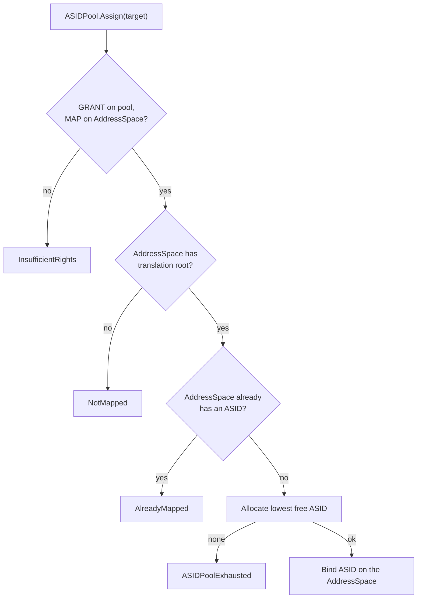

# ASIDPool

| | |
|---|---|
| Wire type | `0x83` (arch index 3) |
| Pool | `PoolTag::ASIDPool` (boot-provided; not Retype-creatable) |
| Status | Active: Assign (capability-protected ASID binding) |

## Purpose

An `ASIDPool` capability protects a slice of the hardware ASID namespace: 512
ASIDs, allocated from a bitmap. ASIDs tag non-global cached translations, so
binding one to an `AddressSpace` lets unmap paths withdraw exactly that
`AddressSpace`'s translations. ASIDs are a hardware namespace, not memory, so
memory authority cannot mint them: pools are **boot-provided, not
Retype-creatable**. Kickstart initializes the boot pool and installs its
capability at `KeySlot::BOOT_ASID_POOL`.

## User-level visible operations

| Op | Name | Wire schema (`x2..x7`) | Authority | Success result |
|---|---|---|---|---|
| `0` | Assign | `x2` target AddressSpace key, `x3..x7` zero | `GRANT` on the invoked ASIDPool cap, `MAP` on the target AddressSpace cap | Allocated ASID in `x1`, zero in `x2` |

Preconditions: the target AddressSpace must have a translation root installed
(`NotMapped` otherwise) and no ASID yet (`AlreadyMapped` otherwise); pool
exhaustion is `ASIDPoolExhausted`. Allocation is the last failing step, so
every rejection leaves the pool and the AddressSpace unchanged.

```mermaid
flowchart TD
    A["ASIDPool.Assign(target)"] --> B{"GRANT on pool,<br/>MAP on AddressSpace?"}
    B -- "no" --> E1["InsufficientRights"]
    B -- "yes" --> C{"AddressSpace has<br/>translation root?"}
    C -- "no" --> E2["NotMapped"]
    C -- "yes" --> D{"AddressSpace already<br/>has an ASID?"}
    D -- "yes" --> E3["AlreadyMapped"]
    D -- "no" --> F["Allocate lowest free ASID"]
    F -- "none" --> E4["ASIDPoolExhausted"]
    F -- "ok" --> G["Bind ASID on the AddressSpace"]
```

## Kernel-level implementation details

- Object: `AArch64ASIDPool` (`kernel/nucleus/src/objects/arch/asid_pool.rs`)
  — an allocation bitmap (8 words × 64 bits = 512 ASIDs), with **ASID 0
  reserved** for the kernel's own boot translation context (TTBR0's ASID
  field is zero at boot), so the first grant is ASID 1.
- `AsidPoolObject::allocate` returns the lowest free ASID or `None`
  (`ASIDPoolExhausted`); binding is the API handler's commit step
  (`kernel/nucleus/src/api/arch/asid_pool.rs`):
  `address_space.set_asid(Some(allocated))`.
- The bound ASID is used by `Frame.Unmap` (invalidate one VA under it), root
  `PageTable.Unmap` (invalidate the whole ASID), and every `TTBR0_EL1`
  installation (ASID in bits 63:48). Descriptor stores precede TLBI, and
  invalidation completes before further access or reuse.
- Installing a context requires a nonzero ASID within the configured width
  (1–255 in 8-bit mode; 1–65535 in 16-bit mode where supported), otherwise
  `InvalidOperation` — never a truncated alias. `Assign` allocates from the
  512-entry bitmap without that width check.
- The boot pool is the only pool.

## Sidenotes

- The `ASIDControl` kind (wire `0x84`) stays reserved with no pool or handler:
  binding goes through `ASIDPool.Assign` directly (see
  [asid_control.md](asid_control.md)).
- ASID release is `AddressSpace.Retire`: the whole-ASID
  invalidation runs first, then the ASID returns to its originating pool.
  `Thread.Retire` deliberately leaves the AddressSpace untouched. Hardware-safe
  ASID reuse and multi-pool partitioning remain open (D6).

## TODOs

- Hardware-safe reuse rules and hardware-width/pool-range reconciliation — D6.
- Partitioning the 16-bit ASID space across multiple pools — D6.
- Whether any operation besides Assign is ever needed (e.g. query) — no
  contract selected.
