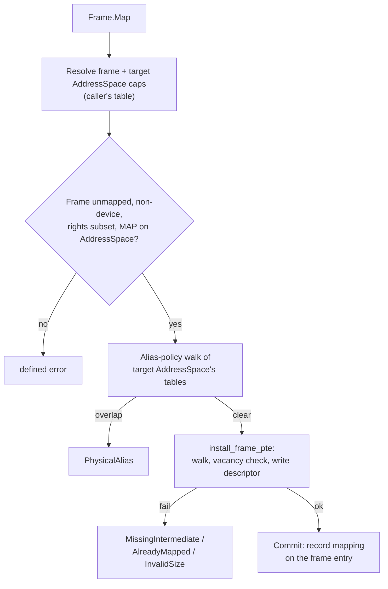

# Frame

| | |
|---|---|
| Wire type | `0x80` (arch index 0) |
| Pool | none — inline `FramePayload` in `KeyEntry` (the capability is the object) |
| Status | Active: Map/Unmap/GetAddress; Remap rejected with a defined error |

## Purpose

A `Frame` capability represents authority over a contiguous physical memory
region (`2^size_bits` bytes; AArch64 4 KiB-granule baseline: 12/21/30 bits =
4 KiB / 2 MiB / 1 GiB). Frames are the unit of memory mapping and sharing:
mapping a frame installs a real page/block descriptor in a target AddressSpace's
translation tables; sharing across protection boundaries is done by mapping
the same physical frame into each participant's own AddressSpace context as
distinct PTEs.

## User-level visible operations

| Op | Name | Wire schema (`x2..x7`) | Authority | Success result |
|---|---|---|---|---|
| `0` | Map | `x2` target AddressSpace key, `x3` virtual address, `x4` requested rights, `x5` attributes (only zero accepted), `x6..x7` zero | requested rights ⊆ frame rights, `READ` required, `MAP` on the target AddressSpace cap | zeros |
| `1` | Unmap | no arguments | (via the frame's recorded mapping) | zeros |
| `2` | GetAddress | no arguments | `GRANT` | physical base in `x1`, size in bytes in `x2` (client wrapper: `get_extent`) |
| `3` | Remap | — | — | `InvalidOperation` (origin-only remap authority open, D4/D6) |

### Map details

- **The explicit target-AddressSpace argument is bootstrap-era mechanism**: it lets
  an authorized builder populate an AddressSpace before its Thread
  can run; self-context mapping is the intended ordinary path once syscall
  caller identity exists.
- The virtual address must be inside the supported VA width (48-bit) and
  aligned to the frame size; the walk requires every intermediate table to be
  present (`MissingIntermediate` with the faulting address otherwise).
- **Permission ceiling**: the requested mask must be a subset of the frame
  capability's rights. `EXECUTE` (within the ceiling) clears PXN|UXN; without
  it every mapping stays execute-never. Interim AP semantics: `EXECUTE` +
  `WRITE` maps kernel-privilege RW+X (AP=00, EL0 denied — W^X preserved);
  `EXECUTE` without `WRITE` maps read-only executable at EL0 and EL1.
- **Alias policy**: the frame's physical extent must not overlap any live
  mapping in the target AddressSpace, whatever capability installed it
  (`PhysicalAlias` with the conflicting physical base otherwise). The check is
  interval-based (covers derived caps and mixed frame sizes); it walks only
  the target AddressSpace's root, so cross-AddressSpace aliases remain allowed.
- A frame capability records its single mapping (owning AddressSpace identity +
  full virtual address) in its payload; `Unmap` clears the leaf descriptor
  through that recorded identity and withdraws the cached translation under
  the owning AddressSpace's bound ASID (if any).

## Kernel-level implementation details

The capability *is* the object: `FramePayload` is stored inline in the
`KeyEntry` — physical address, mapping record (AddressSpace identity + vaddr),
`size_bits`, and device/mapped flags. Frames are created by `Untyped.Retype`
with an architecture-validated `size_bits`; the carved region is **zeroed
(sanitized) by the kernel inside the retype transaction** before capability
installation, so a fresh frame never carries prior-owner
or kernel data.

- Unmap verifies the descriptor still points at this frame before clearing
  (`InvalidOperation` otherwise), then invalidates the TLB entry by virtual
  address under the owning AddressSpace's ASID — observable on the live context
  (the boot test maps, activates, reads, unmaps, remaps different backing at
  the same address, and verifies freshly walked contents).
- Descriptor mechanics live in the arch layer
  (`kernel/nucleus/src/objects/arch/page_table.rs`): level-3 page descriptors
  for 4 KiB, level-2/1 block descriptors for 2 MiB/1 GiB; MAIR index 0
  (normal write-back cacheable) is the only accepted attribute today.
- `CopyDerive` of a Frame produces an *unmapped* derived capability
  (capability-only derivation, no active mapping association); `Move`
  preserves the mapping record; `Delete` of a mapped frame leaves the mapping
  in place under the accepted-leak model — no automatic unmap or retirement.
- Device frames cannot be created by Retype today; the Map handler keeps a
  defensive device rejection until a device-memory policy is contracted.

## Sidenotes

- Copy is not Map: a copied frame capability can establish its own mapping in
  an authorized context, potentially at a different virtual page. Stable frame
  authority (the physical region) and mutable per-capability mapping
  association are distinct.
- The same physical frame may be mapped by different derived caps at different
  virtual pages in *different* AddressSpaces (same-address sharing preferred for
  fbufs); two virtual addresses for overlapping physical backing within *one*
  AddressSpace are prohibited.
- Interim deprovisioning direction: fully revoke the frame capability and do
  not reuse that slot for frames (scope open, D3/D6).

## TODOs

- Remap: origin-only remap authority, descendant effects,
  virtual-relocation vs physical-replacement — D4/D6.
- Device frames and per-kind device policy — D6.
- Cache/device attribute dimension beyond "zero = normal cacheable" — D6.
- Splitting user/privileged execute authority with EL0 entry — D6.
- Precise no-reuse scope for deprovisioned frame slots — D3/D6.

## Cross-reference: implementation vs. desired capabilities (🧠 Vesper vault)

- `Memory.md` (vault): device untyped → device frames, with restrictions
  ("cannot be set as thread IPC buffers, or used in the creation of an ASID
  pool") — **mismatch**: device frames cannot be created at all today
  (Retype rejects device sources); the vault's device-frame restrictions
  (IPC buffers, ASID pools) are not yet representable. Also note the vault
  assumes per-domain IPC buffers exist — they do not yet (D5/D6).
- `Vesper.md` (vault): single-address-space "sharing a buffer is nearly as
  simple as passing out its address" — **divergence**: under the selected
  D1 architecture sharing is by frame capability + Map into each
  participant's AddressSpace; numeric pointer possession grants nothing. The vault
  note is a policy vision, not the current mechanism.
- `API/fbufs.md` (vault): BufferCap over frames, same-address fbuf sharing,
  scatter-gather — **consistent as a userspace composition** over the frame
  primitive (Buffer is not a kernel object — a userspace/libOS construct
  over frame capabilities); none of the vault's higher-level patterns are
  implemented in the kernel, by design.
- `Vesper Capabilities (from wiki).md` (vault): "protection domains …
  manipulation of default memory access rights and capabilities for
  accessing this memory from the outside" — **partially realized**: mapping
  rights are bounded by the frame capability's rights and the target
  AddressSpace's `MAP` authority; there is no "access from the outside" operation
  on a mapped frame other than capability derivation.
- `Prototype.md` (vault): `cap_small_frame_cap`/`cap_frame_cap` as separate
  kinds — **superseded**: one `Frame` kind with architecture-validated
  `size_bits` (12/21/30) covers all sizes.
