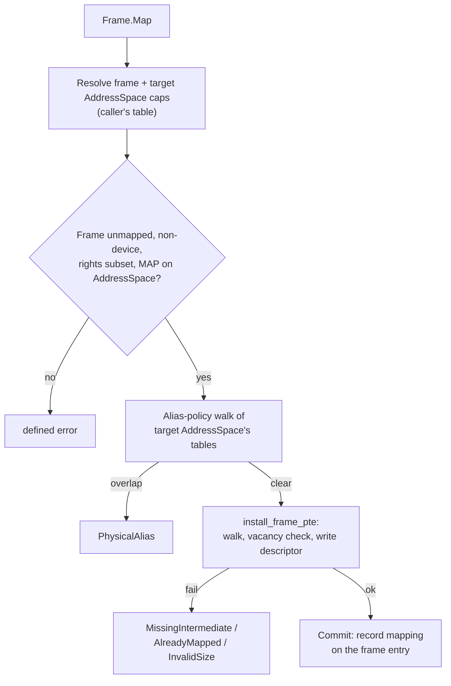

# Frame

| | |
|---|---|
| Wire type | `0x80` (arch index 0) |
| Pool | none — inline `FramePayload` in `KeyEntry` (the capability is the object) |
| Status | Active: Map/Unmap/GetAddress; operation ID 3 is unassigned |

## Purpose

A `Frame` capability represents authority over a contiguous physical memory
region (`2^size_bits` bytes; AArch64 4 KiB-granule baseline: 12/21/30 bits =
4 KiB / 2 MiB / 1 GiB). Frames are the unit of memory mapping and sharing:
mapping a frame installs a real page/block descriptor in a target AddressSpace's
translation tables; sharing across protection boundaries is done by mapping
the same physical frame into each participant's own AddressSpace context as
distinct PTEs.

## User-level visible operations

| Op | Name | Wire schema (`x2..x7`) | Authority | Success result |
|---|---|---|---|---|
| `0` | Map | `x2` target AddressSpace key, `x3` virtual address, `x4` requested rights, `x5` attributes (only zero accepted), `x6..x7` zero | requested rights ⊆ frame rights, `READ` required, `MAP` on the target AddressSpace cap | zeros |
| `1` | Unmap | no arguments | (via the frame's recorded mapping) | zeros |
| `2` | GetAddress | no arguments | `GRANT` | physical base in `x1`, size in bytes in `x2` (client wrapper: `get_extent`) |

### Map details

- **Explicit target**: Map names the target `AddressSpace`, so a builder
  holding `MAP` on it can populate an `AddressSpace` before any of its Threads
  run.
- The virtual address must be inside the supported VA width (48-bit) and
  aligned to the frame size; the walk requires every intermediate table to be
  present (`MissingIntermediate` with the faulting address otherwise).
- **Permission ceiling**: the requested mask must be a subset of the frame
  capability's rights. A rights word with any bit outside `Rights::all()`
  (`0x3F`) is malformed and rejected with `InvalidOperation`. Without `EXECUTE` every mapping is execute-never
  (PXN|UXN). With it the mapping is executable at exactly one level:

  | Requested | AP | PXN | UXN | Executable at |
  |---|---|---|---|---|
  | `READ` | `11` (EL0+EL1 read-only) | 1 | 1 | — |
  | `READ`+`WRITE` | `01` (EL0+EL1 read/write) | 1 | 1 | — |
  | `READ`+`EXECUTE` | `11` (EL0+EL1 read-only) | 1 | 0 | EL0 only |
  | `READ`+`WRITE`+`EXECUTE` | `00` (EL1 read/write) | 0 | 1 | EL1 only |

  W^X holds at both levels, and EL1 never executes a page EL0 can map.
- **Alias policy**: the frame's physical extent must not overlap any live
  mapping in the target AddressSpace, whatever capability installed it
  (`PhysicalAlias` with the conflicting physical base otherwise). The check is
  interval-based (covers derived caps and mixed frame sizes); it walks only
  the target AddressSpace's root, so cross-AddressSpace aliases remain allowed.
- A frame capability records its single mapping (owning AddressSpace identity +
  full virtual address) in its payload; `Unmap` clears the leaf descriptor
  through that recorded identity and withdraws the cached translation under
  the owning AddressSpace's bound ASID (if any).

## Kernel-level implementation details

The capability *is* the object: `FramePayload` is stored inline in the
`KeyEntry` — physical address, mapping record (AddressSpace identity + vaddr),
`size_bits`, and device/mapped flags. Runtime Frames are created by
`Untyped.Retype` with an architecture-validated `size_bits`; the freshly
carved region is **zeroed (sanitized) by the kernel inside the retype
transaction** before capability installation, so a fresh frame never carries
prior-owner or kernel data.

The bootstrap builder also issues content-preserving Frame grants over the
retained init image and boot stack (`RetainedInitMemory::grant_page`); those
occupied bytes are never Retype sources. Each image page is granted once,
CopyDerived for every other root, mapped at its identity VA in each, and the
mapped capabilities are moved into an archive table, which keeps their mapping
records.

```mermaid
flowchart TD
    A["Frame.Map"] --> B["Resolve frame + target AddressSpace caps<br/>(caller's table)"]
    B --> C{"Frame unmapped, non-device,<br/>rights subset, MAP on AddressSpace?"}
    C -- "no" --> E["defined error"]
    C -- "yes" --> D["Alias-policy walk of<br/>target AddressSpace's tables"]
    D -- "overlap" --> E2["PhysicalAlias"]
    D -- "clear" --> F["install_frame_pte:<br/>walk, vacancy check, write descriptor"]
    F -- "fail" --> E3["MissingIntermediate /<br/>AlreadyMapped / InvalidSize"]
    F -- "ok" --> G["Commit: record mapping<br/>on the frame entry"]
```

- Unmap verifies the descriptor still points at this frame before clearing
  (`InvalidOperation` otherwise), then invalidates the TLB entry by virtual
  address under the owning `AddressSpace`'s ASID, so a remap of the same VA in
  the live context sees the new backing. Descriptor stores are ordered before
  `TLBI VAE1IS` (ASID in bits 63:48, `VA[55:12]` in bits 43:0), followed by
  completion barriers.
- Descriptor mechanics live in the arch layer
  (`kernel/nucleus/src/objects/arch/page_table.rs`): level-3 page descriptors
  for 4 KiB, level-2/1 block descriptors for 2 MiB/1 GiB; MAIR index 0
  (normal write-back cacheable) is the only accepted attribute today. All
  TTBR0 page/block leaves set `nG` (bit 11), so cached translations belong to
  the owning AddressSpace's ASID rather than matching other contexts. New
  descriptors are published with `DSB ISHST` and `ISB` before access through
  the mapping, including live remaps without reactivation.
- `CopyDerive` of a Frame produces an *unmapped* derived capability
  (capability-only derivation, no active mapping association); `Move`
  preserves the mapping record; `Delete` of a mapped frame leaves the mapping
  in place under the accepted-leak model — no automatic unmap or retirement.
- Device frames cannot be created by Retype today; the Map handler keeps a
  defensive device rejection until a device-memory policy is contracted.

## Sidenotes

- Copy is not Map: a copied frame capability can establish its own mapping in
  an authorized context, potentially at a different virtual page. Stable frame
  authority (the physical region) and mutable per-capability mapping
  association are distinct.
- The same physical frame may be mapped by different derived caps at different
  virtual pages in *different* AddressSpaces (same-address sharing preferred for
  fbufs); two virtual addresses for overlapping physical backing within *one*
  AddressSpace are prohibited.
- Interim deprovisioning direction: fully revoke the frame capability and do
  not reuse that slot for frames (scope open, D3/D6).

## TODOs

- Remapping remains a possible future operation; origin-only authority,
  descendant effects, and virtual-relocation vs physical-replacement remain
  open — D4/D6.
- Device frames and per-kind device policy — D6.
- Cache/device attribute dimension beyond "zero = normal cacheable" — D6.
- Splitting user/privileged execute authority with EL0 entry — D6.
- Precise no-reuse scope for deprovisioned frame slots — D3/D6.
