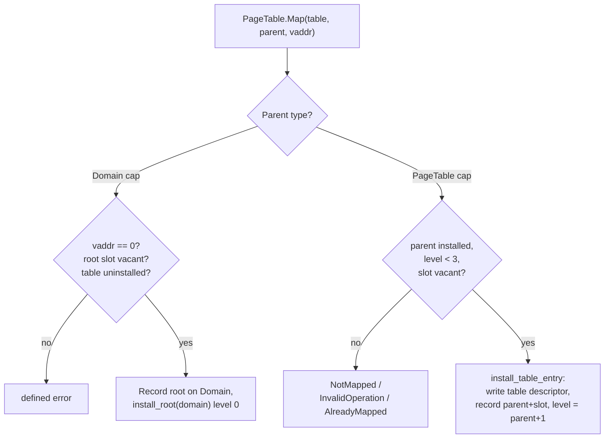

# PageTable

| | |
|---|---|
| Wire type | `0x81` (arch index 1) |
| Pool | `PoolTag::PageTable` (pooled kernel metadata; 4 KiB hardware table carved from Untyped) |
| Status | Active: Map/Unmap (explicitly managed translation tables) |

## Purpose

A `PageTable` capability names one Retype-carved 4 KiB hardware-format
translation table plus kernel metadata (carve address, walk level,
installation record). Intermediate page tables are **explicitly managed,
seL4-style**: the kernel never allocates translation structures implicitly,
so every byte of a translation context is charged to a Retype carve. A
Domain's translation root is also a PageTable capability, installed against
the Domain.

## User-level visible operations

| Op | Name | Wire schema (`x2..x7`) | Authority | Success result |
|---|---|---|---|---|
| `0` | Map | `x2` parent key, `x3` virtual address, `x4..x7` zero | `MAP` on the *parent* capability | zeros |
| `1` | Unmap | no arguments | (via the invoked table's installation) | zeros |

### Map — installation selected by parent capability type

- **Root installation** (parent = Domain capability): the virtual address is
  meaningless for a whole-context root and must be zero; the Domain's root
  slot must be vacant and the table uninstalled (`AlreadyMapped`
  otherwise).
- **Intermediate installation** (parent = PageTable capability): the parent
  must be installed and below the leaf level (a level-3 table holds page
  descriptors; nothing may be installed beneath it); the slot selected by
  the virtual address must be vacant. Mapping a table into itself is
  rejected via alias-safe pair resolution.

### Unmap

The table must be installed and **empty** (every descriptor zero — a non-empty
table would orphan its children). Unmapping the root clears the Domain's
translation-root field and invalidates every cached translation under the
Domain's bound ASID (if any); unmapping an intermediate verifies the parent
descriptor still points at this table, then clears it.

## Kernel-level implementation details

- Creation: `Untyped.Retype` with fixed `size_bits` 12 (4 KiB) on AArch64;
  the carved table is **zeroed (sanitized)** — stale descriptors would leak
  prior contents into hardware walks — and the capability is a checked pool
  identity over kernel metadata, not an inline region.
- Metadata (`kernel/nucleus/src/objects/arch/page_table.rs`):
  `AArch64PageTable { paddr, level, parent: PtParent }` where `PtParent` is
  `Uninstalled` / `Root { domain }` / `Table { parent_paddr, slot }`. The
  metadata (carve address, level, installation record) is the mapping
  identity: enough to locate and retire the real descriptor.
- Hardware format: AArch64 Stage 1, 4 KiB granule, 48-bit VA, 9-bit indices
  (512 entries per table), 4-level walk. Level 0 is the translation root;
  4 KiB pages install page descriptors at level 3, 2 MiB blocks at level 2,
  1 GiB blocks at level 1. Descriptor bits match the boot-time configuration
  (MAIR index 0 = normal write-back cacheable).
- Raw tables are reached through the direct map (`raw_table`); the safety
  contract requires the address to name a live carved table page (never
  freed under the accepted-leak model).
- Walk mechanics: `walk_to_leaf` follows installed table descriptors; a
  missing level fails with `MissingIntermediate`; a block descriptor covering
  the range means the address is already mapped (`AlreadyMapped`).
- An intermediate table's descriptors are all zero when uninstalled
  (required), so no cached translation can exist beneath it and no
  invalidation is needed there; root unmap invalidates the whole ASID.

## Sidenotes

- The Domain is the mapping context (selected 2026-09-15): there is no
  separately targetable VSpace kernel object; the registered `VSpace` kind
  stays reserved (see [vspace.md](vspace.md)).
- Carved tables become hardware-live through `Domain.Activate`, which
  installs the bound root into `TTBR0_EL1` with the bound ASID.
- Gating TLB invalidation on live TTBR installation may be more efficient
  once Domain scheduling exists (maintainer remark, 2026-09-15); today the
  invalidation is executed whenever the owning Domain has a bound ASID.

## TODOs

- Interaction of root/intermediate unmap with in-flight access and eventual
  table reclamation — D2/D6 (carved tables leak under the accepted-leak
  model).
- Block-descriptor mappings (2 MiB/1 GiB frames) install at levels 1–2; any
  additional per-level policy is future work.
- Multi-level table pools' Untyped-backed backing ownership — Phase 5.

## Cross-reference: implementation vs. desired capabilities (🧠 Vesper vault)

- `seL4 Capabilities.md` / `API/seL4 API.md` (vault): seL4-style explicit
  page-table management (`seL4 ARM PageTable Map/Unmap`) — **consistent**:
  the implemented model is deliberately seL4-like (explicit installation,
  no implicit kernel allocation, vacant-slot checks).
- `Memory.md` (vault): "all objects consume a fixed amount of memory once
  created" — **consistent**: a 4 KiB carve per table, charged to the
  caller's Untyped.
- `Prototype.md` (vault): `cap_page_table_cap` / `cap_page_directory_cap` as
  separate kinds — **superseded**: one `PageTable` kind with a per-object
  `level` (0 = root … 3 = leaf) covers the hierarchy; there is no separate
  page-directory kind.
- `Vesper.md` (vault): guarded page tables are mentioned in the vault only
  as a *capability-space* technique (KeyNodes), not for memory translation —
  no conflict; memory translation uses plain multi-level tables.
- `seL4 Kernel boot sequence.md` (vault): boot creates initial page tables
  kernel-privately — **consistent**: Kickstart boot-carves the kernel's own
  tables; user-visible tables come from Retype.
