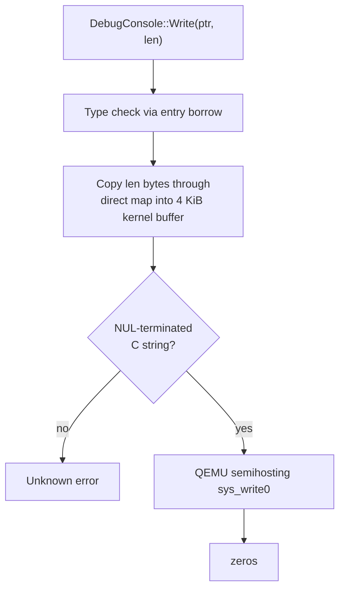

# DebugConsole

| | |
|---|---|
| Wire type | `0x7f` (core — deliberate top-of-core sentinel) |
| Pool | none — stateless object |
| Status | Debug-only: compiled and granted only with the opt-in `debug_kernel` Cargo feature |

## Purpose

`DebugConsole` is a trusted-debugging output channel: a minimal
capability-invocation path for printing from early boot and test fixtures. It
is **not a generally available capability** — its handler, bootstrap grant,
userspace wrapper, and boot demonstration all require the `debug_kernel`
feature, disabled by default. Neither `qemu` nor `jtag` implicitly enables it;
production kernels must omit it.

## User-level visible operations

| Op | Name | Wire schema | Authority | Success result |
|---|---|---|---|---|
| `0` | Write | `x2` pointer, `x3` length | none enforced yet (debug-only; explicit console-use authority is deferred) | zeros |

The type ID `127` and operation ID `0` remain reserved/defined regardless of
feature availability. Without the feature, no console capability is installed
and DebugConsole dispatch is unsupported (an absent slot returns the normal
lookup error).

## Kernel-level implementation details

- Handler: `kernel/nucleus/src/api/debug_console.rs` (feature-gated), object:
  `kernel/nucleus/src/objects/debug_console.rs`. The handler validates the
  capability's type through a shared entry borrow without deriving an object
  reference from its payload (no console-specific mutable casts).
- Write path: interprets `x2` as a physical address, converts through the
  direct map (`user_to_kernel`), copies into a 4096-byte kernel buffer,
  requires a NUL terminator (C-string semantics), and emits via QEMU
  semihosting `sys_write0`. **Actual output currently requires `qemu`**;
  enabling `debug_kernel` alone does not add a hardware output backend.
- Bootstrap: Kickstart installs the console capability at
  `KeySlot::DEBUG_CONSOLE` (slot 14) with `Rights::all()` when the feature is
  on.

## Sidenotes

Temporary debug-only leeway is not a safety or isolation guarantee. Known
limitations, deliberately retained for now (scoped D4/D9):

- The active caller is trusted EL1h boot code, not yet an EL0 domain;
  permitted origins are not classified.
- The pointer is treated as a physical/direct-map address with unchecked
  copying — not caller virtual memory with authorized, bounded access.
- C-string limitations: no byte/UTF-8 definition, embedded-NUL or empty-input
  behavior, maximum length, or partial-output semantics; the 4096-byte buffer
  needs terminator space and has no length check.
- No explicit caller/rights enforcement; client errors propagate through the
  shared decoder.

Alternatives recorded beside the handler: restrict pointer writes to
registered bootstrap buffers, or add a distinct register-inline byte
operation (e.g. up to 40 bytes/call with client chunking). Do not silently
reinterpret `Write` = 0.

## TODOs

General availability requires the normal supported-operation criteria:
explicit caller/rights, bounded caller-authorized memory access with fault
recovery, defined byte/length/partial-output semantics, checked
exception/argument decoding, and observable results (D1/D3/D4/D6/D9 remain
open beyond this limited availability decision).

## Cross-reference: implementation vs. desired capabilities (🧠 Vesper vault)

- **No vault counterpart**: the `🧠 Vesper` vault notes describe no console
  or debug-output capability. DebugConsole is a Vesper-specific debug
  addition; nothing in the vault conflicts with it, and nothing in the vault
  depends on it.
- Indirect consistency check: `Vesper.md` (vault) "narrow(est possible)
  kernel API — everything is invoked via capabilities" — the console follows
  the single capability-invocation syscall rather than a separate debug
  syscall, which keeps the API surface narrow even in debug builds.
- `Kernel and module testing.md` / `Debugging` vault notes (unchecked todo
  lists) expect debug output during bring-up; the semihosting-only backend
  means non-QEMU targets (real hardware, JTAG) currently get no output —
  a practical gap to keep in mind when reviewing debug workflows.
