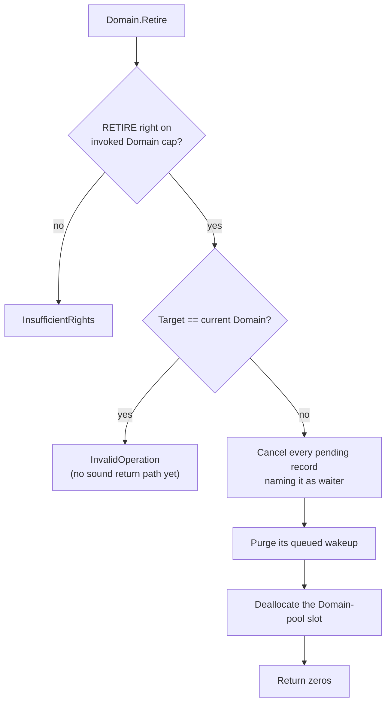

# Domain

| | |
|---|---|
| Wire type | `0x02` (core) |
| Pool | `PoolTag::Domain` (pool-backed kernel object) |
| Status | Active: `Activate` (translation-context installation) and `Retire` (teardown); Grant/Suspend/Resume return defined errors |

## Purpose

A `Domain` is a protection domain: the unit of address-space isolation and
the mapping context for translation tables (selected D1: Domain = VSpace
boundary). It combines kernel-private state (capability table, translation
root, bound ASID, execution context) with a userspace-observable DCB (Domain
Control Block). Domain capabilities authorize control over that domain's
mapping context and lifecycle.

## User-level visible operations

| Op | Name | Wire schema (`x2..x7`) | Authority | Success result |
|---|---|---|---|---|
| `0` | Activate | no arguments (all zero) | `MAP` on the invoked Domain | zeros; installs the Domain's bound translation root + ASID into the current hardware translation context (`TTBR0_EL1`) |
| `1` | Grant | — | — | `InvalidOperation` (unsupported; overlaps KeyTable delegation) |
| `2` | Suspend | — | — | `InvalidOperation` (deferred, D7/D8) |
| `3` | Resume | — | — | `InvalidOperation` (deferred, D7/D8) |
| `4` | Retire | no arguments (all zero) | `RETIRE` (`0x20`) on the invoked Domain | zeros; tears down the invoked Domain |

### Activate

Installs the invoked Domain's bound translation root into the current
hardware translation context. Preconditions: the Domain has a translation root
installed *and* an ASID bound (`NotMapped` if either is missing); until Domain
scheduling exists, **only the current (caller) Domain may activate itself**
(`InvalidOperation` otherwise). Installation is idempotent for the same
context. This is the translation-context step of activation only — full
Activate/Suspend/Resume (initialized execution contexts, execution budget, EL0
entry) remains Phase 7 work.

### Retire (selected 2026-09-19)

Tears down the invoked Domain:

The current Domain may not retire itself: the invocation must return to a
surviving caller. Never-returns self-retirement is contract-recorded
follow-up. Deliberately out of scope (recorded gaps): carved backing
(keytable, kernel stack) stays leaked per accepted-leak; a bound ASID stays
allocated (D6); the DCB is untouched (D5). Subsequent invocations of the
retired Domain's capabilities fail pool validation with a defined error.

## Kernel-level implementation details

- Pool-backed via `NucleusPools::domains`; capabilities store a checked
  `ObjectId` (pool tag + index + generation), resolved through the guarded
  `Access` context — never raw pointers.
- Kernel-private fields (`kernel/nucleus/src/objects/domain.rs`):
  `keytable_addr` (the Domain's carved KeyTable), `translation_root`
  (physical address of the installed root PageTable), `asid` (bound hardware
  ASID), and `context` (`ExecutionContext`: `NotStarted` / `Parked` /
  `Running`) used by the completion foundation to park and resume blocked
  callers.
- `Domain.Retire` maps to `Nucleus::cancel_domain_pending` + pool
  deallocation; teardown-before-reuse cancels waits and purges queued
  wakeups first.
- The user-visible half is the DCB (`DcbPages` manager, up to 8192 domains,
  256 pages × 32 DCBs/page, nanosecond time accounting), mapped read-only at
  a well-known userspace base. **DCBs are not yet connected to pool Domains**
  (D5); the current 128-byte-DCB layout is a migration finding, not the
  chosen future ABI.
- Retype cannot create a Domain (`InvalidObjectType`): bootstrap grants are
  the initial source of Domain capabilities, which is why `RETIRE` cannot
  originate from a memory carve.
- No current domain is an explicit state: absent caller identity fails with
  `InvalidDomain` rather than falling back to domain zero.

## Sidenotes

- `Activate` requires `MAP` — the same right as root installation, frame
  mapping, and ASID binding — making "authority over the mapping context" one
  consistent permission across the mapping family.
- `RETIRE` is delegable like other capability permissions: retirement
  authorization follows capability permissions, not a privileged owner
  identity (permission-based lifetime control, confirmed 2026-09-05).
- A caller that keeps executing under the activated context must itself be
  mapped (executable) in the Domain's tables — the bootstrap caller maps its
  own image and stack as frames with the `EXECUTE` right.

## TODOs

- Full Activate/Suspend/Resume with legal state transitions, execution
  budget, and EL0 entry — Phase 7 (D7/D8).
- Never-returns self-retirement (terminal entry-path work).
- ASID release on teardown and hardware-safe ASID reuse — D6.
- DCB layout/stride/visibility/publication and DcbView persistence — D5.
- Coherent current-domain identity carrying its own generation — Phase 4.
- `Domain.Grant` relationship to KeyTable CopyDerive — D4.

## Cross-reference: implementation vs. desired capabilities (🧠 Vesper vault)

- `Vesper.md` (vault): "**single address space** … pointer transparency
  between processes" — **major divergence**: the selected D1 architecture
  gives each Domain its own translation context (Domain = VSpace protection
  boundary); cross-Domain sharing is via frame capabilities mapped as
  distinct PTEs, not a global SAS. The vault note itself anticipates this:
  "single-address-space could be implemented by mapping frames to same
  virtual addresses in different processes … Vesper therefore does not
  dictate specific address space arrangements."
- `Vesper Capabilities (from wiki).md` (vault): "thread control blocks …
  mechanisms for manipulating thread state if you are given a corresponding
  capability" — **partial mismatch**: current Domain control is limited to
  translation-context activation and teardown; there are no register/stack
  manipulation operations (the vault `Scheduling/Scheduling.md` note
  "capability model provides a way for server holding capability to a thread
  to manipulate its registers and stack" is not implemented).
- `Scheduling/Scheduling.md` (vault): user-level scheduling with kernel
  upcalls — **not implemented**; no scheduler-driven cancellation or upcall
  mechanism exists yet (Phase 7, D8).
- `Vesper.md` (vault): "kernel provides only address space isolation and IPC"
  — **consistent**: the Domain object is exactly the isolation boundary;
  IPC (Endpoint/Reply) remains unimplemented sketch work.
- DCB observation ("protection domains … capabilities for accessing this
  memory from the outside", vault wiki) — **gap**: DCB pages exist and a
  manager is implemented, but they are not yet connected to pool Domains and
  no userspace observation contract is active (D5).
