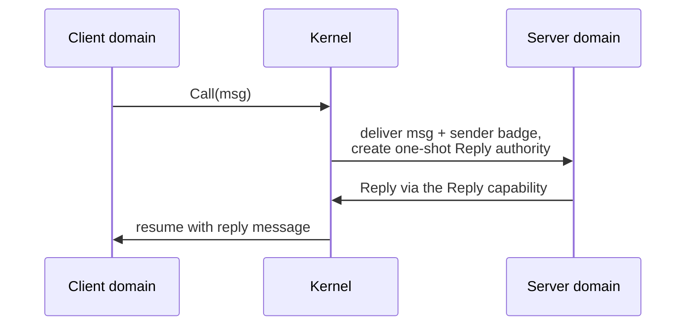

# Endpoint

| | |
|---|---|
| Wire type | `0x05` (core) |
| Pool | none — no active storage |
| Status | Excluded sketch: no handler, no object, dispatch returns `UnsupportedCoreType` |

## Purpose

An `Endpoint` is the intended synchronous-IPC rendezvous object: small-message
cross-domain calls and sends between protection domains. Messages carry a
label plus five data words and optionally one transferred capability; a Call
additionally produces one-shot `Reply` authority. Endpoints queue blocked
senders or receivers; both arrival orders implement the same rendezvous and
reply-creation semantics.

## User-level visible operations

None active. The intended vocabulary (contract qualification only):

| Op | Name | Intended semantics | Status |
|---|---|---|---|
| `0` | Call | Send + closed wait for the reply; produces one-shot Reply authority for the receiver | Deferred (D7) |
| `1` | Send | Deliver a message to a queued receiver, or block/queue as sender-first | Deferred (D7) |
| `2` | Recv | Open wait for any authorized sender | Deferred (D7) |
| `3` | ReplyRecv | Reply via a reply cap, then atomically receive next | Deferred optimization (D7) |
| `4` | Reply | Legacy conflicting operation — resolve in D7 | Unresolved |
| `5` | Forward | Transfer the actual reply authority to another receiver | Deferred optimization (D7) |

Invoking an Endpoint capability today returns `UnsupportedCoreType`.

## Kernel-level implementation details

Nothing is active. The selected transport and completion model that any
implementation must follow:

- **Register transport with hybrid spill**: small messages travel in syscall
  registers; a per-domain IPC buffer receives anything beyond register
  capacity. The buffer's registered location and lifetime are part of domain
  creation (D5/D6 follow-up).
- **Message layout**: a label word plus five data words, one optional
  capability-transfer slot; dedicated words, no packed metadata word.
- **Extended outputs**: IPC completions may use `x1..x7` (badge, label, data
  words, received-capability indication); ordinary operations keep the
  two-word result. Requires exception-return path and `protected_call*`
  assembly clobber migration.
- **Capability transfer**: zero or one transferred capability per message
  initially, via prevalidation/reservation and atomic commit; ownership
  retained on pre-commit failure.
- **Blocking**: a blocking operation does not return until completion or
  cancellation — no "blocked" wire status; the eventual return is the
  completion or a cancellation error. One relative `u64`-nanosecond timeout
  per blocking operation (`u64::MAX` infinite, zero invalid); a single Call
  timeout has phase-specific outcomes (send-phase expiry = cancelled before
  commit; reply-phase expiry = outcome unknown). Late replies consume the
  one-shot Reply and return a defined error to the replier.
- Pending payload, badge, transfer metadata, and completion state belong to
  each blocked invocation (pending-invocation record), never to a single
  endpoint-global message buffer.

The excluded sketches (`kernel/nucleus/src/objects/endpoint.rs`,
`kernel/nucleus/src/api/endpoint.rs`) record the rendezvous intent:

The sketch's endpoint-global `msg_regs` buffer, implicit reply-slot handling,
and kernel reply allocation are known defects superseded by the selected
model above (per-invocation pending records; explicit reply destinations).

## Sidenotes

- Badges identify authority-bearing sender views, not a caller-supplied
  identity.
- Open waits (any authorized peer) versus closed waits (a specific call's
  reply phase) stand as directed; closed-wait identity is the kernel
  pending-invocation record with a non-wrapping 64-bit generation.
- Large-data IPC preferentially uses fbufs (shared frames at matching virtual
  addresses) rather than endpoint message copying; endpoints are for
  small-message rendezvous.
- The staging decision: the completion foundation plus
  Notification/EventCount land first; Endpoint/Reply and the extended-return
  migration follow on the same foundation.

## TODOs

- Per-operation commit points, transfer/reply destinations and failure
  semantics, per-operation register assignments — D7.
- Shared wire encodings for cancellation/late-reply errors — D9.
- Resolve the conflicting legacy `Reply` op 4 — D7.
- Non-blocking send/receive variants: contract not selected (the vault
  expects them; see cross-reference).
- Per-domain IPC buffer registration — D5/D6.

## Cross-reference: implementation vs. desired capabilities (🧠 Vesper vault)

- `IPC and PPC/IPC and PPC.md` (vault): Send, **Non-blocking Send**, Call,
  Recv, **Non-blocking Recv**, Reply, Reply-then-Recv, and a `Yield` syscall
  "not associated with any kernel object" — **mismatches**: (a) non-blocking
  Send/Recv variants have no selected contract (only Notification.Poll
  exists as a non-blocking consume, on a different kind); (b) ReplyRecv is
  selected as op 3 but deferred; (c) there is no Yield operation anywhere in
  the current catalogue.
- Vault: "Messages sent to `Endpoint` are destined for other threads, while
  messages sent to other objects are processed by the kernel" — **consistent
  with the design** (single invocation syscall; kernel-object methods are
  capability invocations), but unimplemented for endpoints.
- Vault: capability transfer requires the endpoint capability to have
  `Grant` rights — **partially divergent**: the selected model authorizes
  transfer per-operation with explicit prevalidation; the exact rights matrix
  (which bit gates transfer) is open in D4/D7.
- Vault: "IPC is a user-controlled context switch" / migrating threads with
  direct switch and time donation — **unimplemented**: no direct-switch
  fastpath or donation exists; scheduling currently only resumes completed
  waiters via the runnable queue.
- Vault (Pebble portals, Metta-level): portal code generation, memory
  windows, LRPC — **out of scope for the kernel object** (vault itself marks
  portals "to use in Metta, but not in Vesper"); noted here only because the
  endpoint contract must not preclude optimized traversal later.
- `Design Requirements.md` (vault): "Cheap IPC (as close to seL4 as
  possible)" — **open**: no performance claims exist; nothing is measured.
