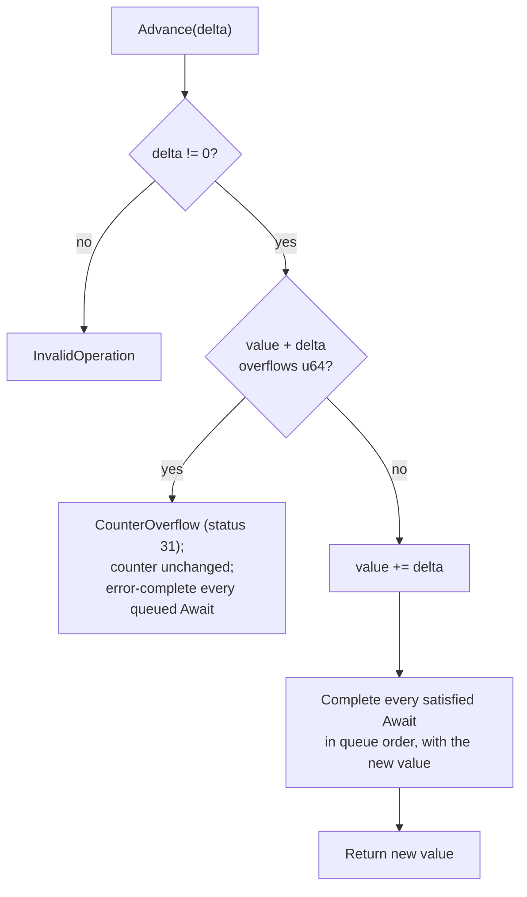

# EventCount

| | |
|---|---|
| Wire type | `0x07` (core) |
| Pool | `PoolTag::EventCount` (bootstrap-carved pool; Retype-creatable) |
| Status | Active: Advance/Await/Read through real SVC dispatch, including blocking Await |

## Purpose

An `EventCount` is a monotonic `u64` progress counter with threshold waits:
producers `Advance` the counter; consumers `Await` until
`value >= target` or `Read` the current value. Unlike a Notification, advances
do not coalesce and readers do not consume the counter — each reader maintains
an independent position. This is the primitive for producer/consumer
backpressure, streaming, and per-reader progress tracking (e.g. ring-buffer
produced/consumed counters in the fbuf direction).

## User-level visible operations

| Op | Name | Wire schema (`x2..x7`) | Authority | Success result |
|---|---|---|---|---|
| `0` | Advance | `x2` delta (nonzero); `x3..x7` zero | `SEND` | New value in `x1`; completes every queued `Await` whose target the new value satisfies |
| `1` | Await | `x2` target, `x3` timeout (ns; `u64::MAX` = infinite; zero/finite invalid until the time subsystem exists); `x4..x7` zero | `RECV` | Current value in `x1` (already-satisfied path); blocks otherwise |
| `2` | Read | no arguments | `RECV` | Current value in `x1`; never blocks |

`EventCountKey::WAIT_INFINITE` (`u64::MAX`) is the userspace encoding of an
infinite wait.

## Kernel-level implementation details

Pool-backed kernel metadata (`kernel/nucleus/src/objects/event_count.rs`): a
monotonic `u64` value plus a bounded `AwaitQueue` of pending-invocation
records. The capability is a checked pool identity resolved through the
guarded `Access` context. Retype installs it from the bootstrap-carved
event-count pool with `size_bits` reserved zero (no Untyped bytes carved).

- **Broadcast wakeups**: an advance completes *every* queued `Await` whose
  target it satisfies, each resumed with the new value — the deliberate
  counterpart to Notification's one-consumer delivery.
- **Overflow policy** (selected 2026-09-18): the counter never wraps and
  never saturates. An overflowing advance returns the shared
  `CounterOverflow` error (status 31, zero details), leaves the counter
  unchanged, and completes every queued `Await` with the same error so
  waiters observe the producer's failure instead of blocking indefinitely;
  a woken waiter may re-`Await`.
- **Blocking path**: as with Notification, a would-block `Await` reports
  `InvokeOutcome::Blocked`; the entry parks the caller and the resume
  delivers the terminal result — including error wakeups (status 31), since
  the completed pending record carries the full result shape (status + two
  words). Validated end-to-end (2026-09-18) via the debug-gated Bounce
  fixture.
- **Bounded queues**: a full await queue rejects before admission
  (`PoolExhausted`) with no record to roll back.
- **Teardown**: object teardown cancels queued waiters; domain teardown
  (`remove_waiter`) unqueues only the torn-down Domain's records, driven by
  `Domain.Retire`.
- **Memory ordering** (selected 2026-09-18): kernel-mediated release/acquire
  — `Advance` is a release on the producer's behalf; observing the value
  (wakeup, satisfied await, Read) is an acquire. DMA/device writes excluded.

## Sidenotes

- Rights reuse per kind: `Advance` requires `SEND`, `Await`/`Read` require
  `RECV` (per-kind bit reuse, as with Notification).
- `Await` target zero is trivially satisfied (returns the current value);
  `Advance` delta zero is invalid.
- Signal/Advance/Poll-analogues (`Read`) do not block but can still fail
  validation/authorization.

## TODOs

- Finite timeouts once the time subsystem exists (D8); currently rejected
  with a defined error.
- Wakeup summary agreement with DCB semantics (D5).

## Cross-reference: implementation vs. desired capabilities (🧠 Vesper vault)

- `API/fbufs.md` (vault): Nemesis `IO_Channel` with `put_ec`/`get_ec`
  Event_Counts for ring-buffer flow control, and the vault's
  "BufferCap + EventCountCap" design with produced/consumed counters —
  **consistent in intent**: the implemented EventCount is exactly the
  primitive that vault pattern needs. **Divergence in the surrounding
  design**: the vault's `BufferCap` kernel object does not exist — Buffer
  was removed from the catalogue (2026-09-15) as a userspace/libOS construct
  over frame capabilities; the fbuf composition is now frames +
  EventCount caps, with no kernel Buffer kind.
- `Vesper.md` (vault): "efficient data passing between protection domains" —
  **half-realized**: the EventCount half of the fbuf pattern exists; the
  shared-frame mapping half exists (Frame.Map across Domains); the
  higher-level fbuf protocol (same-address agreement, ownership modes) is
  libOS policy and unimplemented.
- No other vault note covers EventCount; the primitive originates from
  Nemesis (via the fbufs analysis) rather than the seL4-derived notes, and
  nothing in the vault contradicts the selected overflow/broadcast
  contracts.
