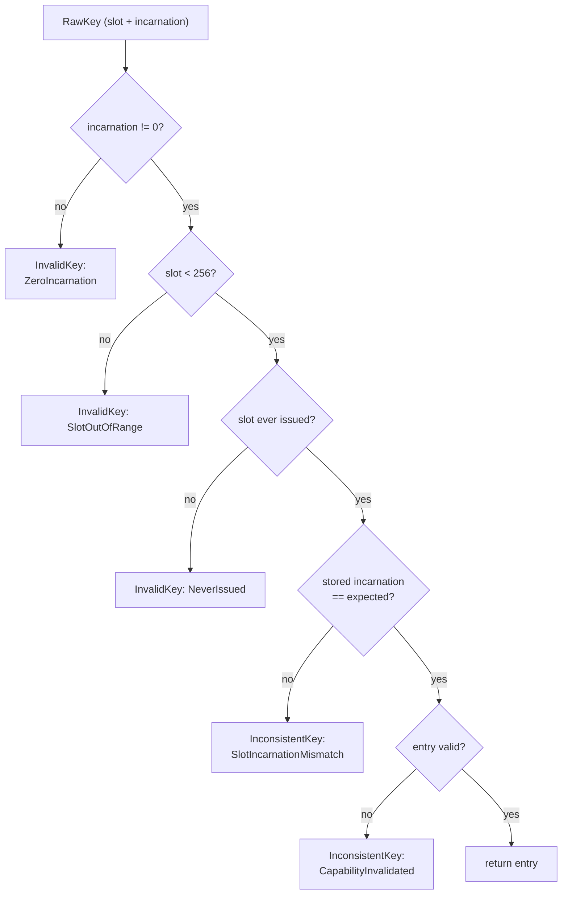

# KeyTable

| | |
|---|---|
| Wire type | `0x02` (core) |
| Pool | none as an object — a Retype-carved kernel object referenced by carve address |
| Status | Active: CopyDerive/Move/Delete; Revoke rejected with a defined error |

## Purpose

A `KeyTable` is a thread's capability table (seL4's `CNode`): a fixed array of
256 capability slots, each holding one `KeyEntry` plus a per-slot incarnation
counter. KeyTable capabilities authorize *management* of entries in a table —
derivation, removal, and installation — distinct from the authority granted by
the entries themselves. Tables are Retype-created carved objects; the boot
Thread's table is carved and initialized kernel-privately by Kickstart.

## User-level visible operations

| Op | Name | Wire schema (`x2..x7`) | Authority | Success result |
|---|---|---|---|---|
| `0` | CopyDerive | `x2` source selector, `x3` destination-table key, `x4` vacant destination slot, `x5` requested rights; `x6..x7` zero | `DERIVE` on the invoked source-table cap, `INSTALL` on the destination-table cap | Destination-local packed key in `x1`, zero in `x2`; badge preserved, rights attenuated only |
| `1` | Move | `x2` source selector, `x3` destination-table key, `x4` vacant destination slot; `x5..x7` zero | `DERIVE` + `REMOVE` on the source-table cap, `INSTALL` on the destination | As CopyDerive; source invalidated on commit; rights and per-capability state preserved |
| `2` | Delete | `x2` target selector; `x3..x7` zero | `REMOVE` on the invoked table | zeros; entry removed, no automatic object retirement |
| `3` | — | unassigned | — | `InvalidOperation` (decoder rejects) |
| `4` | Revoke | — | — | `InvalidOperation` (scope/completion contract unresolved, D2) |

KeyTable-management rights (per-kind interpretation of the rights byte):
bit 0 `DERIVE` (source derivation), bit 1 `REMOVE` (source removal/move-out
and deletion), bit 2 `INSTALL` (destination installation); bit 3 reserved
for future table administration and not granted initially.

Rules:

- **No amplification**: requested rights must be a subset of the source
  entry's rights (`InsufficientRights` otherwise).
- **Vacant destinations**: occupied slots fail with `SlotOccupied`; Move to
  the exact same table/slot is rejected, not a no-op.
- **Checked selectors**: source/target selectors carry slot + expected
  incarnation; a stale selector never acts on a replacement occupant.
- **Derivation allowlist**: `KeyTable`, `Frame`, and
  debug-gated `DebugConsole`. Frame CopyDerive produces an *unmapped* derived
  capability; Move preserves the mapping record; Delete of a mapped frame
  leaves the mapping in place (accepted-leak).
- **Cross-table resolution**: both the invoked table and the
  destination table are resolved through the caller's own table, so
  CopyDerive/Move can target a table other than the caller's.
- Failed operations leave authority and accounting unchanged; Move rolls
  back into the source slot on installation failure.

## Kernel-level implementation details

Storage (`kernel/nucleus/src/objects/key_table.rs`): 256 `KeyEntry` slots +
256 `u32` incarnation counters + owner `DomainId` + occupancy count. A
KeyTable capability references the carved object through a per-kind payload
address (`KeyTablePayload::address`), resolved via
`Access::resolve_carved{,_mut,_pair_mut}`.

Slot lifecycle and lookup validation precedence:

- **Incarnations**: counter is zero before first installation,
  increment-on-install, retained on deletion. A slot whose counter cannot
  issue a fresh incarnation without wrapping rejects further installation
  (`KeySlotExhausted`, status 28) — slot-local exhaustion, never table
  retirement. This is stale-key protection: a vacated slot's old keys can
  never validate against a replacement occupant.
- **Insertion is atomic**: pre-commit failure returns the submitted entry to
  the caller (`InsertError`); null entries cannot be installed; occupancy
  count only changes on committed operations.
- **No unrestricted mutable access**: mutation happens only through targeted,
  type-checked transitions (`advance_untyped_watermark`,
  `record_frame_mapping`, `clear_frame_mapping`) that cannot change identity,
  rights, badge, or incarnation.
- `KeyEntry` is 32 bytes (`size_of` asserted, "same as seL4"): type byte,
  rights byte, `u16` badge, and a 24-byte payload union (object identity,
  region, frame, or keytable-address variants).
- Same-table operands use a single mutable guard; distinct tables use the
  alias-rejecting pair-resolution form (`resolve_carved_pair_mut`).

## Sidenotes

- Authority split: possession of an ordinary invocable object key
  does not confer table-management authority; there is no manager-identity
  exception — the appropriate KeyTable capabilities and permissions are the
  general rule.
- CopyDerive preserves badges verbatim; badge creation/rebadging is deferred
  (D4). `grant_to` remains a client-side CopyDerive convenience wrapper
  requesting prototype `Rights::all()`.
- Deleting the last retirement-authorized capability need not retire the
  object — correct resource management is the OS's responsibility (accepted
  leak).

## TODOs

- Revoke: scope, completion contract, selective subtree invalidation of a
  still-live object — D2 (rejected, not faked, until then).
- Badge derivation and badge-zero semantics beyond Notification's selected
  hybrid — D4.
- Bootstrap slot conventions (self thread, parent, self-table, manager) — D4
  must define one layout; the current names are conflicting sketches.
- Notification index/registration versus 256-slot tables (a 64-bit pending
  bitmap does not fit every slot) — D4.
- Untyped-backed pool/metadata ownership for tables — Phase 5.

## Cross-reference: implementation vs. desired capabilities (🧠 Vesper vault)

- `Vesper Capabilities (from wiki).md` (vault): capability spaces as a
  **directed graph of KeyNodes** with guarded page tables, per-node radix,
  guards, depth limits, and sparse addressing — **major mismatch**: the
  current KeyTable is a single-level flat 256-slot table with no graph, no
  guards, no radix, and no depth-limit addressing. `Capabilities/Prototype.md`
  sketches the radix-prefixed tree (`Key::KeyNode { next_node_ptr }`) — none
  of that is implemented.
- Vault wiki: "Each slot requires **16 bytes** of physical memory" —
  **mismatch**: the current `KeyEntry` is 32 bytes (asserted "same as seL4"),
  plus a per-slot `u32` incarnation counter outside the entry.
- Vault wiki: minted capabilities tracked in a kernel **capability derivation
  tree (CDT)**; revoke "recursively removes any capabilities that were
  derived from the original" — **mismatch**: there is no kernel CDT; Revoke is
  rejected outright, and subtree revocation/cleanup is delegated to
  userspace managers (D2 selection). The vault's kernel-side CDT conflicts with
  the selected no-kernel-derivation-tree direction.
- Vault wiki: capabilities "sent via IPC" / "passed through messages" —
  **gap**: capability transfer via IPC is designed (zero-or-one transfer
  slot) but unimplemented (Endpoint/Reply excluded sketches).
- Vault wiki: "number of slots in a KeyNode must be a power of two" and is
  user-chosen at Retype — **partial mismatch**: 256 slots is a fixed
  `NUM_SLOTS` constant; variable-size tables are not supported.
- `Capabilities.md` (vault): seL4-style `cte` (cap table entry + mdb node)
  and `sameObjectAs` — **not implemented**: no MDB/ancestry metadata is
  stored; object identity is checked via pool generations instead.
