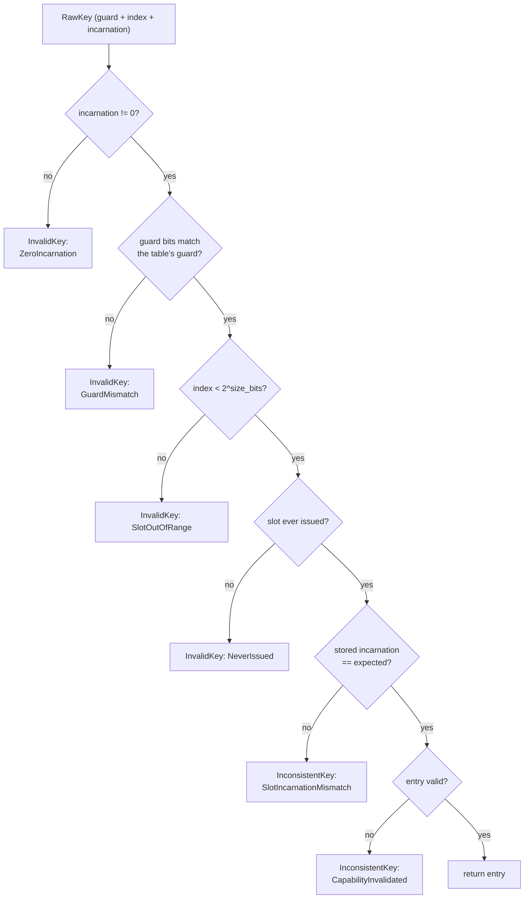

# KeyTable

| | |
|---|---|
| Wire type | `0x02` (core) |
| Pool | none as an object — a Retype-carved kernel object referenced by carve address |
| Status | Active: AddressSpace-associated caller lookup, CopyDerive/Move/Delete with guard-aware resolution; variable-size guarded tables (Retype `size_bits` 1–20); Revoke rejected with a defined error |

## Purpose

A `KeyTable` is a capability table (seL4's `CNode`): a carved array of
capability slots, each holding one `KeyEntry` plus a per-slot incarnation
counter. Each AddressSpace has one associated keytable, established during
AddressSpace provisioning and shared by all Threads executing there. PPC
selects the target AddressSpace's table on Call and restores the source
AddressSpace's table on Return; the Thread does not have an independent table. The capacity is selected at Retype — `2^size_bits` entries with
`size_bits` from 1 to 20 — and each table has a **guard**: a userspace-chosen
value, fixed for the table's lifetime, that every key minted into the table
carries above its slot index (see the key package in
`nucleus_capabilities.md`). A key whose guard bits do not address the
resolving table is rejected before indexing, so keys are bound to their table
cross-table confusion fails the guard check instead of colliding on slot and
incarnation. Guards are namespace values, not secrets: they are visible in
any valid key's address bits. KeyTable capabilities authorize *management* of
entries in a table — derivation, removal, and installation — distinct from the
authority granted by the entries themselves. Tables are Retype-created carved
objects; the boot AddressSpace's table is carved and initialized kernel-privately
by Kickstart. Caller-table selection resolves the current Thread's live
AddressSpace and its immutable provisioned table binding before looking up a key.
The binding is issued only from initialized, retained kernel-private storage;
it does not provide future reclaimable table identity.

## User-level visible operations

| Op | Name | Wire schema (`x2..x7`) | Authority | Success result |
|---|---|---|---|---|
| `0` | CopyDerive | `x2` source selector, `x3` destination-table key, `x4` vacant destination slot (bare index, guard-position bits zero), `x5` requested rights; `x6..x7` zero | `DERIVE` on the invoked source-table cap, `INSTALL` on the destination-table cap | Destination-local packed key in `x1` (carrying the destination table's guard), zero in `x2`; badge preserved, rights attenuated only |
| `1` | Move | `x2` source selector, `x3` destination-table key, `x4` vacant destination slot; `x5..x7` zero | `DERIVE` + `REMOVE` on the source-table cap, `INSTALL` on the destination | As CopyDerive; source invalidated on commit; rights and per-capability state preserved |
| `2` | Delete | `x2` target selector; `x3..x7` zero | `REMOVE` on the invoked table | zeros; entry removed, no automatic object retirement |
| `3` | — | unassigned | — | `InvalidOperation` (decoder rejects) |
| `4` | Revoke | — | — | `InvalidOperation` (scope/completion contract unresolved, D2) |

KeyTable-management rights (per-kind interpretation of the rights byte):
bit 0 `DERIVE` (source derivation), bit 1 `REMOVE` (source removal/move-out
and deletion), bit 2 `INSTALL` (destination installation); bit 3 reserved
for future table administration and not granted initially.

Rules:

- **No amplification**: requested rights must be a subset of the source
  entry's rights (`InsufficientRights` otherwise).
- **Vacant destinations**: occupied slots fail with `SlotOccupied`; Move to
  the exact same table/slot is rejected, not a no-op.
- **Checked selectors**: source/target selectors carry the table-relative
  address (guard + slot index) and expected incarnation; the guard must match
  the authorized table, and a stale selector never acts on a replacement
  occupant.
- **Guard preservation**: CopyDerive/Move of a KeyTable capability copies its
  payload — address, guard, `size_bits` — verbatim; the guard is fixed at
  table creation (Retype) and never mutated afterwards.
- **Derivation allowlist**: `KeyTable`, `Frame`, and
  debug-gated `DebugConsole`. Frame CopyDerive produces an *unmapped* derived
  capability; Move preserves the mapping record; Delete of a mapped frame
  leaves the mapping in place (accepted-leak). `CurrentReturnOnly` is not on
  the allowlist: AddressSpace provisioning installs it. Call-only Invocation
  distribution is deferred; neither extends this allowlist or approves
  arbitrary named-Thread derivation/transfer.
- **Cross-table resolution**: both the invoked table and the
  destination table are resolved through the caller's own table, so
  CopyDerive/Move can target a table other than the caller's.
- Failed operations leave authority and accounting unchanged; Move rolls
  back into the source slot on installation failure.

## Kernel-level implementation details

Storage (`kernel/nucleus/src/objects/key_table.rs`): a carved, variable-size object — a 32-byte header (owner `DomainId`, occupancy count, and the table's own `size_bits`, authoritative for internal bounds) followed by `2^size_bits` `KeyEntry` slots and `2^size_bits` `u32` incarnation counters in the same carve; the carve size is derived from `size_bits` (`KeyTable::carve_size`), and `KeyTable::initialize` writes the header and zeroes both arrays (a null `KeyEntry` is the all-zero value, so the carve is sanitized). A KeyTable capability references the carved object through a per-kind payload — `{address, guard, size_bits}` (`KeyTablePayload`) — resolved via `Access::resolve_carved{,_mut,_pair_mut}`; the payload is kernel-visible only and copied verbatim by derivation. The caller's own-table guard is sourced from its self-table capability at the well-known `SELF_KEYTABLE` slot, which must name the AddressSpace-bound table with the same capacity exponent as its binding and header; a missing or mismatched self-table capability rejects the invocation before any key validation (provisionally `InconsistentKey`/`CapabilityInvalidated`; the exact status is D9).

The entry array uses a **64 B stride**, with separate **4 B** counters.
`KeyTable::carve_size(size_bits)` rounds
`HEADER_SIZE + 2^size_bits * (size_of::<KeyEntry>() + size_of::<u32>())`
up to alignment 32. The header is 32 B; for 256 entries (`size_bits = 8`)
the full carve is **17,440 B** (`32 + 256 * (64 + 4)`). Runtime Retype,
Kickstart bootstrap, translation archive tables and fixture backing/strides
use this type-derived calculation. Counter offsets and initialization bounds
follow the same layout; entry growth changes storage charges, not slot count,
key encoding, guards or incarnation behavior.

`KeyTableBinding` stores a private nonzero address and capacity exponent, issued
by `unsafe KeyTable::binding` only when the entire initialized private carve
remains stable and neither reclaimed nor reinitialized for every retained copy.
It carries no management authority or guard; SELF remains the guard source.
The header's `owner: DomainId` is Retype bookkeeping provenance, not a checked
AddressSpace owner or authorization mechanism. Table backing is not reclaimed
by Thread/AddressSpace retirement under accepted-leak.

`KeySlot::THREAD_RETURN` stays Slot(1) and locates a granted Thread entry with
the explicit `CurrentReturnOnly` selector, never `Named(ObjectId)`. The sentinel
names no function, AddressSpace or concrete Thread, carries no management
rights, rejects Grant/Suspend/Resume/Retire and `object_id` extraction, and
permits only the invoking Thread's own current Return. AddressSpace provisioning
installs it: `KeyTable::bind_address_space`, the only issuer of the binding an
AddressSpace is created from, adds it to a vacant never-issued Slot(1) (or
accepts an existing first-incarnation sentinel), so every AddressSpace has it
before it can be activated and its key is deterministic (table guard and size,
Slot(1), incarnation `KeySlot::THREAD_RETURN_INCARNATION = 1`). A component may
still delete its own. It undergoes the same caller-AS/table/SELF, guard, incarnation,
bounds and entry-presence checks as any ordinary invocation: use the actual
issued table-local packed key, not slot index 1 alone. `KeyEntry::new_thread_return`
constructs the rights-empty sentinel. Selector accessors and
`ThreadOp::Return = 0` are implemented; `object_id` extraction on the sentinel
returns `InvalidOperation`. `Thread.Return` is dispatched with same-Thread PPC
migration.

Other slot conventions are Null `0`, self AddressSpace `2`, parent Thread `3`,
self KeyTable `4`, boot Untyped `5`, boot ASID pool `14`, and debug console `15`;
boot-table Retype test destinations remain `6–13`. No slot or kind ID changes
are implied by current-relative Return.

Slot lifecycle and lookup validation precedence:

```mermaid
flowchart TD
    A["RawKey (guard + index + incarnation)"] --> B{"incarnation != 0?"}
    B -- "no" --> E1["InvalidKey:<br/>ZeroIncarnation"]
    B -- "yes" --> G{"guard bits match<br/>the table's guard?"}
    G -- "no" --> E6["InvalidKey:<br/>GuardMismatch"]
    G -- "yes" --> C{"index < 2^size_bits?"}
    C -- "no" --> E2["InvalidKey: SlotOutOfRange"]
    C -- "yes" --> D{"slot ever issued?"}
    D -- "no" --> E3["InvalidKey: NeverIssued"]
    D -- "yes" --> E{"stored incarnation<br/>== expected?"}
    E -- "no" --> E4["InconsistentKey:<br/>SlotIncarnationMismatch"]
    E -- "yes" --> F{"entry valid?"}
    F -- "no" --> E5["InconsistentKey:<br/>CapabilityInvalidated"]
    F -- "yes" --> OK["return entry"]
```

- **Incarnations**: counter is zero before first installation,
  increment-on-install, retained on deletion. A slot whose counter cannot
  issue a fresh incarnation without wrapping rejects further installation
  (`KeySlotExhausted`, status 28) — slot-local exhaustion, never table
  retirement. This is stale-key protection: a vacated slot's old keys can
  never validate against a replacement occupant.
- **Insertion is atomic**: pre-commit failure returns the submitted entry to
  the caller (`InsertError`); null entries cannot be installed; occupancy
  count only changes on committed operations.
- **No unrestricted mutable access**: mutation happens only through targeted,
  type-checked transitions (`advance_untyped_watermark`,
  `record_frame_mapping`, `clear_frame_mapping`) that cannot change identity,
  rights, badge, or incarnation.
- `KeyEntry` is 64 bytes with alignment 32 (compile-time assertions): type
  byte, rights byte, `u16` badge, and a 40-byte payload union with
  object-identity, Thread-selector, region, frame, keytable-address, Invocation,
  and null-byte variants. The aligned payload begins at offset 8; tail padding
  makes the slot stride 64 B. `ThreadSelector` is `#[repr(C, u8)]`, 12 bytes
  with alignment 4; its forms are `Named(ObjectId)` and `CurrentReturnOnly`.
  `InvocationPayload` is 40 bytes/alignment 8 and stores a mandatory
  `NonZero<u64>` function address, checked target AddressSpace identity and
  immutable validated `InvocationStackExtent` (24 B/alignment 8). Other
  payload sizes remain `RegionPayload` 16 B, `FramePayload` 24 B and
  `KeyTablePayload` 16 B; none fixes the union or entry size.
- `KeyEntry::from_id` returns `Result<KeyEntry, CapError>` and accepts only
  known identity-backed kinds. It rejects NULL, UNTYPED, FRAME, KEY_TABLE and
  INVOCATION with `InvalidObjectType` before payload initialization; those
  kinds use their dedicated constructors. Thread construction initializes
  `ThreadSelector::Named(id)` rather than a generic object-identity union
  member, so the kind always selects an initialized compatible payload.
- Same-table operands use a single mutable guard; distinct tables use the
  alias-rejecting pair-resolution form (`resolve_carved_pair_mut`).

## Sidenotes

- Authority split: possession of an ordinary invocable object key
  does not confer table-management authority; there is no manager-identity
  exception — the appropriate KeyTable capabilities and permissions are the
  general rule.
- CopyDerive preserves badges verbatim; badge creation/rebadging is deferred
  (D4). `grant_to` remains a client-side CopyDerive convenience wrapper
  requesting prototype `Rights::all()`.
- Deleting the last retirement-authorized capability need not retire the
  object — correct resource management is the OS's responsibility (accepted
  leak).

## TODOs

- Revoke: scope, completion contract, selective subtree invalidation of a
  still-live object — D2 (rejected, not faked, until then).
- Badge derivation and badge-zero semantics beyond Notification's selected
  hybrid — D4.
- Ownership of well-known `KeySlot` constants and remaining bootstrap
  Thread/AddressSpace lists, capacities/grants and incarnation-bearing handoff
  records — D4; the slot conventions above are fixed for this scope.
- Call-only Invocation distribution restrictions — deferred D4 decision, not
  allowlist/transfer approval.
- Notification index/registration versus variable-capacity tables (a 64-bit
  pending bitmap does not fit every slot) — D4.
- Untyped-backed pool/metadata ownership for tables — Phase 5.

## Cross-reference: implementation vs. desired capabilities (🧠 Vesper vault)

- `Vesper Capabilities (from wiki).md` (vault): capability spaces as a
  **directed graph of KeyNodes** with guarded page tables, per-node radix,
  guards, depth limits, and sparse addressing — **partial mismatch**: a
  per-table guard and Retype-chosen capacity are selected, but the current
  KeyTable remains a single-level flat table — no graph, no radix tree, no
  depth-limit addressing. `Capabilities/Prototype.md` sketches the
  radix-prefixed tree (`Key::KeyNode { next_node_ptr }`) — none of that is
  implemented.
- Vault wiki: "Each slot requires **16 bytes** of physical memory" —
  **mismatch**: the current `KeyEntry` is 64 bytes/alignment 32,
  plus a per-slot `u32` incarnation counter outside the entry and a shared
  32 B table header. Storage is type-derived, not a fixed seL4-size target.
- Vault wiki: minted capabilities tracked in a kernel **capability derivation
  tree (CDT)**; revoke "recursively removes any capabilities that were
  derived from the original" — **mismatch**: there is no kernel CDT; Revoke is
  rejected outright, and subtree revocation/cleanup is delegated to
  userspace managers (D2 selection). The vault's kernel-side CDT conflicts with
  the selected no-kernel-derivation-tree direction.
- Vault wiki: capabilities "sent via IPC" / "passed through messages" —
  **open**: PPC Invocation capability-transfer semantics have not been
  selected; do not infer them from the removed message-rendezvous sketches.
- Vault wiki: "number of slots in a KeyNode must be a power of two" and is
  user-chosen at Retype — **consistent**: the capacity is `2^size_bits` with
  `size_bits` 1–20 chosen at Retype, implemented as a variable-size carve
  with header-authoritative bounds; 256 entries is a fixture capacity,
  not a universal table limit.
- `Capabilities.md` (vault): seL4-style `cte` (cap table entry + mdb node)
  and `sameObjectAs` — **not implemented**: no MDB/ancestry metadata is
  stored; object identity is checked via pool generations instead.
