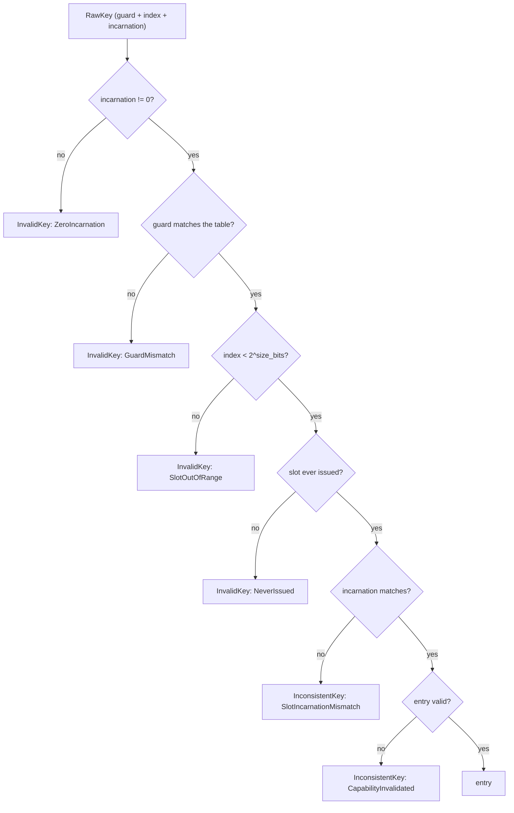

# KeyTable

| | |
|---|---|
| Wire type | `0x02` (core) |
| Pool | none — a Retype-carved kernel object referenced by carve address |
| Status | Active: CopyDerive/Move/Delete; Revoke returns `InvalidOperation` |

## Purpose

A `KeyTable` is a capability table (seL4's `CNode`): `2^size_bits` slots
(`size_bits` 1–20, chosen at Retype), each holding one `KeyEntry` with a
per-slot incarnation counter. Every `AddressSpace` has exactly one table,
bound when the `AddressSpace` is provisioned and shared by all Threads
executing in it; a Thread migrated by PPC uses the target's table.

Each table has a **guard**, chosen at creation and fixed for its lifetime.
Every key minted into the table carries the guard above its slot index, so a
key presented to the wrong table fails the guard check instead of colliding
on slot and incarnation. Guards are namespace values, not secrets.

A KeyTable capability authorizes *managing* entries — derivation, removal,
installation — independently of the authority the entries themselves carry.

## User-level visible operations

| Op | Name | Wire schema (`x2..x7`) | Authority | Success result |
|---|---|---|---|---|
| `0` | CopyDerive | `x2` source key, `x3` destination-table key, `x4` vacant destination slot (bare index), `x5` requested rights; `x6..x7` zero | `DERIVE` on the invoked table, `INSTALL` on the destination | Destination-local key in `x1`, zero in `x2`; badge kept, rights only attenuated |
| `1` | Move | `x2` source key, `x3` destination-table key, `x4` vacant destination slot; `x5..x7` zero | `DERIVE` + `REMOVE` on the invoked table, `INSTALL` on the destination | As CopyDerive; source invalidated; rights and state kept |
| `2` | Delete | `x2` target key; `x3..x7` zero | `REMOVE` on the invoked table | zeros; entry removed, object not retired |
| `3` | — | unassigned | — | `InvalidOperation` |
| `4` | Revoke | — | — | `InvalidOperation` (D2) |

Management rights: bit 0 `DERIVE`, bit 1 `REMOVE`, bit 2 `INSTALL`; bit 3 is
reserved for table administration.

- **No amplification**: requested rights must be a subset of the source's
  (`InsufficientRights`).
- **Vacant destinations**: an occupied slot fails with `SlotOccupied`; Move
  onto its own slot is rejected.
- **Checked keys**: source and target keys carry guard, slot and incarnation;
  a stale key never acts on a newer occupant.
- **Derivation allowlist**: `KeyTable`, `Frame` and (debug-gated)
  `DebugConsole`. A derived Frame is unmapped; Move keeps a Frame's mapping
  record; deleting a mapped Frame leaves the mapping in place (accepted leak).
  Other kinds are created directly in their destination (Retype into any
  table the caller can `INSTALL` into; `CreateInvocation` into a chosen
  table).
- **Cross-table**: the invoked and destination tables are both resolved
  through the caller's own table, so a manager can operate on tables other
  than its own.
- Failures leave authority and accounting unchanged; Move rolls back into the
  source slot if installation fails.

### Well-known slots

| Slot | Contents |
|---:|---|
| 0 | Null |
| 1 | `KeySlot::THREAD_RETURN`: the [`CurrentReturnOnly`](thread.md#return) sentinel, installed by provisioning |
| 2 | Self `AddressSpace` |
| 3 | Parent Thread |
| 4 | Self KeyTable (the guard source for the caller's own lookups) |
| 5 | Boot Untyped |
| 14 | Boot ASID pool |
| 15 | Debug console |
| 16 | `KeySlot::FAULT_HANDLER`: this `AddressSpace`'s fault handler, an `Invocation` the kernel Calls on a faulting Thread ([fault delivery](thread.md#fault-delivery)); empty means faults here are unhandled |

## Kernel-level implementation details

- **Storage** (`kernel/nucleus/src/objects/key_table.rs`): one carve holding a
  32-byte header (owner, occupancy, `size_bits`), `2^size_bits` 64-byte
  `KeyEntry` slots and `2^size_bits` `u32` incarnation counters, rounded to
  alignment 32 (`KeyTable::carve_size`; 17,440 B for 256 entries). Retype
  initializes it, and the all-zero entry is null, so a new table is sanitized.
- **Capability payload**: `{address, guard, size_bits}`, resolved through
  `Access::resolve_carved{,_mut,_pair_mut}`; derivation copies it verbatim.
- **Binding**: `unsafe KeyTable::bind_address_space` is the only issuer of the
  `KeyTableBinding` an `AddressSpace` is created from. It requires initialized,
  retained private storage and installs the Return sentinel at Slot 1. The
  caller's guard comes from its Slot-4 self-table capability, which must match
  the binding; a mismatch fails before any key is checked.
- **Lookup** order:

```mermaid
flowchart TD
    A["RawKey (guard + index + incarnation)"] --> B{"incarnation != 0?"}
    B -- "no" --> E1["InvalidKey: ZeroIncarnation"]
    B -- "yes" --> G{"guard matches the table?"}
    G -- "no" --> E6["InvalidKey: GuardMismatch"]
    G -- "yes" --> C{"index < 2^size_bits?"}
    C -- "no" --> E2["InvalidKey: SlotOutOfRange"]
    C -- "yes" --> D{"slot ever issued?"}
    D -- "no" --> E3["InvalidKey: NeverIssued"]
    D -- "yes" --> E{"incarnation matches?"}
    E -- "no" --> E4["InconsistentKey: SlotIncarnationMismatch"]
    E -- "yes" --> F{"entry valid?"}
    F -- "no" --> E5["InconsistentKey: CapabilityInvalidated"]
    F -- "yes" --> OK["entry"]
```

- **Incarnations** start at zero, increment on install and survive deletion.
  A slot that cannot issue a fresh incarnation refuses installation
  (`KeySlotExhausted`, status 28).
- **Insertion is atomic**: a failed insert hands the entry back
  (`InsertError`); null entries cannot be installed.
- **No unrestricted mutable access**: entries change only through typed
  transitions (`advance_untyped_watermark`, `record_frame_mapping`,
  `clear_frame_mapping`) that cannot alter identity, rights, badge or
  incarnation.
- **`KeyEntry`** (64 B, alignment 32): type, rights, `u16` badge and a 40-byte
  payload union (object identity, Thread selector, region, frame, table,
  Invocation). `KeyEntry::from_id` accepts only identity-backed kinds; the
  others have dedicated constructors.
- Same-table operands use one mutable guard; two tables use the
  alias-rejecting `resolve_carved_pair_mut`.

## Sidenotes

- Holding a key to an object grants no table-management authority; there is
  no manager-identity exception.
- CopyDerive keeps badges verbatim; badge creation is not implemented (D4).
- Deleting the last retirement-authorized capability does not retire the
  object; resource management is the OS's job (accepted leak).
- Table backing is not reclaimed by Thread or `AddressSpace` retirement.

## TODOs

- Revoke: scope, completion, selective invalidation of a still-live object —
  D2.
- Badges — D4.
- Ownership of the well-known slot constants and the bootstrap handoff
  records — D4.
- Invocation distribution (CopyDerive of Invocations) — D4.
- Notification indexing versus variable-capacity tables — D4.
- Untyped-backed ownership of table storage — Phase 5.
