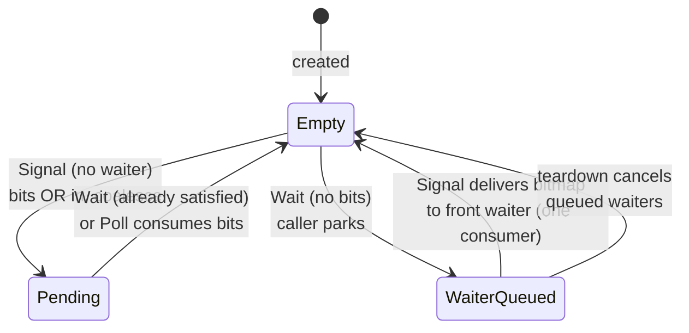

# Notification

| | |
|---|---|
| Wire type | `0x06` (core) |
| Pool | `PoolTag::Notification` (bootstrap-carved pool; Retype-creatable) |
| Status | Active: Signal/Wait/Poll through real SVC dispatch, including blocking Wait |

## Purpose

A `Notification` is a word-sized coalescing signal bitmap with one-consumer
waiter delivery: asynchronous, non-queuing event notification. Repeated
signals to a bit coalesce; a `Wait` blocks until bits are pending and then
consumes them. Typical uses: IRQ identity, completion signaling, waking
workers to inspect a queue. Broadcast-style observation is served by
`EventCount` instead, by design.

## User-level visible operations

| Op | Name | Wire schema (`x2..x7`) | Authority | Success result |
|---|---|---|---|---|
| `0` | Signal | `x2` bits (used when the capability badge is zero); `x3..x7` zero | `SEND` | zeros; ORs the authorized bits and wakes at most one waiter |
| `1` | Wait | `x2` timeout (ns; `u64::MAX` = infinite; zero/finite invalid until the time subsystem exists); `x3..x7` zero | `RECV` | Pending bits in `x1` (consumed); blocks when none pending |
| `2` | Poll | no arguments | `RECV` | Pending bits in `x1` (consumed), zero = none; never blocks |

Signal-bits hybrid: a badged capability signals its
badge; an unbadged one (badge zero — what Retype installs) signals the
caller-supplied argument. `NotificationKey::WAIT_INFINITE` (`u64::MAX`) is the
userspace encoding of an infinite wait.

## Kernel-level implementation details

Pool-backed kernel metadata (`kernel/nucleus/src/objects/notification.rs`):
a `u64` coalescing bitmap plus a bounded FIFO `WaitQueue`. The capability is
a checked pool identity resolved through the guarded `Access` context.
Retype installs it from the bootstrap-carved notification pool with
`size_bits` reserved zero (no Untyped bytes carved).

- **One-consumer delivery**: at most one waiter wakes per signal; the front
  (oldest) waiter's pending record completes with the delivered bitmap and
  its thread becomes runnable. Invariant: `state` is nonzero only while no
  waiter is queued (single-core execution under the kernel lock keeps this
  race-free).
- **Blocking path**: a would-block `Wait` returns `InvokeOutcome::Blocked`;
  the syscall entry parks the caller's exception frame and switches via the
  bounded runnable-thread scheduler; the resume delivers the completed
  bitmap. Validated end-to-end by the debug-gated Bounce fixture
  in `just test-capability-boot`.
- **Bounded queues**: the wait reservation is validated before admission — a
  full queue rejects with `PoolExhausted` before any record is registered,
  so nothing leaks.
- **Teardown**: object teardown (`cancel_waiters`) gives every queued record
  its single terminal transition (`Cancelled`); domain teardown
  (`remove_waiter` + `PendingPool::teardown_waiter`) unqueues only the
  torn-down Thread's records, preserving FIFO order of the survivors, and is
  driven by `Thread.Retire` via `Nucleus::cancel_thread_pending`.
- **Memory ordering** : kernel-mediated release/acquire
  — a `Signal` acts as a release on the caller's behalf; observing the
  bitmap (wakeup, satisfied wait, Poll) acts as an acquire. DMA/device writes
  are not covered.

## Sidenotes

- Rights reuse per kind: `SEND` = bit 1, `RECV` = bit 0 (the same positions as
  `WRITE`/`READ` with per-kind meaning, permitted by the contract).
- Do not promise both "consumes all bits" and "delivers those bits to every
  waiter" — the one-consumer contract is deliberate; use `EventCount` for
  broadcast.
- Wakeup summary updates must agree with DCB semantics (D5).

## TODOs

- Badge derivation (D4) activates the badge path of the signal hybrid;
  currently only the argument path is reachable.
- Finite timeouts once the time subsystem exists (D8); currently rejected
  with a defined error rather than pretending to time out.
- IRQ identity delivery: notifications are the intended landing object for
  interrupt delivery, but no IRQ→Notification binding exists (see
  [irq_handler.md](../arch/irq_handler.md)).
- Notification index/registration scheme versus 256-slot tables (D4).

## Cross-reference: implementation vs. desired capabilities (🧠 Vesper vault)

- `IPC and PPC/IPC and PPC.md` (vault wiki section): notifications as
  coalescing endpoints for async signaling — **consistent**: the implemented
  bitmap-coalescing, wait-consumes semantics match the seL4-style intent.
- Vault: notifications are the destination for IRQ delivery ("Interrupts …
  translating them into invocations of the device drivers' handlers",
  `Vesper.md`) — **gap**: no interrupt-controller HAL or IRQ binding exists
  (`Interrupts.md` vault note is an unchecked todo list); the Notification
  object is ready to be the target, but nothing delivers to it yet.
- `Vesper Capabilities (from wiki).md` (vault): capabilities can be "sent via
  IPC" — **gap**: Notification carries no capability transfer (by design,
  data-free); capability transfer belongs to Endpoint/Reply and is
  unimplemented.
- `API/fbufs.md` (vault): `irq_notify` notification in the NetRxChannel
  pattern — **consistent as a composition pattern**: the vault's intended
  use (IRQ → notification → worker inspects ring) is exactly the
  "waking workers to inspect a queue" composition; the kernel primitive
  exists, the IRQ half does not.
- No vault note contradicts the one-consumer selection; the vault wiki does
  not specify waiter-delivery policy, so the selection fills a gap rather
  than diverging.
