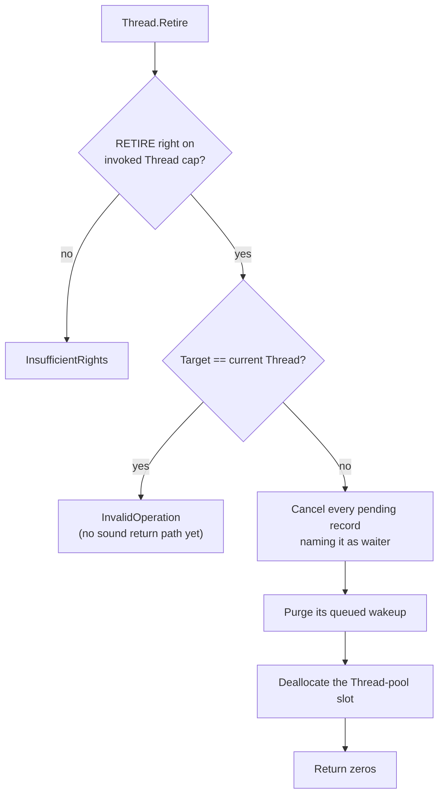

# Thread

| | |
|---|---|
| Wire type | `0x03` (core) |
| Pool | `PoolTag::Thread` (pool-backed kernel object) |
| Status | Active: `Retire` (teardown); Grant/Suspend/Resume return defined errors |

## Purpose

A `Thread` is the schedulable execution entity that holds a capability to its
`AddressSpace` (the protection/mapping context — Vesper's VSpace equivalent)
and to its `KeyTable` (its CSpace), plus the kernel-private execution state
used to park and resume blocked callers. Thread capabilities authorize
control over that thread's lifecycle.

## User-level visible operations

| Op | Name | Wire schema (`x2..x7`) | Authority | Success result |
|---|---|---|---|---|
| `0` | — | — | — | unassigned; activation is `AddressSpace.Activate`; `InvalidOperation` |
| `1` | Grant | — | — | `InvalidOperation` (unsupported; overlaps KeyTable delegation) |
| `2` | Suspend | — | — | `InvalidOperation` (deferred, D7/D8) |
| `3` | Resume | — | — | `InvalidOperation` (deferred, D7/D8) |
| `4` | Retire | no arguments (all zero) | `RETIRE` (`0x20`) on the invoked Thread | zeros; tears down the invoked Thread |

### Retire

Tears down the invoked Thread:

The current Thread may not retire itself: the invocation must return to a
surviving caller. Never-returns self-retirement is contract-recorded
follow-up. Deliberately out of scope (recorded gaps): carved backing
(keytable, kernel stack) stays leaked per accepted-leak; the AddressSpace is
untouched — its teardown is the separate
[`AddressSpace.Retire`](../arch/address_space.md); the DCB is untouched
(D5). Subsequent invocations of the retired Thread's capabilities fail pool
validation with a defined error.

## Kernel-level implementation details

- Pool-backed via `NucleusPools::threads`; capabilities store a checked
  `ObjectId` (pool tag + index + generation), resolved through the guarded
  `Access` context — never raw pointers.
- Kernel-private fields (`kernel/nucleus/src/objects/thread.rs`):
  `keytable_addr` (the Thread's carved KeyTable), `address_space` (the
  checked identity of its `AddressSpace`), and `context`
  (`ExecutionContext`: `NotStarted` / `Parked` / `Running`) used by the
  completion foundation to park and resume blocked callers.
- `Thread.Retire` maps to `Nucleus::cancel_thread_pending` + pool
  deallocation; teardown-before-reuse cancels waits and purges queued
  wakeups first.
- The user-visible half is the DCB (`DcbPages` manager, nanosecond time
  accounting). **DCBs are not yet connected to pool Threads** (D5); the
  selected direction makes them thread scheduling pages explicitly shared
  with the userspace scheduler (Composite-style), not a global export of
  every thread's state.
- Retype cannot create a Thread (`InvalidObjectType`): bootstrap grants are
  the initial source of Thread capabilities, which is why `RETIRE` cannot
  originate from a memory carve.
- No current thread is an explicit state: absent caller identity fails with
  `InvalidDomain` rather than falling back to thread zero.

## Sidenotes

- `RETIRE` is delegable like other capability permissions: retirement
  authorization follows capability permissions, not a privileged owner
  identity (permission-based lifetime control).
- A Thread executes in exactly one AddressSpace; resolving its
  `address_space` identity validates against the address-space pool, so a
  retired AddressSpace fails the next resolution with a defined error.

## TODOs

- Full Start/Suspend/Resume with legal state transitions, execution
  budget, and EL0 entry — Phase 7 (D7/D8).
- Never-returns self-retirement (terminal entry-path work).
- DCB layout/stride/sharing/publication and DcbView persistence — D5.
- Coherent current-thread identity carrying its own generation — Phase 4.
- `Thread.Grant` relationship to KeyTable CopyDerive — D4.

## Cross-reference: implementation vs. desired capabilities (🧠 Vesper vault)

- `Vesper Capabilities (from wiki).md` (vault): "thread control blocks …
  mechanisms for manipulating thread state if you are given a corresponding
  capability" — **partial mismatch**: current Thread control is limited to
  teardown; there are no register/stack manipulation operations (the vault
  `Scheduling/Scheduling.md` note "capability model provides a way for
  server holding capability to a thread to manipulate its registers and
  stack" is not implemented).
- `Scheduling/Scheduling.md` (vault): user-level scheduling with kernel
  upcalls — **not implemented**; no scheduler-driven cancellation or upcall
  mechanism exists yet (Phase 7, D8).
- `Memory.md` (vault): "arbitrary threads may execute" in a protection
  domain's address space (Mach/Mungi notes) — **now aligned in structure**:
  the Thread (execution) is separate from the AddressSpace (protection
  context); multiple threads per address space remains future work (one
  Thread per AddressSpace today).
- DCB observation ("protection domains … capabilities for accessing this
  memory from the outside", vault wiki) — **gap**: DCB pages exist and a
  manager is implemented, but they are not yet connected to pool Threads and
  no userspace observation contract is active (D5).
