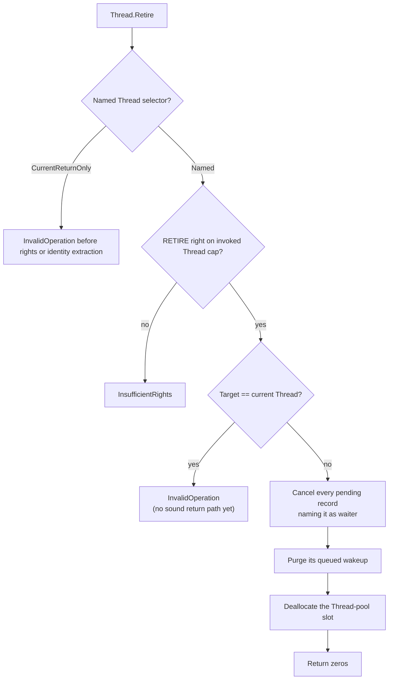

# Thread

| | |
|---|---|
| Wire type | `0x03` (core) |
| Pool | `PoolTag::Thread` for `Named(ObjectId)`; `CurrentReturnOnly` names no pooled object |
| Status | `ThreadSelector` and boot Slot(1) sentinel implemented; `Retire` active on named Threads; Grant/Suspend/Resume return `InvalidOperation`; `Return` `0` on `CurrentReturnOnly` is active through real SVC dispatch (pop, source restore, scrubbed result delivery); Return faults halt the kernel under the interim policy; fault delivery, fallible `ThreadReturnKey::return_from_invocation` helper and `ppc_export!` export adapter implemented |

## Purpose

A `Thread` is the schedulable execution entity that holds a capability to its
`AddressSpace` (the protection/mapping context — Vesper's VSpace equivalent),
plus kernel-private execution state. Ordinary capability invocations use the
keytable associated with the Thread's current AddressSpace; all Threads in one
AddressSpace share that keytable. Named Thread capabilities authorize control
over that Thread's lifecycle through the explicit `Named(ObjectId)` selector.
The separate `CurrentReturnOnly` selector authorizes only the invoking Thread's
own current PPC return: it names no function, AddressSpace or concrete Thread,
carries no Thread-management rights, and rejects `object_id` extraction.

## User-level visible operations

| Op | Name | Wire schema (`x2..x7`) | Authority | Success result |
|---|---|---|---|---|
| `0` | Return | `x2` first `u64` payload word, `x3` second; `x4..x7` ignored | Only `CurrentReturnOnly`, never `Named(ObjectId)`; no Thread-management rights | Contract: nonlocal source resumption with `x0 = SUCCESS`, `x1 = r0`, `x2 = r1`; currently `InvalidOperation`, PPC dispatch unimplemented |
| `1` | Grant | — | — | `InvalidOperation` (unsupported; overlaps KeyTable delegation) |
| `2` | Suspend | — | — | `InvalidOperation` (deferred, D7/D8) |
| `3` | Resume | — | — | `InvalidOperation` (deferred, D7/D8) |
| `4` | Retire | no arguments (all zero) | `RETIRE` (`0x20`) on the invoked `Named(ObjectId)` Thread | zeros; tears down the invoked Thread |

### Return

`Thread.Return` uses the ordinary capability transport: `x0` is the actual
current-AS-table-local packed return key, `x1 = 0`, and `x2`/`x3` carry the two
payload words. `KeySlot::THREAD_RETURN` locates the kernel-constructed
`CurrentReturnOnly` sentinel at Slot(1); Kickstart installs it in the boot table.
AddressSpace provisioning installs it (`KeyTable::bind_address_space`) before the AddressSpace can be activated; a component may still delete its own sentinel. All other slots and kind IDs
remain unchanged (`Thread = 3`, `Invocation = 7`).

Ordinary lookup validates the invoking Thread's live current AddressSpace,
its bound KeyTable and SELF entry, table guard, slot bounds, incarnation and
entry presence before selector/operation handling. There is no magic raw key,
slot-only fallback or lookup bypass. All Threads in one AddressSpace share
the sentinel, but it acts only on the invoking Thread's own current invocation
stack. It grants no access to another Thread's continuation.

A valid `Named(ObjectId)` entry rejects Return with `InvalidOperation`.
`CurrentReturnOnly` rejects Grant/Suspend/Resume/Retire with `InvalidOperation`
and rejects `object_id` extraction with `InvalidOperation`, without resolving
a fake concrete identity. Retire checks `CurrentReturnOnly` before testing
`RETIRE` rights or extracting a named identity. Empty/stale/wrong-guard keys retain ordinary lookup failures.
Invocation has only Call `0`; opcode zero on an Invocation means Call, not
wrong-form Return, and unknown Invocation opcode `1` is `InvalidOperation`
(the Call handler is active).

An admitted Return consumes only the immediate-source top continuation and
restores the source context with the selected result/scrub rules below.
Depth-zero underflow is the "illegal return" fault; a retired saved source
AddressSpace is the "return target retired" fault. Neither pops the stack;
Thread teardown releases the records. Kernel fault delivery/binding/resumption
remain open, not ordinary helper-error paths.

The low-level helper contract is `Result<core::convert::Infallible, CapError>`:
correct success never returns locally, ordinary pre-commit rejection returns
`Err` with shared diagnostics and no pop/migration, and unexpected local
SUCCESS becomes `UnexpectedReturn` status 34 without a safe-retry guarantee.
The common export adapter's result spill, clobbers and non-returning
`vesper_thread_return_fault` handoff are described in the
[Invocation PPC adapter contract](invocation.md#contract-details-still-to-specify).
`ThreadOp::Return = 0`, `ThreadSelector`, kernel construction/accessors and
bootstrap installation at `KeySlot::THREAD_RETURN` Slot(1) are implemented.
The kernel Return path:
`api::thread::prepare_return` checks the op, ordinary lookup, Thread kind and
`CurrentReturnOnly` form (the selector is the authority; the sentinel has no
rights), then `Nucleus::prepare_return` classifies underflow as
`ReturnFault::IllegalReturn` and a stale or reused saved source AddressSpace as
`ReturnFault::ReturnTargetRetired`, neither popping. A live source whose
root/ASID is missing or unencodable is not classified by the contract; it
currently surfaces as the ordinary preparation error, also without a pop.
`Nucleus::commit_return` re-checks the description (same Thread incarnation,
running, same AddressSpace, depth and top record; stale is `InvalidOperation`
with no mutation), pops the top record and migrates the Thread back to the
source AddressSpace and table. The resumed frame carries `x0 = SUCCESS`,
`x1 = r0`, `x2 = r1`, zero `x3..x18`, and the exact saved source
`x19..x30`, SP, PC, origin and raw SPSR including NZCV; `x4..x7` are ignored.
Return is dispatched: `core_invoke` routes op 0 on a Thread entry to
`return_from_call`, and the SVC entry installs the source translation after
guards and the lock end, restores the resumed frame and traces
`✅ Thread::Return()`. Under the maintainer-selected interim policy, either
classified fault (`IllegalReturn`, `ReturnTargetRetired`) halts the kernel with
`panic!` and nothing is popped; real fault delivery (D1/D7) is not designed.
`ThreadReturnKey::return_from_invocation(r0, r1) -> Result<Infallible, CapError>`
(over `libsyscall::ppc_return`) is the low-level helper: success never returns
locally, ordinary rejections come back as `Err`, and a local `SUCCESS` becomes
`UnexpectedReturn` (status 34) with the local x1/x2. The common export adapter
(`libobject::export::complete_export`, used by `ppc_export!`) loads the Return
key recorded at component init, Returns through this helper, and on `Err`
hands the error triple and the original words to the image-supplied
`vesper_thread_return_fault`. The sentinel is installed by AddressSpace
provisioning and is not propagated through KeyTable management; no named-Thread
derivation or transfer permissions are granted.

### Retire

Tears down the invoked named Thread:

```mermaid
flowchart TD
    A["Thread.Retire"] --> S{"Named Thread selector?"}
    S -- "CurrentReturnOnly" --> ES["InvalidOperation before rights or identity extraction"]
    S -- "Named" --> B{"RETIRE right on invoked Thread cap?"}
    B -- "no" --> E1["InsufficientRights"]
    B -- "yes" --> C{"Target == current Thread?"}
    C -- "yes" --> E2["InvalidOperation<br/>(no sound return path yet)"]
    C -- "no" --> D["Cancel every pending record<br/>naming it as waiter"]
    D --> E["Purge its queued wakeup"]
    E --> F["Deallocate the Thread-pool slot"]
    F --> OK["Return zeros"]
```

The current Thread may not retire itself: the invocation must return to a
surviving caller. Never-returns self-retirement is contract-recorded
follow-up. Deliberately out of scope (recorded gaps): the AddressSpace is untouched — its
teardown is the separate [`AddressSpace.Retire`](../arch/address_space.md).
The keytable belongs to the AddressSpace, not the Thread; Thread retirement
leaves that association and its retained carved backing untouched. Scheduler-shared record
retirement and reuse follow the D5 protocol and are not implemented yet.
Subsequent invocations of the retired Thread's capabilities fail pool
validation with a defined error.

## Kernel-level implementation details

- Named Thread entries are pool-backed via `NucleusPools::threads`, with the
  `Named(ObjectId)` selector carrying a checked pool tag + index + generation,
  resolved through the guarded `Access` context — never raw pointers.
  `CurrentReturnOnly` has no object identity to resolve; its ordinary checked
  key lookup and selector handling are distinct from concrete-object access.
  The implemented `ThreadSelector` is `#[repr(C, u8)]`, 12 bytes with alignment
  4, stored in the 40-byte payload union. `KeyEntry` is 64 bytes with alignment
  32. The larger union holds the 40 B Invocation payload (target identity,
  mandatory nonzero entry and immutable validated extent/headroom); the
  Thread selector itself is unchanged. KeyTable backing/accounting uses the
  actual 64 B stride. `KeyEntry::from_id` returns `Result<KeyEntry, CapError>` and initializes
  `ThreadSelector::Named(id)` for the Thread kind. `new_thread_return` creates
  the rights-empty sentinel; `thread_selector` and `is_thread_return_key` read
  its form without resolving a concrete object. `object_id` on
  `CurrentReturnOnly` returns `InvalidOperation`.
- Current implementation fields (`kernel/nucleus/src/objects/thread.rs`):
  `address_space` (the checked identity of its `AddressSpace`, which selects
  the associated keytable), and `context`
  (`ExecutionContext`: `NotStarted` / `Parked` / `Running`) used by the
  completion foundation to park and resume blocked callers. There is no
  per-Thread table address. The internal creation fixture validates the
  AddressSpace before allocation and does not install table grants, so several
  Threads can share one AddressSpace/table without changing slot incarnations.
  `NotStarted` owns its initial `SavedContext`; `Parked` owns a saved context
  and checked pending-record identity. The 280-byte saved state contains all
  integer registers, SP, PC, raw SPSR, and exception origin. No persistent
  exception-frame pointer or per-Thread kernel stack exists. The SVC handler
  copies blocked state here, selects a runnable Thread, rewrites its transient
  288-byte trap frame, and unwinds normally to `ERET`. Thread pool carving and
  fixture backing derive from the actual type layout, with page-fit assertions.
  Trusted source/Bounce execution uses EL1t/SP_EL0 while traps share the high
  per-core SP_EL1 stack. The bounded wait/resume fixture switches between
  independently provisioned roots with source ASID 1 and Bounce ASID 2;
  source activation precedes the first handoff. This is internal fixture
  scheduling, not public Thread control or protected EL0 confinement.
  Same-Thread PPC Call/Return migrates between the same roots through the
  invocation stack below.
- PPC storage and [GPR/NZCV exposure contract](invocation.md#non-payload-gpr-and-condition-flag-exposure):
  depth-16 inline kernel-private continuation array with source AddressSpace
  identity, PC/SP, stamp, raw SPSR, exception origin and twelve source x19–x30
  words. On successful Call, the kernel first saves the source continuation
  from the transient frame and consumes provisional target SP from saved
  `frame.gpr[9]`; it then retains real arguments x2..x7, zeroes dummy x0/x1
  and x8..x30, clears target NZCV, inherits source saved SPSR mode/masks/other
    non-NZCV controls, and sets target execution SP/PC. Status comes from the
    saved admitted source frame, not live kernel-handler PSTATE; Call changes
    AddressSpace/keytable, not execution privilege. No
  source-side dummy-zeroing or source spill stub is required. Successful Return
  captures r0/r1 before rewriting the frame, delivers x0=SUCCESS/x1=r0/x2=r1,
  zeroes x3..x18, and restores exact source x19..x30, AddressSpace/SP/PC/origin
  and raw SPSR including NZCV. Nested Calls save each immediate source's own
  snapshot; restoration does not trust target code or direct Return.
  Migration scrubbing does not apply to recoverable local Call/Return rejection;
  existing preservation/error contracts are unchanged. Ignored Return x4..x7
  require no userspace initialization or zeroing despite successful resumed-frame
  scrubbing. No extra fields are needed; the record is 144 B and the array
  2304 B per Thread. Thread layout, pool stride/backing/accounting and fixture
  bounds derive from the actual types. Storage comes from supplied Thread pool
  backing, without runtime kernel allocation. The record array, preservation,
  scrubbing and status inheritance are implemented and validated through real
  Call/Return; TLS, debug state and complete architectural-state isolation
  remain open. x9 stays provisional
  and the native body-result convention experimental.
- `Nucleus::park_and_select` validates the target AddressSpace incarnation,
  root/ASID presence and backend encoding, saved execution state, and pending
  completion before committing park/select. Subsequent capability lookup
  resolves the selected Thread's current AddressSpace's keytable. Hardware
  installation and transient-frame restoration occur after object/Access
  guards and the kernel lock end. Rejected preparation preserves both Thread
  contexts, pending records, current selection, and the runnable FIFO; it does
  not undo the wait already admitted by dispatch. The trusted fixture treats
  an impossible preparation failure as an invariant failure, not fake wait
  completion or a recovery ABI. Copied prepared metadata is not a lifetime
  pin: immediate installation relies on the serialized single-core, masked,
  non-reentrant trap interval; later or asynchronous use needs fresh validation.
- `Thread.Retire` maps to `Nucleus::cancel_thread_pending` + pool
  deallocation; teardown-before-reuse cancels waits and purges queued
  wakeups first.
- Scheduler-visible scheduling records reside in scheduler-owned pages
  shared to the kernel through `Scheduler.ShareRegion`; they are not a global
  DCB view. The scheduler can write all bytes in its mapped pages. Kernel-only
  TCB/execution state remains private. The initial field split follows the
  existing DcbPage/TCB division, with exact fields still to be specified.
  Record association with pool Threads, sharing, and publication are not yet
  implemented.
- Retype cannot create a Thread (`InvalidObjectType`): bootstrap grants are
  the initial source of Thread capabilities, which is why `RETIRE` cannot
  originate from a memory carve.
- No current thread is an explicit state: absent caller identity fails with
  `InvalidDomain` rather than falling back to thread zero.

## Sidenotes

- `RETIRE` is delegable like other capability permissions: retirement
  authorization follows capability permissions, not a privileged owner
  identity (permission-based lifetime control).
- A Thread executes in exactly one AddressSpace; resolving its
  `address_space` identity validates against the address-space pool, so a
  retired AddressSpace fails the next resolution with a defined error.

## TODOs

- Return fault delivery (underflow, retired saved source) — D1/D7; currently
  an interim kernel panic with nothing popped.
- Per-call time attribution on Return from the record's Call stamp.
- Full Start/Suspend/Resume with legal state transitions, execution
  budget, and EL0 entry — Phase 7 (D7/D8).
- Never-returns self-retirement (terminal entry-path work).
- Scheduler-shared record table layout/capacity/publication/reuse and
  `Scheduler.ShareRegion` implementation — D5.
- Coherent current-thread identity carrying its own generation — Phase 4.
- `Thread.Grant` relationship to KeyTable CopyDerive — D4.

## Cross-reference: implementation vs. desired capabilities (🧠 Vesper vault)

- `Vesper Capabilities (from wiki).md` (vault): "thread control blocks …
  mechanisms for manipulating thread state if you are given a corresponding
  capability" — **partial mismatch**: current Thread control is limited to
  teardown; there are no register/stack manipulation operations (the vault
  `Scheduling/Scheduling.md` note "capability model provides a way for
  server holding capability to a thread to manipulate its registers and
  stack" is not implemented).
- `Scheduling/Scheduling.md` (vault): user-level scheduling with kernel
  upcalls — **not implemented**; no scheduler-driven cancellation or upcall
  mechanism exists yet (Phase 7, D8).
- `Memory.md` (vault): "arbitrary threads may execute" in a protection
  domain's address space (Mach/Mungi notes) — **now aligned in structure**:
  the Thread (execution) is separate from the AddressSpace (protection
  context); multiple Threads can share its table and allocation/dispatch are
  tested. Full userspace scheduling and protected execution remain unfinished.
- DCB observation ("protection domains … capabilities for accessing this
  memory from the outside", vault wiki) — **gap**: scheduler-shared records
  and their association with pool Threads are not implemented (D5).
