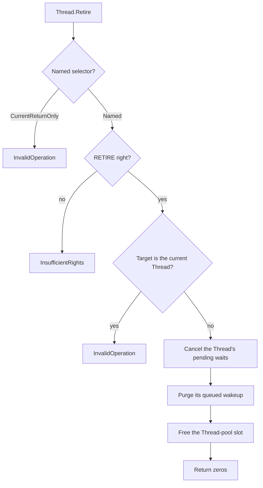

# Thread

| | |
|---|---|
| Wire type | `0x03` (core) |
| Pool | `PoolTag::Thread` for `Named(ObjectId)`; `CurrentReturnOnly` names no pooled object |
| Status | Active: Return (on `CurrentReturnOnly`) and Retire (on named Threads); Grant/Suspend/Resume return `InvalidOperation` |

## Purpose

A `Thread` is the schedulable execution entity. It executes in exactly one
`AddressSpace` at a time — its home, or a PPC target it has migrated into —
and capability invocations resolve through that `AddressSpace`'s table, which
all of its Threads share. A Thread capability carries one of two selectors:

- `Named(ObjectId)` names a concrete Thread and authorizes control over it
  (currently teardown).
- `CurrentReturnOnly` is the PPC return sentinel: it names no Thread,
  function or `AddressSpace`, carries no rights, and acts only on the
  invoking Thread's own top continuation.

## User-level visible operations

| Op | Name | Wire schema (`x2..x7`) | Authority | Success result |
|---|---|---|---|---|
| `0` | Return | `x2` = `r0`, `x3` = `r1`; `x4..x7` ignored | `CurrentReturnOnly` only | Never returns locally: the source resumes with `x0 = 0`, `x1 = r0`, `x2 = r1` |
| `1` | Grant | — | — | `InvalidOperation` |
| `2` | Suspend | — | — | `InvalidOperation` |
| `3` | Resume | — | — | `InvalidOperation` |
| `4` | Retire | no arguments | `RETIRE` on a `Named` Thread | zeros; tears the Thread down |

### Return

`x0` is the caller's packed key to the sentinel. AddressSpace provisioning
(`KeyTable::bind_address_space`) installs it at `KeySlot::THREAD_RETURN`
(Slot 1) before the `AddressSpace` can be activated, so the key is known to
the component's builder: `ThreadReturnKey::provisioned(guard, size_bits)`.
Ordinary lookup applies — guard, bounds, incarnation, presence; there is no
lookup bypass. Every Thread in the `AddressSpace` uses the same sentinel.

Return pops the invoking Thread's top continuation and resumes the source
exactly as described in [Invocation](invocation.md#register-state-across-a-migration).

| Situation | Outcome |
|---|---|
| Empty, stale or wrong-guard key | Ordinary lookup error; nothing popped |
| Return on a `Named` Thread | `InvalidOperation` |
| Grant/Suspend/Resume/Retire on `CurrentReturnOnly` | `InvalidOperation` |
| Empty invocation stack (`IllegalReturn`) | Fault; interim policy halts the kernel, nothing popped |
| Source `AddressSpace` retired (`ReturnTargetRetired`) | Fault; interim policy halts the kernel, nothing popped |

`ThreadReturnKey::return_from_invocation(r0, r1)` returns
`Result<Infallible, CapError>`: success never returns, ordinary rejections are
`Err`, and a local `SUCCESS` becomes `UnexpectedReturn` (status 34).

### Retire

```mermaid
flowchart TD
    A["Thread.Retire"] --> S{"Named selector?"}
    S -- "CurrentReturnOnly" --> ES["InvalidOperation"]
    S -- "Named" --> B{"RETIRE right?"}
    B -- "no" --> E1["InsufficientRights"]
    B -- "yes" --> C{"Target is the current Thread?"}
    C -- "yes" --> E2["InvalidOperation"]
    C -- "no" --> D["Cancel the Thread's pending waits"]
    D --> E["Purge its queued wakeup"]
    E --> F["Free the Thread-pool slot"]
    F --> OK["Return zeros"]
```

The `AddressSpace` and its table are untouched; their teardown is
[`AddressSpace.Retire`](../arch/address_space.md). Later invocations of the
retired Thread's capabilities fail pool validation.

## Kernel-level implementation details

- `Thread` (`kernel/nucleus/src/objects/thread.rs`) holds `address_space`
  (the checked identity of the `AddressSpace` it currently executes in),
  `context` (`NotStarted` / `Running` / `Parked`) and the depth-16 invocation
  stack. There is no per-Thread table address.
- Saved state is Thread-resident: a 288-byte `SavedContext` (all integer
  registers, SP, PC, raw SPSR, exception origin and the EL0 TLS register
  `TPIDR_EL0`, which the exception frame carries). A blocking SVC copies the
  caller's state into its Thread, selects the next runnable Thread, rewrites
  the transient trap frame and returns through `ERET` on the single per-core
  kernel stack.
- `Nucleus::park_and_select` validates the selected Thread's
  `AddressSpace`, root and ASID before committing; the SVC entry installs that
  translation after guards and the kernel lock are released.
- `ThreadSelector` is 12 bytes in the `KeyEntry` payload union; `object_id`
  on `CurrentReturnOnly` is `InvalidOperation`.
- Return: `api::thread::prepare_return` (lookup, kind, selector) →
  `Nucleus::prepare_return` (classifies the two faults) → `commit_return`
  (re-validates, pops, migrates back to the source `AddressSpace`). The SVC
  entry installs the source translation, restores the frame and traces
  `✅ Thread::Return()`.
- Retire: `Nucleus::cancel_thread_pending`, then pool deallocation.
- Threads are created by the bootstrap builder; `Untyped.Retype` cannot create
  a Thread (`InvalidObjectType`).
- Without a current Thread an invocation fails with `InvalidDomain`.

## Sidenotes

- `RETIRE` is delegable like any other right: lifetime control follows
  capabilities, not an owner identity.
- A Thread starts either as `EL1t` (`SavedContext::el1t`) or unprivileged at
  EL0 (`SavedContext::el0`, with one argument word in `x0`); EL0 cannot
  unmask interrupts. Both start with TLS zero. Only the bootstrap builder
  creates Threads today.
- EL0 sees a fixed set of other architectural state, the same for every
  Thread: `TPIDRRO_EL0` is zero, the virtual counter (`CNTVCT_EL0`,
  `CNTFRQ_EL0`) is readable, and the physical counter, timers, performance
  monitors, debug communications channel and FP/SIMD all trap.

## TODOs

- Return fault delivery — D1/D7.
- Fault delivery for EL0 Threads (aborts, undefined instructions), which
  currently halt the kernel — D1.
- Start/Suspend/Resume with legal state transitions and budget
  (D7/D8).
- Thread creation ABI.
- Self-retirement (never returns).
- Scheduler-shared Thread records and `Scheduler.ShareRegion` — D5.
- A current-Thread identity that carries its own generation.
- Per-call time attribution on Return.
- `Thread.Grant` versus KeyTable CopyDerive — D4.
