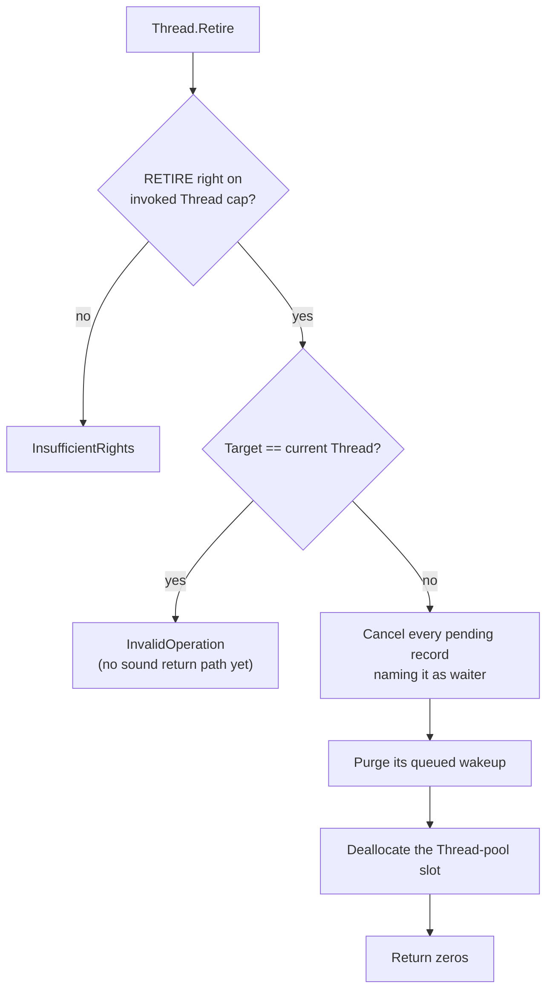

# Thread

| | |
|---|---|
| Wire type | `0x03` (core) |
| Pool | `PoolTag::Thread` (pool-backed kernel object) |
| Status | Active: `Retire` (teardown); Grant/Suspend/Resume return defined errors |

## Purpose

A `Thread` is the schedulable execution entity that holds a capability to its
`AddressSpace` (the protection/mapping context — Vesper's VSpace equivalent),
plus kernel-private execution state. Ordinary capability invocations use the
keytable associated with the Thread's current AddressSpace; all Threads in one
AddressSpace share that keytable. Thread capabilities authorize control over
that thread's lifecycle.

## User-level visible operations

| Op | Name | Wire schema (`x2..x7`) | Authority | Success result |
|---|---|---|---|---|
| `0` | — | — | — | unassigned; activation is `AddressSpace.Activate`; `InvalidOperation` |
| `1` | Grant | — | — | `InvalidOperation` (unsupported; overlaps KeyTable delegation) |
| `2` | Suspend | — | — | `InvalidOperation` (deferred, D7/D8) |
| `3` | Resume | — | — | `InvalidOperation` (deferred, D7/D8) |
| `4` | Retire | no arguments (all zero) | `RETIRE` (`0x20`) on the invoked Thread | zeros; tears down the invoked Thread |

### Retire

Tears down the invoked Thread:

```mermaid
flowchart TD
    A["Thread.Retire"] --> B{"RETIRE right on<br/>invoked Thread cap?"}
    B -- "no" --> E1["InsufficientRights"]
    B -- "yes" --> C{"Target == current Thread?"}
    C -- "yes" --> E2["InvalidOperation<br/>(no sound return path yet)"]
    C -- "no" --> D["Cancel every pending record<br/>naming it as waiter"]
    D --> E["Purge its queued wakeup"]
    E --> F["Deallocate the Thread-pool slot"]
    F --> OK["Return zeros"]
```

The current Thread may not retire itself: the invocation must return to a
surviving caller. Never-returns self-retirement is contract-recorded
follow-up. Deliberately out of scope (recorded gaps): the AddressSpace is untouched — its
teardown is the separate [`AddressSpace.Retire`](../arch/address_space.md).
The keytable belongs to the AddressSpace, not the Thread; Thread retirement
leaves that association and its retained carved backing untouched. Scheduler-shared record
retirement and reuse follow the D5 protocol and are not implemented yet.
Subsequent invocations of the retired Thread's capabilities fail pool
validation with a defined error.

## Kernel-level implementation details

- Pool-backed via `NucleusPools::threads`; capabilities store a checked
  `ObjectId` (pool tag + index + generation), resolved through the guarded
  `Access` context — never raw pointers.
- Current implementation fields (`kernel/nucleus/src/objects/thread.rs`):
  `address_space` (the checked identity of its `AddressSpace`, which selects
  the associated keytable), and `context`
  (`ExecutionContext`: `NotStarted` / `Parked` / `Running`) used by the
  completion foundation to park and resume blocked callers. There is no
  per-Thread table address. The internal creation fixture validates the
  AddressSpace before allocation and does not install table grants, so several
  Threads can share one AddressSpace/table without changing slot incarnations.
  `NotStarted` owns its initial `SavedContext`; `Parked` owns a saved context
  and checked pending-record identity. The 280-byte saved state contains all
  integer registers, SP, PC, raw SPSR, and exception origin. No persistent
  exception-frame pointer or per-Thread kernel stack exists. The SVC handler
  copies blocked state here, selects a runnable Thread, rewrites its transient
  288-byte trap frame, and unwinds normally to `ERET`. Thread pool carving and
  fixture backing derive from the actual type layout, with page-fit assertions.
  Trusted source/Bounce execution uses EL1t/SP_EL0 while traps share the high
  per-core SP_EL1 stack. The bounded wait/resume fixture switches between
  independently provisioned roots with source ASID 1 and Bounce ASID 2;
  source activation precedes the first handoff. This is internal fixture
  scheduling, not public Thread control, same-Thread PPC migration, or
  protected EL0 confinement. PPC invocation-stack storage and Call/Return
  migration remain unimplemented.
- PPC storage and [GPR/NZCV exposure contract](invocation.md#non-payload-gpr-and-condition-flag-exposure):
  depth-16 inline kernel-private continuation array with source AddressSpace
  identity, PC/SP, stamp, raw SPSR, exception origin and twelve source x19–x30
  words. On successful Call, the kernel first saves the source continuation
  from the transient frame and consumes provisional target SP from saved
  `frame.gpr[9]`; it then retains real arguments x2..x7, zeroes dummy x0/x1
  and x8..x30, clears target NZCV, and sets target execution SP/PC. No
  source-side dummy-zeroing or source spill stub is required. Successful Return
  captures r0/r1 before rewriting the frame, delivers x0=SUCCESS/x1=r0/x2=r1,
  zeroes x3..x18, and restores exact source x19..x30, AddressSpace/SP/PC/origin
  and raw SPSR including NZCV. Nested Calls save each immediate source's own
  snapshot; restoration does not trust target code or direct Return.
  Migration scrubbing does not apply to recoverable local Call/Return rejection;
  existing preservation/error contracts are unchanged. Ignored Return x4..x7
  require no userspace initialization or zeroing despite successful resumed-frame
  scrubbing. No extra fields are needed; projected record size remains 144 B,
  array 2304 B per Thread, unmeasured. Actual complete Thread layout,
  per-Thread page fit, pool stride/backing/accounting and fixture bounds are
  not validated. Storage comes from supplied Thread pool backing, without
  runtime kernel allocation. The record array, preservation and scrubbing are
  selected, not implemented or validated. Only GPR/NZCV disclosure is addressed;
  other target-entry SPSR bits (mode/masks), TLS, debug state and complete
  architectural-state isolation remain separately open. x9 stays provisional
  and the native body-result convention experimental.
- `Nucleus::park_and_select` validates the target AddressSpace incarnation,
  root/ASID presence and backend encoding, saved execution state, and pending
  completion before committing park/select. Subsequent capability lookup
  resolves the selected Thread's current AddressSpace's keytable. Hardware
  installation and transient-frame restoration occur after object/Access
  guards and the kernel lock end. Rejected preparation preserves both Thread
  contexts, pending records, current selection, and the runnable FIFO; it does
  not undo the wait already admitted by dispatch. The trusted fixture treats
  an impossible preparation failure as an invariant failure, not fake wait
  completion or a recovery ABI. Copied prepared metadata is not a lifetime
  pin: immediate installation relies on the serialized single-core, masked,
  non-reentrant trap interval; later or asynchronous use needs fresh validation.
- `Thread.Retire` maps to `Nucleus::cancel_thread_pending` + pool
  deallocation; teardown-before-reuse cancels waits and purges queued
  wakeups first.
- Scheduler-visible scheduling records reside in scheduler-owned pages
  shared to the kernel through `Scheduler.ShareRegion`; they are not a global
  DCB view. The scheduler can write all bytes in its mapped pages. Kernel-only
  TCB/execution state remains private. The initial field split follows the
  existing DcbPage/TCB division, with exact fields still to be specified.
  Record association with pool Threads, sharing, and publication are not yet
  implemented.
- Retype cannot create a Thread (`InvalidObjectType`): bootstrap grants are
  the initial source of Thread capabilities, which is why `RETIRE` cannot
  originate from a memory carve.
- No current thread is an explicit state: absent caller identity fails with
  `InvalidDomain` rather than falling back to thread zero.

## Sidenotes

- `RETIRE` is delegable like other capability permissions: retirement
  authorization follows capability permissions, not a privileged owner
  identity (permission-based lifetime control).
- A Thread executes in exactly one AddressSpace; resolving its
  `address_space` identity validates against the address-space pool, so a
  retired AddressSpace fails the next resolution with a defined error.

## TODOs

- Full Start/Suspend/Resume with legal state transitions, execution
  budget, and EL0 entry — Phase 7 (D7/D8).
- Never-returns self-retirement (terminal entry-path work).
- Scheduler-shared record table layout/capacity/publication/reuse and
  `Scheduler.ShareRegion` implementation — D5.
- Coherent current-thread identity carrying its own generation — Phase 4.
- `Thread.Grant` relationship to KeyTable CopyDerive — D4.

## Cross-reference: implementation vs. desired capabilities (🧠 Vesper vault)

- `Vesper Capabilities (from wiki).md` (vault): "thread control blocks …
  mechanisms for manipulating thread state if you are given a corresponding
  capability" — **partial mismatch**: current Thread control is limited to
  teardown; there are no register/stack manipulation operations (the vault
  `Scheduling/Scheduling.md` note "capability model provides a way for
  server holding capability to a thread to manipulate its registers and
  stack" is not implemented).
- `Scheduling/Scheduling.md` (vault): user-level scheduling with kernel
  upcalls — **not implemented**; no scheduler-driven cancellation or upcall
  mechanism exists yet (Phase 7, D8).
- `Memory.md` (vault): "arbitrary threads may execute" in a protection
  domain's address space (Mach/Mungi notes) — **now aligned in structure**:
  the Thread (execution) is separate from the AddressSpace (protection
  context); multiple Threads can share its table and allocation/dispatch are
  tested. Full userspace scheduling and protected execution remain unfinished.
- DCB observation ("protection domains … capabilities for accessing this
  memory from the outside", vault wiki) — **gap**: scheduler-shared records
  and their association with pool Threads are not implemented (D5).
