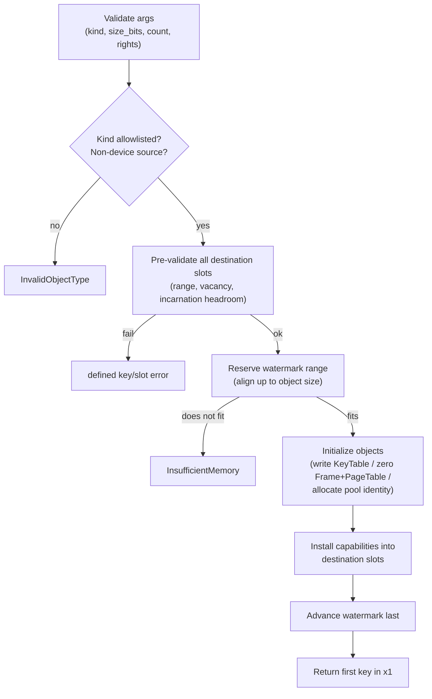

# Untyped

| | |
|---|---|
| Wire type | `0x01` (core) |
| Pool | none — inline region payload in `KeyEntry` |
| Status | Active: `Retype` handler with KeyTable/Frame/PageTable/Notification/EventCount allowlist |

## Purpose

An `Untyped` capability represents authority over a contiguous range of
currently unallocated physical memory (`2^size_bits` bytes, up to 1 GiB). It
is the sole source for creating new kernel objects: `Untyped.Retype` carves
objects from the region's unused watermark range and installs capabilities for
them into a destination `KeyTable`. The kernel never allocates memory for
kernel objects on its own after boot — all object storage is charged to an
authorized Untyped carve.

## User-level visible operations

| Op | Name | Wire schema (`x2..x7`) | Authority | Success result |
|---|---|---|---|---|
| `0` | Retype | `x2` object kind, `x3` `size_bits`, `x4` count, `x5` destination-table key, `x6` first destination slot, `x7` requested rights | `WRITE` on the invoked Untyped, `INSTALL` on the destination-table capability | First destination-local key in `x1`, zero in `x2`; remaining keys occupy consecutive slots |

Batch semantics are **all-or-nothing** (selected 2026-09-13): every
destination slot is pre-validated (range, vacancy, remaining incarnation
capacity) before any object is initialized; any failure leaves the Untyped's
accounting and the destination table unchanged.

### Creatable kinds and sizes

| Kind | `size_bits` | Carve |
|---|---|---|
| `KeyTable` | reserved zero | kernel bookkeeping storage written at the carve |
| `Frame` | arch-validated (AArch64: 12/21/30) | raw physical region, zeroed (sanitized) before installation |
| `PageTable` | fixed 12 (4 KiB) on AArch64 | zeroed hardware-format table; capability is a checked pool identity over kernel metadata |
| `Notification` | reserved zero | no Untyped bytes; object allocated from the bootstrap-carved notification pool |
| `EventCount` | reserved zero | no Untyped bytes; object allocated from the bootstrap-carved event-count pool |

Every other kind is rejected with `InvalidObjectType`, including `Thread`
and `AddressSpace` (cannot be carved from memory) and `Untyped` itself (no
split operation is implemented). A **device Untyped is not a valid source
for any creatable kind**: rejected with `InvalidObjectType` before any
reservation.

## Kernel-level implementation details

The capability *is* the object: an Untyped stores its `RegionPayload` inline
in the `KeyEntry` — physical base, allocation watermark (state), `size_bits`,
and an `is_device` flag. There is no separate kernel structure, pool slot, or
pointer indirection (`kernel/nucleus/src/api/key_entry.rs`,
`kernel/nucleus/src/objects/untyped.rs`).

- The watermark allocator only ever moves forward: previously allocated
  objects below the watermark are never eligible for re-retyping, and no
  reset/reclamation protocol exists (accepted-leak model).
- Watermark encoding has 16-byte granularity (`MIN_ALIGN`); the absolute
  carve address is aligned up to the object's alignment, and the usable range
  ends where the watermark encoding does.
- Region extents are validated before reservation: unrepresentable sizes or
  base+size beyond the physical address space fail with `InvalidSize`.
- The commit step on the caller's own table is
  `KeyTable::advance_untyped_watermark` — a targeted mutation that changes
  only the watermark, never identity/rights/badge/incarnation.
- The nucleus itself is boot-carved from a boot Untyped by Kickstart
  (inert-nucleus handoff, 2026-09-12); the boot Untyped is granted at
  `KeySlot::BOOT_UNTYPED`.

## Sidenotes

- Only an Untyped can be a Retype source; the watermark invariant concerns the
  *candidate allocation*, not a claim that all earlier allocations are
  unmapped.
- Requested rights (`x7`) are installed on the created capabilities, subject to
  per-kind interpretation; Retype-origin capabilities carry delegable
  lifetime-control permission (maintainer decision 2026-09-05).
- Sanitization: the kernel zeroes Retype-carved Frame and PageTable contents
  inside the transaction, before capability installation and watermark commit
  (selected 2026-09-15), so a fresh object never leaks prior-owner or kernel
  data.

## TODOs

- Per-kind device policy (device frames, device-capable kinds) — D6.
- Whether an Untyped-split (retyping an Untyped into smaller Untypeds) becomes
  an operation, and its schema — currently unrepresentable via the active
  allowlist.
- Batch partial-result contracts beyond all-or-nothing, if ever needed — D6.
- General Untyped-backed pools for kernel-private storage (beyond the
  bootstrap-carved notification/event-count pools) — Phase 5 work.

## Cross-reference: implementation vs. desired capabilities (🧠 Vesper vault)

- `Memory.md` (vault): "Untyped Memory regions can then be **split into
  smaller regions** or other kernel objects using `Untyped.Retype()`" —
  **mismatch**: the current Retype allowlist has no Untyped→Untyped split;
  splitting untyped memory into smaller untypeds is not implemented.
- `Memory.md` (vault): "Device untyped objects can only be retyped into
  **frames or other untyped objects**" — **mismatch**: the current
  implementation rejects *all* Retype from a device Untyped (no creatable kind
  is device-capable yet; per-kind device policy is D6). The vault's intended
  device-frame path does not exist yet.
- `Memory.md` (vault): "The user-level application that creates an object …
  receives **full authority** over the resulting object" — **divergence**:
  current Retype installs the *requested* rights (`x7`), which may be a subset;
  this is finer-grained than the vault note, not a conflict, but the vault
  text should not be read as guaranteeing `Rights::all()` on creation.
- `Memory.md` (vault): "children of the original untyped memory object" — the
  current implementation does not track a parent/child derivation relation
  between Untyped and retyped objects (no kernel derivation tree; D2/D6
  reclamation depends on it). Bookkeeping is delegated to userspace managers.
- `Vesper.md` (vault): "after boot-up kernel does not allocate any memory
  itself" — **consistent** in spirit: all object storage is charged to an
  authorized Untyped carve; the bootstrap-carved notification/event-count
  pools are boot-time carving, not runtime kernel allocation.
- `Vesper Capabilities (from wiki).md` (vault): "managers of untyped memory to
  destroy the objects in that memory so it can be retyped" via revoke —
  **mismatch**: no destroy/reclaim path exists; the watermark never rewinds
  (accepted leak). Safe reclamation remains open (D2/D6).
